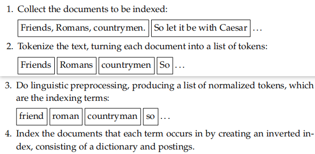

## Boolean retrieval

information retrieval

```
Defn

Information retrieval (IR) is finding material (usually documents) of an unstructured nature (usually text) 
that satisfies an information need from within large collections (usually stored on computers).
```

* Information retrieval is fast becoming **the dominant form of information access**, overtaking traditional databasestyle searching
* Information retrieval can also cover other kinds of data and information problems **beyond that specifified in the core defifinition above**
* Information retrieval is also used to **facilitate “semistructured” search**
* The field of IR also covers supporting users in browsing or filtering document collections or further processing a set of retrieved documents
* Information retrieval systems can also be distinguished by the **scale** at which they operate
  * web
  * personal infromation retrieval
  * domain-specific search

### 1.1 An example information retrieval problem

target:  determine which plays of Shakespeare contain the words **Brutus and Caesar and not Calpurnia**

* **grep**:linear scan through documents(wildcard pattern match)
  * effective
* learn more
  * To process large document collections quickly
  * To allow more flflexible matching operations
  * To allow ranked retrieval
* another method:  **index** the documents in advance

###### Boolean retrieval model

* build a binary term-document incidence matrix
  * **Terms** are the indexed units
  * have a **vector** for each term
* shortcoming:extremely sparse
* ans:  110100 and 110111 and 101111 = **100100**


```apache
Defn

The Boolean retrieval model is a model for information retrieval 
in which we can pose any query which is in the form of a Boolean expression of terms,
that is, in which terms are combined with the operators and, or, and not.

The model views each document as just a set of words.

these systems implemented extended Boolean retrieval models by incorporating additional operators
--Example 1.1: Commercial Boolean searching: Westlaw
```

terminology and notation

* **documents** : the units we have decided to build a retrieval system over
* **collection\corpus**:  the group of documents over which we perform retrieval
* address the **ad hoc retrieval task**

  * a system aims to provide documents from within the collection that are relevant to an arbitrary user information need, communicated to the system by means of a one-off, user-initiated query
* information need\query
* the **effectiveness** of an IR system

  * Precision: What fraction of the **returned results** are relevant to the **information need**?
  * Recall: What fraction of the **relevant documents** in the **collection** were rerecall turned by the system?

###### inverted index


The dictionary in Figure 1.3 has been sorted alphabetically and each postings list is sorted by document ID.

* **dictionary** : the data structure
* **vocabulary** : the set of terms
* **posting** : Each item in the list_records that a term appeared in a document
* **postings** : all the postings lists taken together

### 1.2 A first take at building an inverted index



1. Collect the documents to be indexed
2. Tokenize the text, turning each document into a list of tokens
3. Do linguistic preprocessing, producing a list of normalized tokens, which are the indexing terms
4. Index the documents that each term occurs in by creating an inverted index, consisting of a dictionary and postings

###### examine building a basic inverted index by sort-based indexing

* docID：each document has a uniqued serial number
* sorting this list so that the terms are alphabetica
* The postings are secondarily sorted by docID
* **the most effificient structure for supporting ad hoc text search**
* the dictionary is commonly kept in memory, and postings lists are normally kept on disk

  * an in-memory postings list：Singly linked lists、Variable length arrays、a hybrid scheme, with a linked list of fifixed length arrays for each term


### 1.3 Processing Boolean queries

###### the simple conjunctive query___Brutus and Calpurnia

* need to effificiently **intersect** \ the merge algorithm
* Using a numeric sort by docID


###### more complicated queries__(Brutus or Caesar) and not Calpurnia->(Calpurnia and Brutus) and Caesar

**Query optimization** is the process of selecting how to organize the work of answering a query so that the least total amount of work needs to be done by the system

* the order in which postings lists are accessed
* keeping the **frequency** of terms in the dictionary:make this ordering decision based on in-memory data before accessing any postings list

###### more general queries__(madding or crowd) and (ignoble or strife) and (killed or slain)

* estimate the size of each or by the sum of the frequencies of its disjuncts
* process the query in increasing order of the size of each disjunctive term

what we need

* evaluate and temporarily store the answers for intermediate expressions in a complex expression
* query is purely conjunctive

more efficient :

* intersect each retrieved postings list with the current intermediate result in memory
* destructively modifying or marking invalid items in the intermediate results
* a sequence of binary searches
* store the long postings list as a hashtable

asymmetric :

* intermediate results list is in memory while the list it is being intersected with is being read from disk

**standard postings list intersection operations** remain necessary when both terms of a query are very **common**


### 1.4 The extended Boolean model versus ranked retrieval

ranked retrieval models__contrast with The Boolean retrieval model

* largely use free text queries
* just one or more words

Compared

* Boolean queries are precise
* free text queries produced better results than Boolean queries
* using **and** operators tends to produce high precision but low recall searches
* using **or** operators gives low precision but high recall searches

further target

* We would like to better determine **the set of terms** in the dictionary and to provide retrieval that is tolerant to **spelling mistakes** and **inconsistentchoice** of words.
* search for compounds or phrases that denote a concept_augment the **index** to capture the proximities of terms in documents
* we need **term frequency information**
* a mechanism for **determining a document score**

Ad hoc searching over documents has recently conquered the world

### 1.5 References and further reading

**略**
