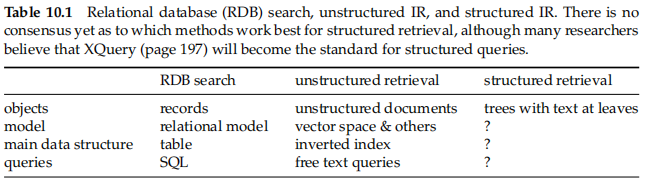

# 10 XML retrieval

There are fundamental differences between **IR and database systems** in terms of retrieval model, data structures, and query language

Some highly structured text search problems are most efficiently handled by a relational database

**structured retrieval** -> many structured data sources containing text are best modeled as structured documents rather than relational data

* can be either structed or unstructed

run queries that **combine textual criteria with structural criteria**

structured queries that cannot be answered well by an unranked retrieval system

* Boolean model suffer from low recall
* Most users are also notoriously bad at precisely stating structural constraints
* be completely unfamiliar with structured search and advanced search interfaces or unwilling to use them

one standard for encoding structured documents -> XML

* only interested in XML as a language for **encoding text and documents**
* data-centric

  * **numerical and nontext attribute-value data** XML dominate and text is usually a small fraction of the overall data
  * in contrast to the inverted index-based methods for text-centric XML that we present in this chapter
* structured retrieval (semistructured retrieval)

intermediate between unstructured retrieval and querying a relational database: parametric and zone search

The number of attributes and nodes is **greater** than in parametric and zone search

data-centric and text-centric approaches

## 10.1 Basic XML concepts

An XML document is **an ordered, labeled tree**. Each node of the tree is **an XML element** and is written with an opening and closing **tag**$[10.1]$

Figure 10.2 shows Figure 10.1 as a tree

* The **leaf** nodes of the tree consist of text
* **internal** nodes encode either the structure of the document (title, act, and scene) mor metadata functions (author)

**DOM**

* The DOM represents elements, attributes, mand text within elements as nodes in a tree
* process an XML document by starting at the root element and then descending down the tree from parents to children

**XPath** is a standard for enumerating paths in an XML document collection

* **/play/title** selects the play’s title in Figure 10.1,/play//title selects a set with two members (the play’s title and the scene’stitle), and /scene/title selects no elements

**schema**

* puts consstraints on the structure of allowable XML documents for a particular application
* Two standards for schemas for XML documents are **XML DTD** (document type defifinition) and **XML schema**

A common format for XML queries is **NEXI**

The two **yr** conditions are relational attribute constraints$[10.3]$

The about clause is a **ranking** constraint

handle relational attribute constraints by **prefifiltering or postfiltering**

> focus on the core information retrieval problem in XML retrieval, namely, how to rank documents according to the relevance criteria expressed in the about conditions of the NEXI query

discard relational attributes, we can represent documents as trees with only one type of node: **element nodes**$[10.4]$

**represent queries as trees** in the same way

## 10.2 Challenges in XML retrieval

The collection consists of structured documents and queries are **either structured (as in Figure 10.3) or unstructured**

problem 1 -> users want us to return **parts of documents**

> Structured document retrieval principle. A system should always retrieve the most specifific part of a document answering the query

returns **the smallest unit** that mcontains the information sought, but does not go below this level->hard

Parallel to the issue of which parts of a document to return to the user is **the issue of which parts of a document to index**

> there are a number of different approaches to mdefifining the indexing unit

approach -> group nodes into nonoverlapping pseudodocuments$[10.5]$

* disadvantage -> pseudodocuments may not make sense to the user because they are not coherent units

also -> use one of the largest elements as the indexing unit

* disadvantage -> the relevance of a whole book is often not a good predictor of the relevance of small subelements within it

three -> search all leaves, select the most relevant ones, and extend them to larger units in postprocessing (bottom up)

* disadvantage -> The relevance of a leaf element is often not a good predictor of the relevance ofelements in which it is contained

the least -> index all elements

* disadvantage -> Many XML elements are not meaningful search results
* disadvantage -> search results will be highly redundant

**nested** -> elements that are contained within each other

* we may need to **distinguish different contexts of a term** when we compute term statistics for ranking -> compute **idf** for XML-context/term pairs

need -> strict the set of elements that are eligible to be returned. **Restriction strategies** include:

* Discard all small elements
* Discard all element types that users do not look at (this requires a working XML retrieval system that logs this information)
* Discard all element types that assessors generally do not judge to be relevant (if relevance assessments are available)
* Only keep element types that a system designer or librarian has deemed to be useful search results

complement -> remove some elements in a postprocessing step to reduce redundancy or **highlight**

**schema heterogeneity or schema diversity**

* several different XML schemas occur in a collection
  * Some form of approximate matching of element names in combination with semiautomatic matching of different document structures can help here
  * **Human editing of correspondences of elements in different schemas** will usually do better than automatic methods
* one reason for **query–document mismatches** like q3/d2 and q3/d3

**extended queries**

> support the user by interpreting all parent–child relationships in queries as descendant relationships with any number of intervening nodes allowed

Elements that do not meet structural constraints perfectly should be ranked lower, but they should not be omitted from search results$[10.7]$

## 10.3 A vector space model for XML retrieval

present a **simple** vector space model for XML retrieval

One way of doing this is to have each dimension of the vector space encode a word together with its position within the XML tree

representation$[10.8]$

* take each text node (which in our setup is always a leaf) and **break** it into multiple nodes, one for each word.
* **define the dimensions of the vector space** to be **lexicalized subtrees**  of documents
  * subtrees that contain at least one vocabulary term.
  * A subset of these possible lexicalized subtrees is shown in the figure, but there are others – for example, the subtree corresponding to the whole document with the leaf node Gates removed
* r**epresent queries and documents as vectors** in this space of lexicalized subtrees and compute matches between them
  * the dimensions of vector space in unstructured retrieval are vocabulary terms, whereas they are **lexicalized subtrees in XML retrieval**

There is **a tradeoff between the dimensionality of the space and accuracy** of query results

* structural term
  * index all paths that end in na single vocabulary term, in other words, all XML-context/term pairs
* <c, t> :a pair of XML-context c and vocabulary term t

interpret all queries as **extended queries**

prefer documents that m**atch the query structure closely by ninserting fewer additional nodes**

* computing a weight for each match
* **context resemblance function Cr**
  * |cq | and |cd | are the number of nodes in the query path and document path
  * cq matches cd iff we can transform cq into cd by inserting additional nodes
* **SimNoMerge**->The **final score** for a document is computed as a variant of the cosine measure
  * V is the vocabulary of nonstructural terms
  * is the set of all XML contexts
  * weight(q, t, c) and weight(d, t, c) are the weights of term t in XML context c in query q and document d
  * omitted query length normalization to simplify the formula
* algorithm$[10.9]$
* computes query–document similarities$[10.10]$

**SimMerge**

* An alternative similarity function
* relax the matching conditions of query and document further

  * collect the statistics used for **computing weight(q, t, c) and weight(d, t, c)** from all contexts that have a nonzero resemblance to c
  * **modify Equation** (10.2) by merging all structural terms in the document that have a nonzero context resemblance to a given query structural term
  * The **context resemblance** function is further relaxed: Contexts have a nonzero resemblance in many cases where the defifinition of Cr in Equation (10.1) returns 0

advantage

* sparse term statistics
* increase the robustness
* SimMerge increase the effectiveness of XML retrieval

## 10.4 Evaluation of XML retrieval

**INEX**$[10.2]$

* premier venue for research on XML retrieval
* a collaborative effort that has produced reference collections, sets of queries, and relevance judgments

Two types of information needs or topics in INEX

* content-only->CO

  * regular keyword queries as in unstructured information retrieval
* content-and-structure -> CAS$[10.11]$

  * structural constraints in addition to keywords
  * defined **component coverage and topical relevance** as orthogonal dimensions of relevance
  * **component coverage**
    * “structurally” correct -> neither too low nor too high in the tree
    * four cases

      * **Exact coverage (E)**. The information sought is the main topic of the component and the component is a meaningful unit of information
      * **Too small (S).** The information sought is the main topic of the component, but the component is not a meaningful (self-contained) unit of informaion
      * **Too large (L).** The information sought is present in the component, but is not the main topic
      * **No coverage (N).** The information sought is not a topic of the component
  * **topical relevance**
    * four levels
      * hly relevant (3)
      * fairly relevant (2)
      * marginally relevant (1)
      * nonrelevant (0)
  * 4X4=16 -> are sixteen combinations of coverage and relevance, but many cannot occur
    * such as 3N -> a nonrelevant component cannot have exact coverage
* **The quantization function Q** does not impose a binary choice relevant/nonrelevant and instead allows us to grade the component as partially relevant

**The number of relevant components in a retrieved set A** of components can then be computed as:

**overlap** is not accounted for

* Much of the recent focus at INEX has been on developing algorithms and evaluation measures that return nonredundant results lists and evaluate them properly

shows two INEX 2002 runs of the vector space system$[10.3]$

* The better run is the SimMerge run
* often lower than in unstructured retrieval -> for hard

directly shows the effect of using structure in retrieval$[10.4]$

* structure helps to **increase precision** at the top of the results list
* **Recall may suffer**
  * some relevant documents will be fifiltered out, but for precision-oriented tasks structured retrieval is superior

## 10.5 Text-centric versus data-centric XML retrieval

optimized for **text-centric XML**

The premise of our approach is that XML document retrieval is **characterized** by

(i) long text fields (e.g., sections of a document)

(ii) inexact matching

(iii) relevance ranked results

**Relational databases** do not deal well with this use case

**data-centric XML**

* mainly encodes numerical and nontext attribute-value data
* puts the emphasis on the structural aspects of XML documents and queries

**Relational databases** are better equipped to handle many structural constraints

* most data-centric XML retrieval systems are **extensions** of relational databases
* If text fields are **short**, exact matching meets user needs and retrieval results in form of unordered sets are acceptable, then using a relational database for XML retrieval is appropriate

## 10.6 References and further reading

null

