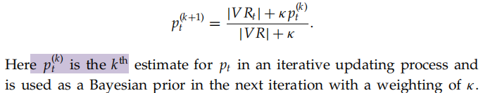

# 11 Probabilistic information retrieval

information needs -> query representations

documents -> document representations

## 11.1 Review of basic probability theory

$P(A, B) = P(A∩ B) = P(A|B)P(B) = P(B|A)P(A)$

Bayes’ rule

* prior probability P(A)
* posterior probability P(A|B)

## 11.2 The probability ranking principle

### 11.2.1 The 1/0 loss case

R/$R_{d,q}$

* whether d is relevant with respect to a given query q1 the document d is relevan
* 1 relevant
* 0 otherwise

probability ranking principle (PRP)

> basis:
>
> Using a probabilistic model, the obvious order in which to present documents to the user is to rank documents by their estimated probability of relevance with respect to the information need: P(R = 1|d, q)
>
> defn:
>
> If a reference retrieval system’s response to each request is a ranking of the documents in the collection in order of decreasing probability of relevance to the user who submitted the request, where the probabilities are estimated as accurately as possible on the basis of whatever data have been made available to the system for this purpose, the overall effectiveness of the system to its user will be the best that is obtainable on the basis of those data

the simplest case of the PRP__no retrieval costs or other utility concerns

* accuracy : 1/0 loss
* simply rank all documents in decreasing order of P(R = 1|d, q)
* Bayes optimal decision rule-> minimizes the risk of loss
  * d is relevant if P(R = 1|d, q) > P(R = 0|d, q)

> Theorem 11.1.
> The PRP is optimal, in the sense that it minimizes the expected loss (also known as the Bayes risk) under 1/0 loss.

### 11.2.2 The probability ranking principle with retrieval costs

* C1 -> cost of retrieval of a relevant document
* C2 -> the cost of retrieval of a nonrelevant document
* d -> a specifific document
* d' -> all documents d not yet retrieved

model differential costs of false positives and false negatives and even system performance issues at the modeling stage

## 11.3 The binary independence model

binary independence model (BIM)

* “binary” is equivalent to Boolean
* Documents and queries are both represented as binary term incidence vectors
* Independence -> means that terms are modeled as occurring in documents independently
* each term is a dimension that is orthogonal to all other terms

To make a probabilistic retrieval strategy precise, we need to estimate **how terms in documents contribute to relevance**

model the probability P(R|d, q) that a document is relevant via the probability in terms of term incidence vectors P(R|x, q)

estimate-> Statistics about the actual document collection

* such as the percentage of relevant documents in the collection

limitation -> 

### 11.3.1 Deriving a ranking function for query terms

rank documents by their **odds of relevance**->monotonic with the probability of relevance

The left term in the rightmost expression is a **constantthe**

Naive Bayes conditional independence assumption

* the presence or absence of a word in a document is **independent of** the presence or absence of any other word (given the query)

each **xt is either 0 or 1**, we can separate the terms to give

an additional simplifying assumption

* terms not occurring in the query are equally likely to occur in relevant and nonrelevant document
* if qt = 0 then pt = ut

transform:

The resulting quantity used for ranking is called the **retrieval status value (RSV)** in this model:

So everything comes down to computing the RSV. **Defifine ct**:

* log odds ratios for the terms in the query

### 11.3.2 Probability estimates in theory

dft is **the number of documents that contain term t**

Using this, **pt = s/S** and **ut = (dft − s)/(N − S)** and

avoid the possibility of zeroes->add 1/2(smothing)

* as the the **relative frequency** of the event
* the relative frequency is the **maximum likelihood estimate** (or MLE)
* We initially **prior assume a uniform distribution** over events, where the size of α denotes **the strength of our belief** in uniformity, and we then **update the probability** based on **observed events**

### 1.3.3 Probability estimates in practice

provide a theoretical justification for **the most frequently used form of idf weighting**

* relevant documents are a very small percentage of the collection

The approximation technique in Equation **cannot easily be extended to relevant documents**. The quantity pt can be estimated in various ways:

* the frequency of term occurrence in known relevant document
* pt is **constant** over all terms xt in the query and that pt = 0.5
  * Combining this method with our earlier approximation for ut, the document ranking is determined simply by which query terms occur in documents scaled by their idf weighting
* simply estimating pt from collection level statistics about the occurrence of t, as pt = dft/N

### 11.3.4 Probabilistic approaches to relevance feedback

use **(pseudo) relevance feedback (RF)**, perhaps in an iterative process of estimation, to get a more accurate estimate of pt

1. Guess initial estimates of pt and ut
2. Use the current estimates of pt and ut to determine a best guess at the set of relevant documents R = {d : Rd,q = 1}
3. We interact with the user to refifine the model of R
   * two subset:
   * VR = {d ∈V, Rd,q = 1} ⊂ R
   * VNR = {d ∈ V, Rd,q = 0} is disjoint from R
4. reestimate pt and ut on the basis of known relevant and nonrelevant documents
   * the sets VR and VNR are large enough -> pt = |VRt|/|VR|
   * SMOOTHING -> $p_t=\frac{|VR_t+1/2}{|VR|+1/2}$
   * (V) is usually very small -> combine the new information with the original guess in a process of Bayesian updating

     
5. Repeat the above process from Step 2, generating a succession of approximations to R and hence pt, until the user is satisfified

It is also straightforward to derive a pseudo RF version of this algorithm, where we simply pretend that **VR = V**

1. Assume initial estimates for pt and ut as above
2. Determine a guess for the size of the relevant document set
3. Improve our guesses for pt and ut.

4. Go to Step 2 until the ranking of the returned results converges

## 11.4 An appraisal and some extensions

### 11.4.1 An appraisal of probabilistic models

**Getting reasonable approximations of the needed probabilities** for a probabilistic IR model is possible, but it requires some major assumptions. In the BIM these are:

* a Boolean representation of documents/queries/relevance
* term independence
* terms not in the query don’t affect the outcome
* document relevance values are independent

It is perhaps the severity of the modeling assumptions that **makes achieving good performance diffificult**.

### 11.4.2 Tree-structured dependencies between terms

Some of the assumptions of the BIM can be removed

* remove **the assumption that terms are independent**$[11.1]$
* plausible model that allowed a tree structure of term dependencies
  * the tree-augmented Naive Bayes model by Friedman and Goldszmidt

### 11.4.3 Okapi BM25: A nonbinary model

The BM25 weighting scheme, often called Okapi weighting

* pay attention to **term frequency and document length**

The simplest score for document d is just **idf weighting** of the query terms present

estimate that **S = s = 0**, then we get an alternative idf formulation as follows

the value for each summand can be given a floor of 0

by factoring in the frequency of each term and document length

quert long -> use similar weighting for query terms

* no length normalization of queries
* reasonable values are to set **k1 and k3 to a value between 1.2 and 2 and b = 0.75**

use the full form of in place of the approximation log(N/dft) introduced in

* reflflects relevance feedback
* document term frequency and document length scaling
* term frequency in the query

The BM25 term weighting formulas have **been used quite widely** and quite **successfully** across a range of collections and search tasks.

### 11.4.4 Bayesian network approaches to information retrieval

Bayesian networks

> a form of probabilistic graphical model
>
> use directed graphs to show probabilistic dependencies between variables

The model decomposes into two parts

* a document collection network
  * large
  * be precomputed
* a query network
  * maps from query terms, to query subexpressions

The result is **a flexible probabilistic network** that can generalize various simpler Boolean and probabilistic models

## 11.5 References and further reading

