# 12 Language models for information retrieval

think of words that would likely appear in a relevant document, and to use those words as the query

the basic and most commonly used language modeling approach to IR, **the query likelihood model**

## 12.1 Language models

### 12.1.1 Finite automata and language models

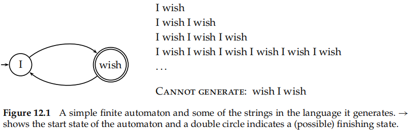

language of the automaton$[12.1]$

**A language model is a function that puts a probability measure over strings drawn from some vocabulary**

* One simple kind of language model is equivalent to a **probabilistic finite automaton** consisting of just a single node with a single probability distribution over producing different terms$[12.2]$
* probability of **stopping in the finishing state**

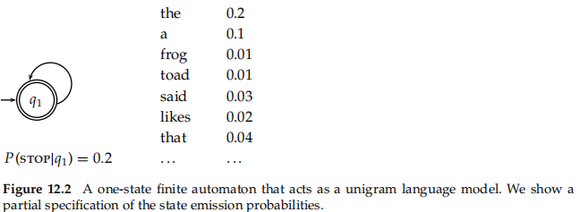

as is common in probabilistic applications, in practice it is usually best to work with sums of **log probabilities**

### 12.1.2 Types of language models

1. the chain rule

$P(t_1t2t3t4) = P(t1)P(t2|t1)P(t3|t1t2)P(t4|t1t2t3)$

2. unigram language model

$P_{uni}(t_1t2t3t4) = P(t1)P(t2)P(t3)P(t4)$

3. bigram language models

$P_{uni}(t_1t2t3t4) = P(t1)P(t2|t1)P(t3|t2)P(t4|t3)$

4. more complex grammar-based language models such as probabilistic context-free grammars

**language-modeling work in IR has used unigram language models**

the bias-variance tradeoff-> Losses from data sparseness tend to outweigh any gains from richer models

> With limited training data, a more constrained model tends to perform better

### 12.1.3 Multinomial distributions over words

**bag-of-words models** -> the order of words is irrelevant

* any other ordering of this bag of terms will have the same probability
* have a multinomial distribution over words

**a multinomial model**

* leave out the multinomial coeffificient in our calculations

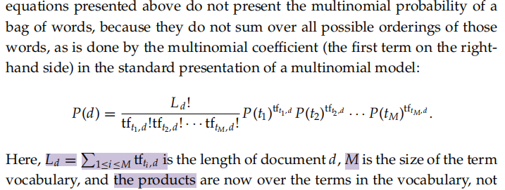

The strategy we adopt in IR is as follows

> We pretend that the document d is only a representative sample of text drawn from a model distribution, treating it like a fifine-grained topic. We then estimate a language model from this sample, and use that model to calculate the probability of observing any word sequence, and, fifinally, we rank documents according to their probability of generating the query

## 12.2 The query likelihood model

### 12.2.1 Using query likelihood language models in IR

query likelihood model

* construct from each document d in the collection a language model $M_d$
* goal -> **rank documents by P(d|q)**, where the probability of a document is interpreted as the likelihood that it is relevant to the query
* P（d|q） -> the probability of the query q under the language model derived from d

$P(d|q) = P(q|d)P(d)/P(q)$

The language modeling approach thus attempts to model the query generation process

> Documents are ranked by the probability that a query would be observed as a random sample from the respective document model

common -> use the multinomial unigram language model

* equivalent to a multinomial naive Bayes model

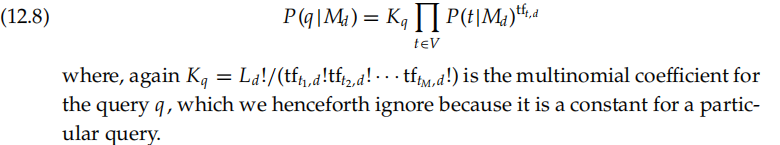

For retrieval based on a language model (henceforth LM), we treat the generation of queries as **a random process**

1. Infer a **LM** for each document.
2. Estimate **P(q|Mdi)**, the probability of generating the query according to each of these document models.
3. **Rank** the documents according to these probabilities.

### 12.2.2 Estimating the query generation probability

The probability of producing the query given the LM Md of document d using **maximum likelihood estimation (MLE)** and the unigram assumption is

* using a mutinomial over word counts

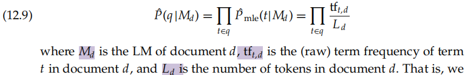

problem -> **one of estimation** (the ˆ symbol on the Ps is used above to stress that the model is estimated)

* **Terms appear very sparsely** in documents

  * Documents will only give a query nonzero probability if all of the query terms appear in the document
  * rather less clear whether this is problematic
* **Occurring words are also poorly estimated**

  * ans: smoothing
  * The smoothing of terms actually implements major parts of the term weighting component
  * It is not just that an unsmoothed model has conjunctive semantics; an unsmoothed model works badly because it lacks parts of the term weighting component

need to **smooth probabilities in our document LMs**

* discount nonzero probabilities
* give some probability mass to unseen words

**a nonoccurring term** should be possible in a query, but its probability should be somewhat close to but no more likely than would be expected by chance from the whole collection

* cft is the raw count of the term in the collection
* T is the raw size of the entire collection

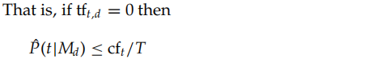

**linear interpolation LM**

> A simple idea that works well in practice is to use **a mixture between** a document-specifific multinomial distribution and a multinomial distribution estimated from the entire collection

* 0 <λ< 1
* Mc is a language model built from the entire document collection
* Correctly setting λ is important to the good performance

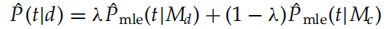

**Bayesian updating process**

> use an LM built from the whole collection as a prior distribution

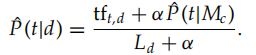

they are both conceptually similar

* the probability estimate **for a word present in the document** combines a discounted MLE and a fraction of the estimate of its prevalence in the whole collection
* **words not present in a document**, the estimate is just a fraction of the estimate of the prevalence of the word in the whole collection

smoothing is essential to the good properties of the model

* The extent of smoothing in these two models is controlled by **the λ and α parameters**
* small value of λ or a large value of α means more smoothing
* approach -> a line search
* The value need not be a constant

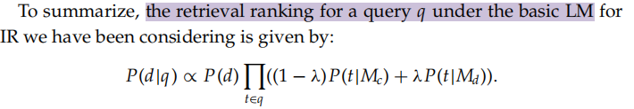

### 12.2.3 Ponte and Croft’s experiments

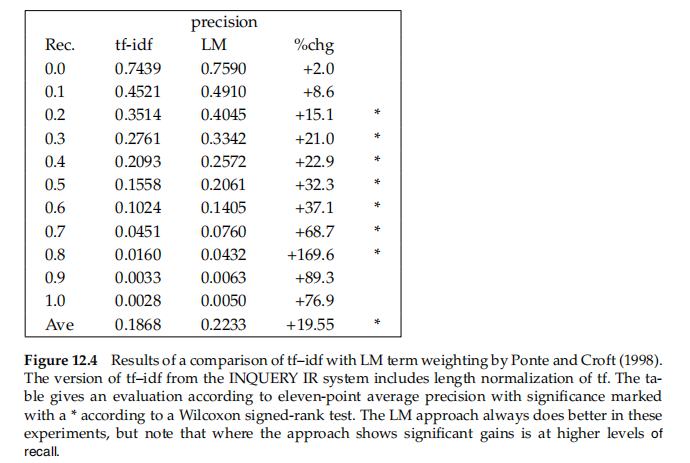

Ponte and Croft argued strongly for the effectiveness of the term weights that come from the language modeling approach **over** traditional tf–idf weights

## 12.3 Language modeling versus other approaches in information retrieval

The LM approach provides **a novel way** of looking at the problem of text retrieval, which links it with a lot of recent work in speech and language processing

the main difference initially appears to be that the LM approach d**oes away with explicitly modeling relevance**

like all IR models, you can also **raise objections** to the model

* The assumption of equivalence between document and information need representation is **unrealistic**
* **relevance feedback** is diffificult to integrate into the model
* to **accommodate** notions of phrase or passage matching or Boolean retrieval operators

The model has signifificant relations to traditional tf–idf models

## 12.4 Extended language modeling approaches

look at the probability of **a query language model Mq** generating the document

* a document likelihood model is less appealing is that there is much less text available to estimate a LM based on the query text->smoothing
* it is easy to see how to incorporate relevance feedback into such a model

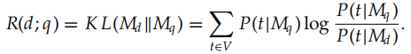

make an LM from **both the document and query**, and then ask how different these two language models are from each other

* Kullback-Leibler (KL) divergence

  * model the risk of returning a document d as relevant to a query q
  * KL divergence is **an asymmetric divergence measure originating in information theory**, which measures how bad the probability distribution Mq is at modeling Md
* disadcantage -> scores are not comparable across queries
* suggest an alternative proposal which models similarity  as a normalized log-likelihood ratio (or, equivalently, as a difference between cross-entropies)

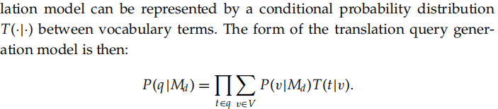

synonymy, or any deviation in use of language between queries and documents

* introduce **translation models** to bridge this query
  * generate query words not in a document by translation to alternate terms with similar meaning
  * provides a basis for performing **cross-language IR**
* P(v|Md ) is the basic document language model
* T(t|v) performs translation
* disadvantage -> more computationally intensive and needs to build a translation model

In general, translation models, relevance feedback models, and model comparison approaches **have all been demonstrated to improve performance over** the basic query likelihood LM

## 12.5 References and further reading

