# 13 text classification and Naive Bayes

**standing queries** -> periodically executed on a collection to which new documents are incrementally added over time

classifification -> capture the generality and scope of the problem space to which standing queries belong

Such more general classes are usually referred to as topics, and the classifification task is then called text classifification, text categorization, **topic classifification, or topic spotting**

The notion of classification is very general and has many applications within and beyond information retrieval (IR)

* Several of the preprocessing steps necessary for indexing
* The automatic detection of spam pages
* The automatic detection of sexually explicit content
* Personal email sorting
* Topic-specifific or vertical search
* the ranking function in ad hoc information retrieval

classification

* **computer** is not essential
* can been sloved **manually**
  * classifification by the use of standing queries
* **machine learning-based** text classification

## 13.1 The text classification problem

a description **d ∈ X** of a document-> X is the document space

a fixed set of classes **C = {c1, c2, ... , c J }**-> classes are also called categories or labels

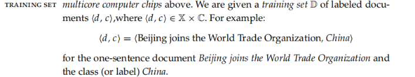

goal -> classifification function γ that maps documents to classes

supervised learning$[13.1]$

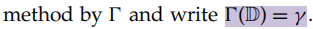

* takes the training set D as input
* returns the learned classifification function γ

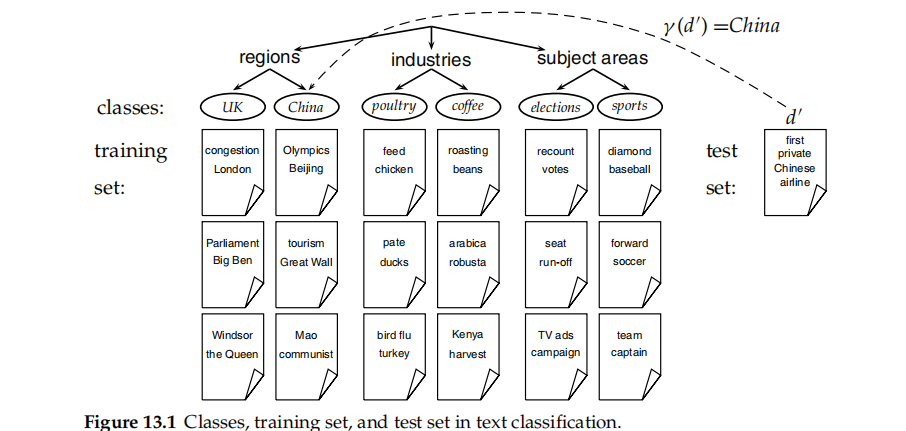

The classes in text classifification often have **some interesting structure** such as the hierarchy$[13.1]$

only **consider one-of problems** where a document is a member of exactly one class(but Defifinition (13.1) stipulates that a document is a member of exactly one class)

Our goal in text classifification is **high accuracy on test data or new data** ->not mean that the classififier will work well

## 13.2 Naive Bayes text classification

multinomial Naive Bayes or multinomial NB model

> a probabilistic learning method
>
> supervised learning method

the probability of **a document d being in class c** is computed as

* our goal -> find the best class for the document -> MAP
  * not know the true values of the parameters P(c) and P(tk |c)
  * **estimate them from the training set**

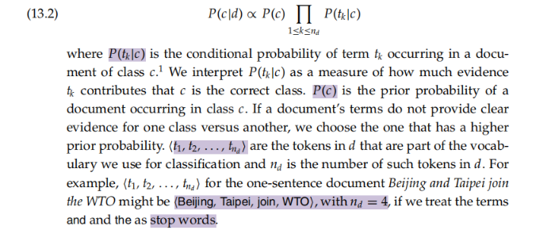

the most likely or maximum a posteriori (MAP) class $c_{map}$

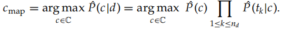

result in a floating point underflflow

* ans:adding **logarithms of probabilities** instead of multiplying probabilities
* the maximization that is actually done in most implementations of NB is:

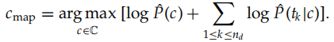

**How do we estimate the parametersˆP(c) andˆP(tk |c)?**

For the priors this estimate is:

* Nc is the number of documents in class c
* N is the total number of documents

$P'(c) = \frac{N_c}{N}$

estimate the **conditional probability P(t|c)**

* relative **frequency of term t in documents belonging to class c**
* Tct is the number of occurrences of t in training documents from class c
* positional independence assumption -> Tct is a count of occurrences in all positions k in the documents in the training set
  * ˆP(tk1 |c) =ˆP(tk2 |c)

$P'(t|c)=\frac{T_{ct}}{\sum _{t' \in V}T_{ct'}}$

MLE problem ->zero for a term–class combination that did not occur in the training data

* because of **sparseness**
* ans : **add-one** or **Laplace smoothing**
  * simply addsone to each count
  * B = |V| is the number of terms in the vocabulary

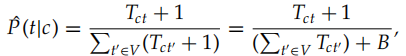

The complete algorithm$[13.2]$

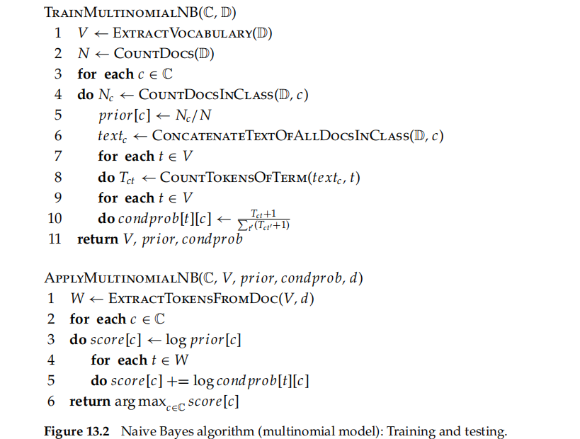

**the time complexity of NB**$[13.2]$

* The **complexity of computing the parameters** is > (|C||V|)
* The **preprocessing** necessary for computing the parameters ->  (|D|Lave)
  * |D| is the number of documents
  * Lave is the average length of a document
* **ApplyMultinomialNB** in Figure 13.2 is > (|C|La)
  * La and Ma are the numbers of tokens and types

NB can be said to **have optimal time complexity**. Its effificiency is one reason why NB is a popular text classifification method

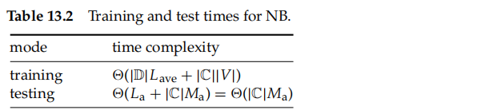

### 13.2.1 Relation to multinomial unigram language model

The multinomial NB model is **formally identical** to the multinomial unigram language model

* The document d in text classifification (Equation (13.2)) takes the role of the query in language modeling (Equation (13.8))
* the classes c in text classification take the role of the documents d in language modeling

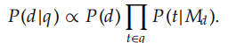

## 13.3 The Bernoulli model

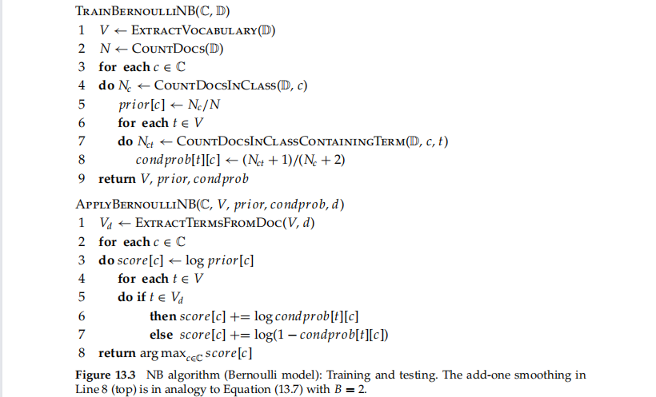

There are **two different ways** we can set up an NB classififier

* the multinomial model
* **the multivariate Bernoulli model or Bernoulli model**$[13.3]$

  * equivalent to the binary independence model of Section 11.3 (page 204)
  * generates an indicator for each term of the vocabulary -> 0/1
  * the same time complexity as the multinomial model

different

* different estimation strategies and different classifification rules
* Bernoulli model estimates ˆP(t|c) as **the fraction of documents of class c that contain term t**
* binary occurrence information, ignoring the number of occurrences
* **absence of terms explicitly**

  * the probability of nonoccurrence is factored in when computing P(c|d)

## 13.4 Properties of Naive Bayes

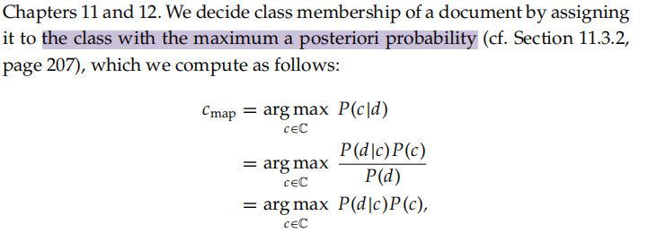

> where Bayes’ rule (Equation (11.4), page 202) is applied in (13.9) and we drop the denominator in the last step because P(d) is the same for all classes and does not affect the argmax

choose **class c with probability P(c)**

the **generation of the document given the class**, corresponding to the conditional distribution:

* t -> the sequence of terms as it occurs in d
* e -> vector of dimensionality M that indicates for each term whether it occurs in d or not
* cannot use for text classification directly -> large quantity

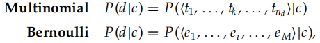

the Naive Bayes conditional independence assumption

* reduce the number of parameters
* assume that **attribute values are independent** of each other given the class
  * **Xk** is the random variable for position k in the document and takes as values terms from the vocabulary
  * **Ui** is the random variable for vocabulary term i and takes as values 0 (absence)
    * in any position and possibly multiple times

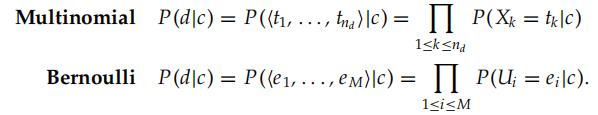

illustrate the conditional independence assumption$[13.4][12.5]$

* five term attributes
* six binary

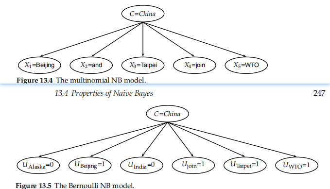

the conditional independence assumption does not hold for text data

* Terms are **conditionally dependent** on each other
* but NB models perform well
* The conditional independence assumption commits us to this way of processing the evidence
* each position k -> **estimation owing to data sparsensess**

**positional independence**

> The conditional probabilities for a term are the same independent of position in the document

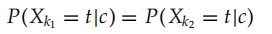

reduce the number of parameters to be estimated by several orders of magnitude

* conditional and positional independence assumptions

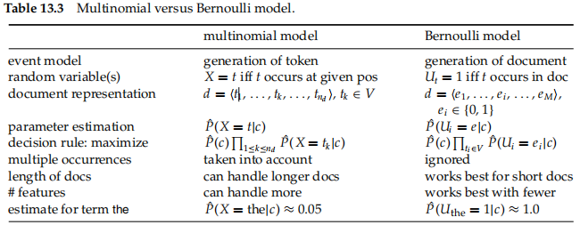

generate a document in the Bernoulli model$[13.5]$

* estimation dquations
* decision rules

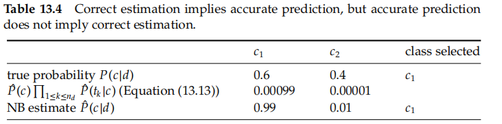

Naive Bayes is so called because the independence assumptions we have just made are indeed very naive for a model of natural language$[13.4]$

> even though the probability estimates of NB are of low quality, its classifification decisions are surprisingly good
>
> **Correct estimation implies accurate prediction, but accurate prediction does not imply correct estimation**

NB's advantage

* many equally important features that jointly contribute to the classification decision
* robust to noise features and concept drift
* combines efficiency with good accuracy

It is often the method of choice

* squeezing out a few extra percentage points of **accuracy** is not worth the trouble in a text classifification application
* a very **large amount of training data** is available and there is more to be gained from training on a lot of data than using a better classifier on a smaller training set
* its **robustness** to concept drift can be exploited

The independence assumptions do not hold for text.

> However, it can be shown that N**B is an optimal classifier** (in the sense of minimal error rate on new data) for data where the independence assumptions do hold

### 13.4.1 A variant of the multinomial model

omitted the multinomial factor

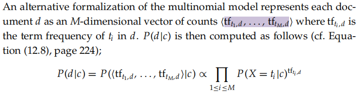

## 13.5 Feature selection

feature selection

> the process of selecting a subset of the terms occurring in the training set and using only this subset as features in text classifification

* makes training and applying a classififier **more efficient** by decreasing the size of the effective vocabulary
* feature selection often **increases classifification accuracy** by eliminating noise features
  * **noist** -> add to the document representation, increases the classifification error on new data
  * **overfitting** -> an incorrect generalization from an accidental property of the training

**weaker models are often preferable when limited training data are available**

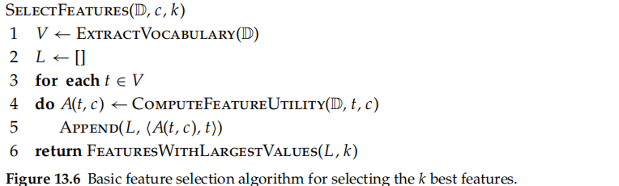

The basic feature selection algorithm$[13.6]$

introduce three different utility measures in this section

* mutual information, A(t, c) = I(Ut;Cc )
* the χ2 test, A(t, c) = X2(t, c)
* frequency, A(t, c) = N(t, c)

### 13.5.1 Mutual information

mutual information (MI) of term t and class c

> measures **how much information** the presence/absence of a term contributes to making the correct classification decision on c
>
> reaches its **maximum value** if the term is a perfect indicator for class membership

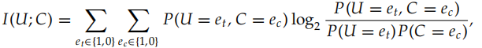

U -> a random variable

* 1 -> document contains term t ,otherwise 0
* e c not clear -> write Ut and Cc

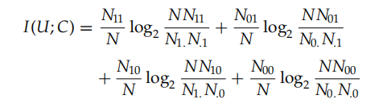

Ns are **counts of documents** that have the values of et and ec that are indicated by the two subscripts

To **select k terms** t1, ... , tk for a given class, we use the feature selection algorithm

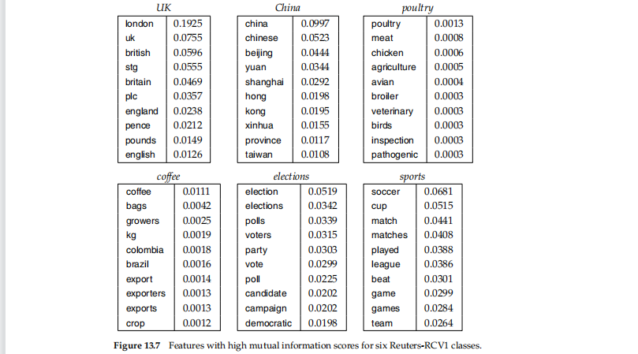

terms with high mutual information scores for the six classes$[13.1]$

> keeping the informative terms and eliminating the non-informative ones tends to reduce noise and improve the classififier’s accuracy

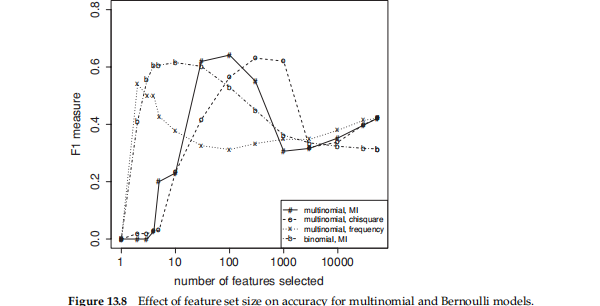

Such an accuracy increase can be observed$[13.8]$

* For the Bernoulli model, **F1 peaks early**, at ten features selected
* the Bernoulli model is better than the multinomial model
* a carefully selected subset of the features results in **better** effectiveness than using all features

### 13.5.2 χ2 Feature selection

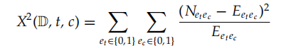

χ2 Feature**applied to test the independence of two events**

> a measure of **how much expected** counts E and observed counts N deviate from each other
>
> If the **two events are dependent**, then the occurrence of the term makes the occurrence of the class **more likely**, so it should be helpful as **a feature**

We then rank terms with respect to the belowing quantity

* **N** is the observed frequency in D
* **E** -> the expected frequency
* **E11** -> the expected frequency of t and c occurring together in a document assuming that term and class are independent

An arithmetically simpler way of computing X2 is the following:

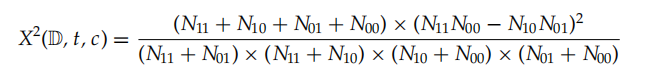

#### Assessing χ2 as a feature selection method

From a statistical point of view, χ2 feature selection is problematic

* For a test with one degree of freedom, the so-called **Yates** correction should be used

> As long as **χ2 feature selection only ranks features** with respect to their usefulness and is **not used to** make statements about statistical **dependence or independence** of variables, we need not be overly concerned that it does not adhere strictly to statistical theory

### 13.5.3 Frequency-based feature selection

frequency-based feature selection

> selecting the terms that are most common in the class. Frequency can be either defifined as document frequency or as collection frequency

* document frequency
  * the number of documents in the class c that contain the term t
  * more appropriate for the Bernoulli model
* collection frequency
  * the number of tokens of t that occur in documents in c
  * for the multinomial model

Frequency-based feature selection selects some frequent terms that **have no specific information about the class**

> if somewhat suboptimal accuracy is acceptable, then frequency-based feature selection can be **a good alternative to more complex methods**

### 13.5.4 Feature selection for multiple classifiers

**select a single set of features** instead of a different one for each classififier

* **compute the X2 statistic for an n × 2 table** where the columns are occurrence and nonoccurrence of the term and each row corresponds to one of the classes
* **feature selection statistics** are first computed separately for each class on the two-class classifification task c versus c and then **combined**

accuracy often decreases but the gain in efficiency

### 13.5.5 Comparison of feature selection methods

Mutual information and χ2

* Despite the differences between the two methods, the classification accuracy of feature sets selected with χ2 and MI does **not seem to differ systematically**
  * strong indicators and a large number of weak indicators are selected
* based – are **greedy methods**
  * non-greedy methods are rarely used in text classification due to their computational cost

## 13.6 Evaluation of text classification

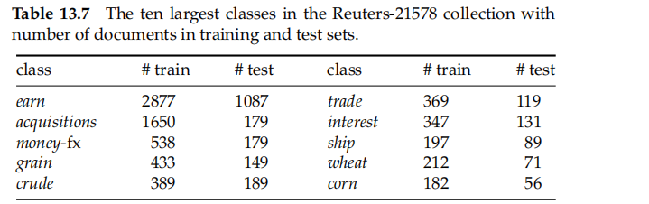

the **classic Reuters-21578 collection** was the main benchmark for text classifification evaluation

people almost invariably use **the ModApte split**, which split includes only documents that were viewed and assessed by a human indexer

* distribution of documents in classes is very uneven

For **small classes, precision, recall and F1** are better measures

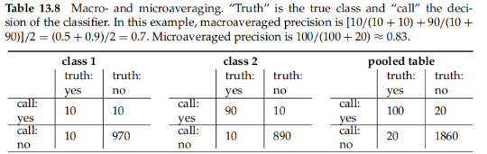

When we process a collection with **several** two-class classififiers,we often want to compute a single aggregate measure that **combines the measures for individual classififiers**$[13.8]$

* Macroaveraging computes a simple average over classes
* Microaveraging pools per-document decisions across classes

The **differences** between the two methods can be large

* **Macroaveraging** gives equal weight to each class
  * a measure of effectiveness on the large classes in a test collection
* m**icroaveraging** gives equal weight to each per-document classifification decision
  * get a sense of effectiveness on small classes

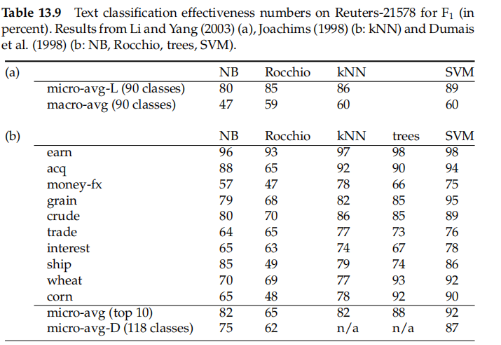

gives microaveraged and macroaveraged effectiveness of Naive Bayes for the ModApte split of Reuters-21578 $[13.9]$

* a surprisingly small effectiveness penalty for its simplicity and effificiency
* there is considerable variation from class to class
* There are often differences in the experimental setup or the evaluation that complicate the interpretation of the results
* **unable** to build a fancy classififier for a certain problem that consistently performs **better than NB**
* the ranking of classififiers ultimately depends on the **class, the document collection, and the experimental setup**
* it is important to **maintain a strict separation between the training set and the test set**
* it is nevertheless **highly important to not look at the test data and to run systems on it as sparingly as possible**

## 13.7 References and further reading

