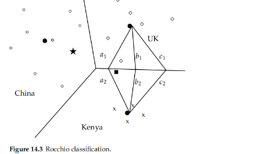
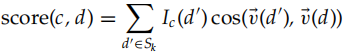

# 14 Vector space classifification

adopt a different representation for text classifification -> the vector space model

> each document as a vector with one real-valued component, usually a tf–idf weight, for each term
>
> the document space X, the domain of the classifification function γ , is R|V|

The basic hypothesis in using the vector space model for classifification -> **the contiguity hypothesis**

> Documents in the same class form a contiguous region and regions of different classes do not overlap

Whether or not a set of documents is mapped into a contiguous region depends on the particular choices we make for the document representation

* written by a group
* wtritten by a single person

The same considerations that led us to prefer weighted representations, in particular length-normalized tf–idf representations

two vector space classifification methods

* Rocchio
  * divides the vector space prototype into regions centered on **centroids or prototypes**, one for each class, computed as the center of mass of all documents in the class
  * **simple and effificient, but inaccurate** if classes are not approximately spheres with similar radii
* kNN
  * assigns the majority class of the k nearest neighbors to a test document
  * requires no explicit training and can use the unprocessed training set directly in classifification
  * less effificient than other classifification methods in classifying documents
  * If the training set is large, then kNN can handle nonspherical and other complex classes better than Rocchio

**linear classifiers**

> classififiers that classify based on a simple linear combination of the features

Such classififiers partition the space of features into regions **separated by linear decision hyperplanes**

Because of the **bias-variance tradeoff**, more complex nonlinear models are not systematically better than linear models

Nonlinear models have more parameters to fit on a limited amount of training data and are more likely to make mistakes for small and noisy data sets

two-class classifers

* one-of tasks
* any-of tasks

solve any-of problems and can be combined to solve one-of problems

## 14.1 Document representations and measures of relatedness in vector spaces

render these vectors as points in a plane as in the example->shows three classes, China, UK, and Kenya, in a 2D space$[14.1]$

document vectors are **length-normalized unit vectors** that point to the surface of a hypersphere

view the two-dimensional (2D) planes in our figures as **projections** onto a plane of the surface of a (hyper-)sphere $[14.2]$

* distances approximate

notion of distance

* Euclidean distance->knn
* cosine similarity
  * both are correspond
* Centroids are not length normalized
  * For **unnormalized vectors**, dot product, cosine similarity, and Euclidean distance all have **different** behaviors in general

with small local regions when computing the similarity between a document and a centroid, and the smaller the region the more similar the behavior of the three measures is.

## 14.2 Rocchio classification

decision boundaries

* separate these classes
* arbitrary
* need -> devise algorithms that compute good boundaries where “good” means high **classification accuracy** on data unseen during training

uses **centroids** to define the boundaries

* The centroid of a class c is computed as the vector average or center of mass of its members

the generalization of **a line in M-dimensional space** is a **hyperplane**, which we define as the set of points x that satisfy

* w is the M-dimensional normal vector1 of the hyperplane
* b -> constant

**the boundaries of class regions in Rocchio classifification are hyperplane**

* classify a point in accordance **with the region it falls into**$[14.3]$

Rocchio classification is a form of **Rocchio relevance feedback**

* Rocchio relevance feedback is designed to distinguish **only two classes**, relevant and nonrelevant
* another be applied to J > 2 classes

respecting contiguity->the classes in Rocchio classifification must **be approximate spheres with similar radii**

The assumption of sphericity also does not hold in Figure 14.5

* Rocchio often **misclassifies this type of multimodal class**
* **Two-class classification** is another case where classes are rarely distributed like spheres with similar radii
  * modifified decision rule of the form

the time complexity$[14.2]$

* training time is **linear in the size of the collection**

## 14.3 k nearest neighbor

> determine the decision boundary **locally**
>
> a test document d to have the same label as the training documents located in the local region surrounding d

Decision boundaries in 1NN are concatenated segments of the **Voronoi tessellation**$[14.6]$

* The Voronoi tessellation then partitions the plane into |D| convex polygons, each containing its corresponding document
* where a convex polygon is a convex region in 2D space bounded by lines

general k ∈ N in kNN

* the region in the space for which **the set of k nearest neighbors** is the same
* This again is a convex polygon and the space is partitioned into convex polygons, within each of which the set of k nearest neighbors is **invariant**
* **robust** -> assigns documents to the majority class of their k closest neighbors, with ties broken randomly

**a probabilistic version of this kNN** classifification algorithm

> estimate the probability of membership in class c as the proportion of the k nearest neighbors in c

The parameter k in kNN is often chosen based on **experience or knowledge** about the classifification problem at hand

* k = 3 and k = 5 are common choices
* much large 30-100
* best-> gives best results on a held-out portion of the training set

weight **the “votes” of the k nearest neighbors** by their cosine similarity

* Sk is the set of d’s k nearest neighbors
* Ic (d ) = 1 iff d is in class c and 0 oterwise
* assign the document to the class **with the highest score**

summarizes the kNN algorithm$[14.7]$

### 14.3.1 Time complexity and optimality of k nearest neighbor

the time complexity of kNN$[14.3]$

* simply consists of **determining k and preprocessing documents**
* akes more sense to **preprocess training documents once**

**memory-based learning** or **instance-based learning**

> kNN simply memorizes all examples in the training set and then compares the test document to them
>
> large training sets come with a severe effificiency penalty in classifification

in the context of kNN, **the inverted index will be efficient** if the test document has no term overlap with a large number of training documents

* but not always with short documents and a large stop list

kNN’s effectiveness **is close to that of the most accurate** learning methods in text classifification

* Bayes error rate->mearse

Noise affects two components of kNN

* the test document
* closest training document
* two sources of noise are additive

## 14.4 Linear versus nonlinear classifiers

a linear classifier

> **decides class membership by comparing a linear combination of the features to a threshold**
>
> Rocchio and Naive Bayes are linear classififiers

two dimensions, a linear classififier is a line

generalize this 2D linear classififier to **higher dimensions**

* hyperplane__decision hyperplane

The corresponding algorithm for linear classifification in M dimensions$[14.9]$

> the difficulty is in training the linear classififier, that is, in determining the parameters w and b based on the training set

a graphical example of a linear problem$[14.4]$

> class boundary:
>
> mean that the underlying distributions P(d|c) and P(d|c) of the two classes are separated by a line

problem -> **noise documents**

* Noise documents are one reason why training a linear classifier is hard

**linearly separable** -> there exists a hyperplane that perfectly separates the two classes

* if linear separability holds, then there is an infifinite number of linear separators

**a nonlinear classifier** -> kNN

* consists of **locally linear segments**, but in general has a **complex shape** that is not equivalent to a line in 2D or a hyperplane in higher dimensions

**nonlinear** and its class boundaries cannot be approximated well with linear hyperplane -> **nonlinear classififiers**

**linear**-> **simpler linear classififier**

## 14.5 Classifification with more than two classes

We can extend two-class linear classififiers to J > 2 classes.

* **use depends on whether the classes are mutually exclusive or not**

any-of multilabel, or multivalue classifification

> Classifification for classes that are not mutually exclusive

**Solving an any-of classifification task with linear classififiers**

* **Build a classififier for each class**, where the training set consists of the set of documents in the class (positive labels) and its complement (negative labels)
* Given the test document, **apply each classififier separately**. The decision of one classififier has no inflfluence on the decisions of the other classififiers

**one-of classifification**

> the classes are mutually exclusive. Each document must belong to exactly one of the classes
>
> kNN is a (nonlinear) one-of classififier

True one-of problems are less common in text classifification than any-of problems

often m**ake a one-of assumption**, even if classes are not really mutually exclusive

J hyperplanes do not divide R|V| into J distinct regions$[14.12]$

state this algorithm for one-of classifification with linear classififiers

1. **Build a classififier for each class**, where the training set consists of the set of documents in the class (positive labels) and its complement (negative labels)
2. Given the test document, **apply each classififier separately**
3. Assign the document to the class with
   * the maximum score
   * the maximum confifidence value
   * or the maximum probability

**confusion matrix**

> An important tool for analyzing the performance of a classififier for J > 2
>
> help pinpoint opportunities for improving the accuracy of the system$[14.5]$

## 14.6 The bias–variance tradeoff

**the bias–variance tradeoff**

> helps to explain why there is no universally optimal learning method

In this section, linear and nonlinear classififiers will simply serve as **proxies for weaker and stronger** learning methods in text classifification

Our goal in text classification then is

* find a classifier γ such that, averaged over documents d, γ (d) is **as close as possible to the true probability** P(c|d). We measure this using mean squared error
* Ed is the **expectation** with respect to P(d)
* a classififier γ to be optimal for a distribution P(<d, c>) if it minimizes MSE(y)

formalize this as **minimizing learning error**

* ED is the expectation over labeled training sets
* the distribution P(<d, c>) then defines a distribution P(D) over training sets

* **d and D are independent of each other**

**Bias** -> squared difference

* **P(c|d)**, the true conditional probability of d being in c
* ** D(d)**, the prediction of the learned classififier averaged over training sets

Bias is small

* the classifiers are **consistently right**
* different training sets **cause errors** on different documents
* different training sets cause positive and negative errors on the same documents, but that average out to **close to 0**

**Variance** is the variation of the prediction of learned classififiers

* measures **how inconsistent the decisions are**, not whether they are correct or incorrect
* High-variance learning methods are prone to **overfitting** the training data
  * the learning method also **learns from noise**
* think of variance as the **model complexity** or, equivalently, memory capacity of the learning method

**learning error = bias + variance**

* in general cannot be minimized simultaneously
* **weigh the respective merits of bias and variance in our application and choose accordingly**

In Figure 14.10, we see three classififiers

* **One-feature classifier**

  * a dotted horizontal line
  * has low variance, but its bias is high
* **Linear classifier**

  * a dashed line with long dashes
  * has less bias
  * only noise documents and possibly a few documents close to the boundary between the two classes are misclassifified
  * very few documents will be inconsistently classifified
* **“Fit-training-set-perfectly” classififier**

  * a solid line
  * has the lowest bias sometimes even get noise documents in the test set right
  * the variance IS HIGH

It is perhaps surprising that so many of the best-known text classification algorithms **are linear**

* With **increased dimensionality**, the likelihood of linear separability increases rapidly
* Nonlinear learning methods sometimes perform better if the **training set is large**, but by no means in all cases

## 14.7 References and further reading

