# 15 Support vector machines and machine learning on documents

**An SVM is a kind of large-margin classififier:**

> It is a vector-space–based machine-learning method where the goal is to find a decision boundary between two classes that is maximally far from any point in the training data (possibly discounting some points as outliers or noise)

## 15.1 Support vector machines: The linearly separable case

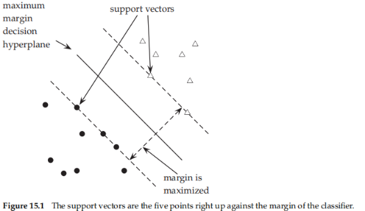

defifines the criterion$[15.1]$

* a decision surface that is maximally far away from any data point
* **margin** -> distance from the decision surface to the closest data point
* **support vectors** -> specified by a (usually small) subset of the data that defifines the position of the separator

good -> points near the decision surface represent very uncertain classifification decisions

* **safety margin** -> A slight error in measurement or a slight document variation will not cause a misclassifification

the memory capacity of the model has been decreased, and hence we expect that its ability to correctly generalize to test data is increased$[15.2]$

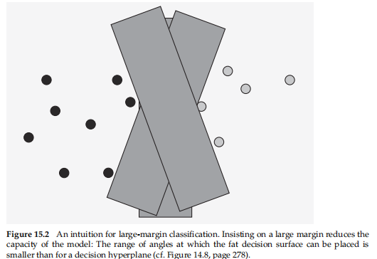

weight vector

> A decision hyperplane can be defined by an intercept term b and a decision hyperplane normal vector w, which is perpendicular to the hyperplane

SVMs, the two data classes are always named +1 and −1

linear classifier is then

* A value of −1 indicates one class
* a value of +1 the other class

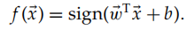

there is a problem with using this defifinition as is: **The value is underconstrained**, because we can always make the functional margin as big as we wish by simply scaling up w and b

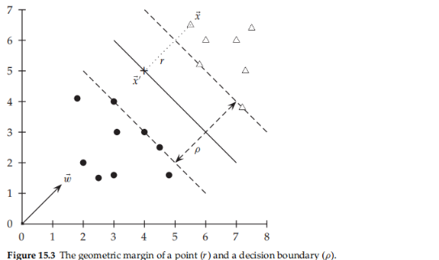

r -> the **Euclidean distance** from a point x to the decision boundary

the point on the hyperplane closest to x as x':

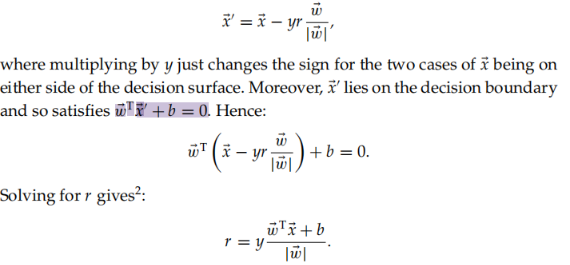

**geometric margin**->the maximum width of the band that margin can be drawn separating the support vectors of the two classes

**inherently normalized** by the length of w -> |w| = 1, making the geometric margin the same as the functional margin

**solving large SVMs** -> choose to require that the functional margin of all data points is at least 1 and that it is equal to 1 for at least one data vector

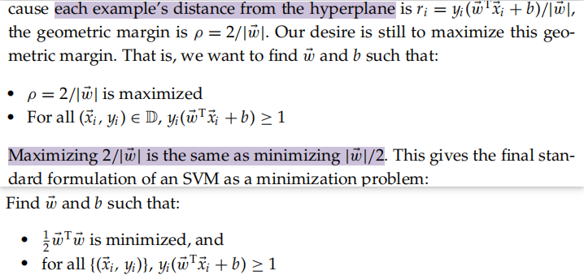

We are now optimizing a **quadratic function** subject to linear constraints

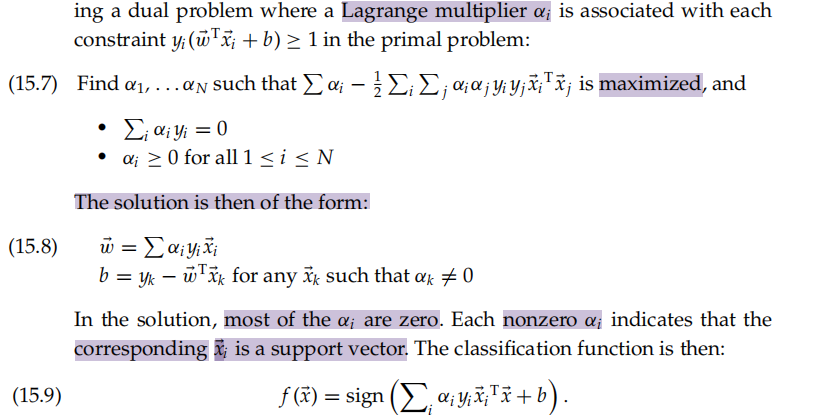

summary

> 1. The data set uniquely defines the best separating hyperplane, and we feed the data through a quadratic optimization procedure to fifind this plane
> 2. margin is constant, if the model includes dimensions from various sources, careful rescaling of some dimensions may be required
> 3. result can be "don't know"

## 15.2 Extensions to the support vector machine model

### 15.2.1 Soft margin classifification

high dimensional

* not linearly separable
* need ignoring a few weird noise documents

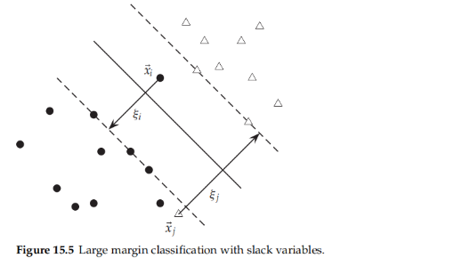

allow the fat decision margin to make a few mistakes

* **pay a cost for each misclassified example**, which depends on how far it is from meeting the margin requirement given in Equation (15.5)
* introduce **slack variables ξi**

  * A nonzero value for ξi allow $x_i$ to not meet the margin requirement at a cost proportional to the value of ξi

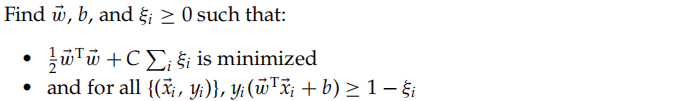

The **optimization problem** is then **trading off how fat** it can make the margin versus **how many** points have to be moved around to allow this margin

* Soft-margin SVMs minimize training error traded off against margin
* C -> regularization term, which provides a way to control **overfifitting**
  * large -> unattractive to not respect the data at the cost of reducing mthe geometric margin
  * small -> easy to account for some data points with the use of slack variables and to have a fat margin placed so it models the bulk of the data

The **dual problem for soft margin** classifification becomes

* the constant C bounding the possible size of the Lagrange multipliers for the support vector data points
* xi with nonzero αi will be the support vectors
* w is not needed explicitly for classifification -> dot products

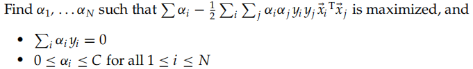

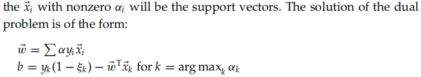

**slowdown -> the nonlinear case**

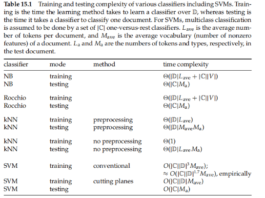

The **complexity of training and testing** with linear SVMs$[15.1]$

* the theoretical and empirical complexity varies depending on the **method** used to solve it
* In practice it can often be cheaper to materialize the higher order features and to **train a linear SVM**

### 15.2.2 Multiclass support vector machines

1. OVA

> been to build |C| one-versus-rest classififiers (commonly referred to as “one-versus-all” or OVA classifification),and to choose the class that classififies the test datum with greatest margin

2. one-versus-one classififiers

> build a set of one-versus-one classififiers, and to choose the class that is selected by the most classififiers.
>
> Although this involves building |C|(|C| − 1)/2 classifiers, the time for training classififiers may actually decrease, because the training data set for each classififier is much smaller.

3. the construction of multiclass SVMs

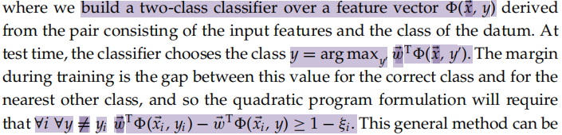

* **extended** to give a multiclass formulation of various kinds of linear classifiers
* a simple instance of a **generalization** of classifification
* belong to **structural SVMs**

### 15.2.3 Nonlinear support vector machines

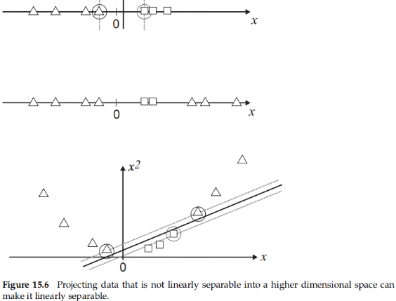

**not linearly separable**  approach$[15.6]$

> map the data onto a higher dimensional space and then to use a linear classififier in the higher dimensional space
>
> preserve relevant dimensions of relatedness between data points,so that the resultant classififier should still generalize well

**kernel trick**

* such a function that corresponds to **a dot product in some expanded feature space**

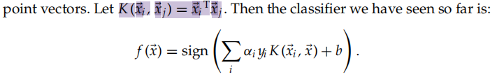

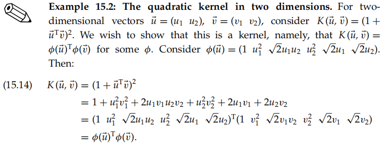

valid

* satisfy Mercer’s condition
* A kernel function K must be **continuous, symmetric, and have a positive definite gram matrix**

  * exists a mapping to a reproducing kernel Hilbert space

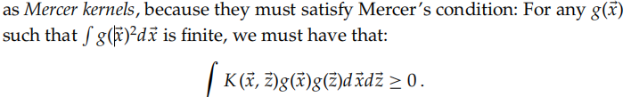

Otherwise, you can content yourself with knowing that 90% of work with kernels uses one of **two straightforward families of functions of two vectors**, which we define below, and which defifine valid kernels

* polynomial kernels

  * d = 1 is a linear kernel
  * d = 2 gives a quadratic kernel, and is very commonly used
* radial basis functions

  * A radial basis function (rbf) is equivalent to mapping the data into an infinite dimensional Hilbert space-> cannot illustrate the radial basis function concretely
* string kernels

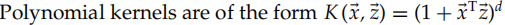

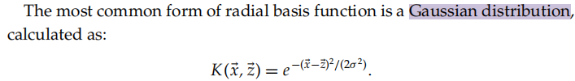

### 15.2.4 Experimental results

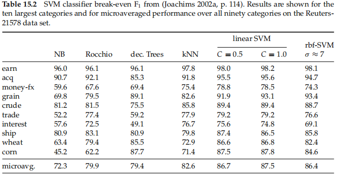

an SVM is a very **effective** text classifier$[13.6]$

* the strong reputation of SVMs for text
* working with simple term features can get one a long way
* extent to which different papers’ results for the same machine learning methods differ

## 15.3 Issues in the classification of text documents

It is frequently the case that greater performance gains can be achieved from **exploiting domain-specifific text features** than from changing from one machine learning method to another

### 15.3.1 Choosing what kind of classifier to use

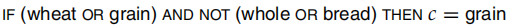

Often one of the biggest practical challenges in fielding a machine-learning classifier in real applications is **creating or obtaining enough training data**

* labeled training data
* hand-written rules->staff knowledgeable about the domain of the data(as below)

  * extra time has to go into maintenance of rules, as the content of documents in classes **drifts** over time
* classifier with high bias-> fairly little data

  * the quality of the model will be adversely affected by the limited training data
* semisupervised training methods

  * EM
  * bootstrapping
  * the system gets some labeled documents, and a further large supply of unlabeled documents over which it can attempt to learn
* **the practical answer is to work out how to get more labeled data as quickly as you can**

  * getting people to label all or a random sample of documents
  * active learning
    * a system that decides which documents a human should label is built
    * good documents to label to train one type of classififier often are not the good documents to label to train a different type of classifier

**much easier to do** by hand-writing a rule than by working out how to adjust the weights of an SVM without destroying the overall classifification accuracy

The general rule of thumb is that each doubling of the training data size **produces a linear increase** in classifier performance, but with very large amounts of data, the improvement becomes **sublinear**

### 15.3.2 Improving classififier performance

signifificant room for improving classifier effectiveness

* exploiting features specifific to the domain or document collection

#### Large and diffificult category taxonomies

many real classification problems consist of a very large number of often **very similar categories**

* hierarchical classification
* aggressive feature selection

get a small boost in classifification accuracy by **combining multiple classififiers**, provided only that the mistakes that they make are at least somewhat independent

* voting, bagging, and boosting multiple classififiers

run a classifier first, and to accept all its **high-confidence decisions**, but to put low confifidence decisions in a queue for manual review

* where the resulting training data is clearly **not randomly sampled** from the space of documents

#### Features for text

feature engineering

> for text classification, a great deal of mileage can be achieved by **designing additional features suited to a specifific problem**
>
> remain a human craft

it is often useful to **increase the number of features by matching parts of words**, and by matching selected multiword patterns that are particularly discriminative

**stemming and lowercasing**->it is **nevertheless useful** to note that such techniques have a more restricted chance of being useful for classifification,Overly aggressive stemming can easily **degrade** classifification performance

#### Document zones in text classifification

Text classifiers can usually **gain from making use of these zones** during training and classifification

* Upweighting document zones
* Separate feature spaces for document zones
* Connections to text summarization

## 15.4 Machine-learning methods in ad hoc information retrieval

### 15.4.1 A simple example of machine-learned scoring

**generalize the methodology of Section 6.1.2 (page 104) to machine learning of the scoring function**

the scoring function is **a linear combination of two factors**

* the vector space **cosine similarity** between query and document
  * on the statistics of query terms in the document as a bag of words
* the **minimum window width ω** within which the query terms lie
  * proximity weighting

be generalized to many more features

result$[15.3]$

$Scor e(d,q) = Scor e(α,ω) = aα + bω + c$

* coefficients **a, b, c to be learned from the training data**
* the function **Scor e(α, ω)** from Equation (15.17) represents a **plane “hanging above”** $[15.7]$
  * pick a value θ->if Scor e(α, ω) > θ we declare the document to be relevant||above the dashed line, relevant
* this line can be written as **a linear equation involving α and ω**, with two parameters (slope and intercept)
* disadcantage->
  * the ability to **maintain a suitably representative set of training examples**, whose relevance assessments must be made by experts

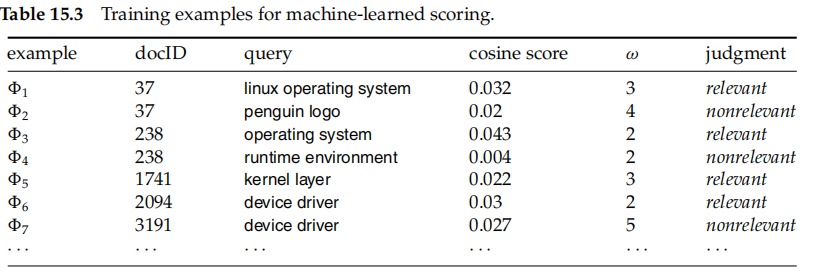

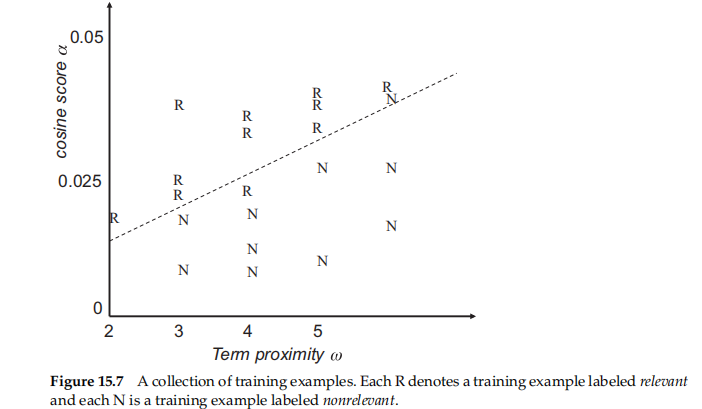

### 15.4.2 Result ranking by machine learning

extend

* functions of many more than two variables
* lots of other scores that are indicative of the relevance

Providing that these measures can be calculated for a training document collection with relevance judgments, **any number of such measures** can be used to train a machine-learning classifier

Issues of ranking are especially germane for web searches

* the slightly simpler **ranking SVM**

  * a set of judged queries
  * For each training query q, we have a set of documents returned in response to the query, which have been totally ordered by a person for relevance to the query
  * construct a vector of features **ψj = ψ(dj , q)**
  * For two documents di and dj , we then form the mvector of feature differences:

    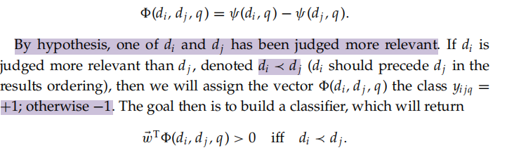
* This SVM learning task is formalized in a manner much like the other examples that we saw before

  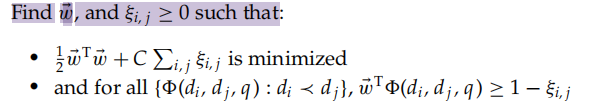
* only need to consider the constraint for document pairs ordered in one direction because ≺ is antisymmetric

  * build ranking functions which **outperform standard** hand-built ranking functions in IR evaluations on standard data sets

machine learning is not good at coming up with good **nonlinear scalings of basic measurements**. This area remains the domain of human feature engineering

## 15.5 References and further reading

