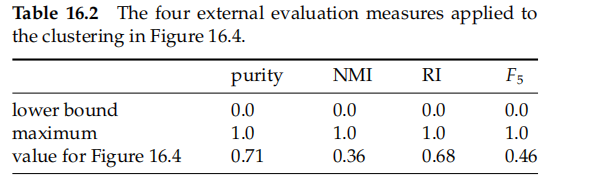

# 16 Flat clustering

Clustering algorithms group **a set of documents into subsets or clusters**

> create clusters that are coherent internally, but clearly different from each other

* form of unsupervised learning
  * there is no human expert who has assigned documents to classes
  * difference between clustering and classifification
* the **distribution and makeup** of the data that will determine cluster membership
* The key input to a clustering algorithm is **the distance measure**
  * an important means by which we can inflfluence the outcome of clustering

**hard and soft clustering algorithms**

* hard assignment
  * each document is a member of **exactly** one cluster
  * K-means
* soft clustering
  * a document’s assignment is **a distribution** over all clusters
  * EM

**Flat clustering and Hierarchical clustering**

* Flat clustering
  * creates a flflat set of clusters **without any explicit structure** that would relate clusters to each other
* Hierarchical clustering
  * creates a **hierarchy** of clusters

## 16.1 Clustering in information retrieval

The cluster hypothesis states the fundamental assumption we make when using clustering in information retrieval (IR)

> Cluster hypothesis. Documents in the same cluster behave similarly withbrespect to relevance to information needs.

shows some of the main **applications** of clustering in IR$[16.1]$

->differ in

* the set of documents that they cluster
* the aspect of an IR system

**search result clustering**

* by search results we mean the documents that were returned in response to a query
* search result clustering clusters the search results, so that **similar documents appear together**$[16.2]$

scatter-gather

* This process is **repeated until** a cluster of interest is found$[16.3]$
  * Scatter-gather clusters the whole collection to get groups of documents that the user can select or gather
  * The selected groups are merged and the resulting set is again clustered
* are **not as neatly** organized as a manually constructed hierarchical tree
* **finding descriptive labels** for clusters automatically is a diffificult problem

compute a static hierarchical clustering of a collection

* not inflfluenced by user interactions
* well suited for access to a collection of news

the cluster hypothesis directly for improving search results, based on a clustering of the entire collection

* use a standard inverted index to identify an initial set of documents that match the query, but we then **add other documents from the same clusters** even if they have low similarity to the query
* **increase recall**-> a group of documents with high mutual similarity is often relevant as a whole

language modeling

* avoid sparse data problems

speed up search

* The **cluster hypothesis** offers an alternative
* Find the **clusters** that are closest to the query and only consider documents from these clusters
* Within this much smaller set, we can compute similarities exhaustively and rank documents in the usual way

## 16.2 Problem statement

defifine the goal in hard flflat clustering as follows

> Given (i) a set of documents D = {d1, ... , dN}, (ii) a desired number of clusters K, and (iii) an objective objective function that evaluates the quality of a clustering, we want to comfunction pute an assignment γ : D → {1, ... , K} that minimizes (or, in other cases, maximizes) the objective function. In most cases, we also demand that γ is surjective, that is, that none of the K clusters is empty

The objective function -> **terms of similarity or distance between documents**

* For documents, the type of similarity we want is usually **topic similarity or high values** on the same dimensions in the vector space model
* approximate **topic similarity with cosine similarity or Euclidean distance** in vector space

> A note on terminology.
>
> An alternative defifinition of hard clustering is that a document can be a full member of more than one cluster. Partitional clustering always refers to a clustering where each document belongs to exactly one cluster.
>
> On the definition of hard clustering that permits multiple membership, the difference between soft clustering and hard clustering is that membership values in hard clustering are either 0 or 1, whereas they can take on any non-negative value in soft clustering

exhaustive clusterings

* each document to a cluster

nonexhaustive clusterings

* some documents will be assigned to no cluster
* each document is a member of either no cluster or one cluster->exclusive

### 16.2.1 Cardinality – The number of clusters

key

* **K**->determining the number of clusters or cardinality of a clustering
  * application puts constraints on the range of K
  * nothing more than a good guess based on experience or domain knowledge
* **find a good starting point**
  * most flat clustering algorithms refifine an initial partitioning iteratively
  * If the search starts at an unfavorable initial point, we may miss the global optimum

## 16.3 Evaluation of clustering

an **internal criterion** for the quality of a clustering

* high intracluster similarity (documents within a cluster are similar)
* low intercluster similarity (documents from different clusters are dissimilar)

internal criteria is direct evaluation in the application of interest

* expensive
* surrogate -> use a set of classes in an evaluation benchmark or gold standard

**external criterion** -> evaluates how well the clustering matches the gold standard classes$[16.2]$

###### Purity

* simple and transparent
* [0,1] -> bad<->good
* cannot use purity to **trade off the quality of the clustering against the number** of clusters

###### Normalized mutual information

* be information-theoretically interpreted
* make this tradeoff -> the quality of the clustering against the number
* I -> measures the **amount of information by which our knowledge about the classes increases** when we are told what the clusters are
  * random->0
* The normalization by the denominator fixes this problem -> e**ntropy tends to increase with the number of clusters**
* NMI->[0,1]

###### Rand index

* penalizes both **false-positive and false-negative** decisions during clustering
* gives **equal weight** to FPs and FNs

$RI=\frac{TP+TN}{TP+FP+FN+TN}$

###### The F measure

* in addition **supports differential weighting of these two types of errors**->FPs and FNs
* strongly than FPs by selecting a value β > 1, thus giving more weight to recall

## 16.4 K-means

> goal -> **minimize the average squared Euclidean distance** of documents from their cluster centers where a cluster center is defined as the mean or centroid µ of the documents in a cluster ω

* The ideal cluster in K-means is **a sphere with the centroid as its center of gravity**
* the clusters should **not overlap**

evaluation -> minimize **the residual sum of squares or RSS**

show that **K-means converges by proving that RSS monotonically decreases in each iteration**

* RSS decreases in the reassignment step
* it decreases in the recomputation step because the new centroid is the vector v for which RSSk reaches its minimum

Because there is only a finite set of possible clusterings, a monotonically decreasing algorithm will eventually **arrive at a (local) minimum**

* need break ties consistently

no guarantee that a global minimum in the objective function will be reached

* specially set contains many outliers$[16.7]$

Another type of suboptimal clustering that frequently occurs is one with **empty clusters**

Effective heuristics for seed selection include

(i) **excluding outliers** from the seed set

(ii) trying out **multiple starting points** and choosing the clustering with lowest cost

(iii) obtaining seeds from **another method such as hierarchical clustering**

the time complexity

* compute vector distance ->  O(KNM)
* recomputation step -> O(NM)
* a fixed number of iterations I -> O(IKNM)

> K-means is linear in **all relevant factors**: iterations, number of clusters, number of vectors, and dimensionality of the space
>
> more effificient than the hierarchical algorithms

speed up

* heuristics for making centroid–document similarities
* Truncating centroids to **the most significant k** terms hardly decreases cluster quality
* addressed by **K-medoids**
  * computes medoids instead of centroids as cluster centers

### 16.4.1 Cluster cardinality in K-means

the number of clusters K

* select **the optimal value of K** according to the objective function
  * but reaches its minimum 0 for K = N where N is the number of document
* heuristic method -> **estimate** $RSS_{min}(K)$
  * perform i (e.g., i = 10) clusterings with K clusters$[16.8]$

    * compute the RSS of each
  * take minimum of the i RSS values

    * denote this minimum byRSSmin(K)
  * K increases

    * find the **“knee” in the curve**
* but There is seldom a single best number of clusters
  * need to employ an **external constraint to choose** from a number of possible values of K

A second type of criterion for cluster cardinality **imposes a penalty for each new cluster**

* create a generalized objective function that combines two elements

  * distortion
  * model complexity
* K-means, we then get this selection criterion for K

  * λ is a **weighting factor**
  * λ = 0, there is no penalty for more clusters and K = N is the best solution
* problem -> determine λ

  * choose values of λ that have worked well for similar data sets in the past

**Akaike information criterion or AIC** ->A theoretical justification for Equation

> an information-theoretic measure that trades off distortion against model complexity

* −L(K), the negative maximum log-likelihood of the data for K clusters
  * measure of model complexity
* q(K), the number of parameters of a model with K clusters
  * measure of distortion

AIC provides **a theoretical justification** for one particular way of weighting these two factors, distortion and model complexity, when selecting a model

For K-means, the AIC can be stated

* a special case of Equation (16.11) for λ = 2M
* L(K) = −(1/2)RSSmin(K)

The derivation of AIC is based on **a number of assumptions**

* data are independent and identically distributed
* only approximately true for data sets in information retrieval

## 16.5 Model-based clustering

a generalization of K-means->the EM algorithm

* can be applied to a larger variety of document representations and distributions than K-means

generate a document in this model consists of

* picking **a centroid at random** and then adding some **noise**
  * If the noise is normally distributed, this procedure will result in clusters of spherical shape
* **Model-based clustering** assumes that the data were generated by a model and tries to recover the original model from the data
  * defifines clusters and an assignment of documents to clusters

* L(D|O) is the objective function that measures the goodness of the clustering
  * choose higher one

> EM clustering is **an iterative algorithm that maximizes** L(D|O )
>
> applied to many different types of probabilistic modeling

* the document representation of the multivariate Bernoulli is **a vector of M Boolean values**

infer the parameters of the clustering from the data

* it alternates between **an expectation step** and and a **maximization step**
  * the expectation step is nothing else but **Bernoulli Naive Bayes classifification**

The EM clustering algorithm$[16.3][16.4]$

* clustered a set of eleven documents into two clusters using EM in Table 16.3
* convergence in **iteration 25**

problem->

**Finding good seeds** is even more critical for EM than for K-means->local optima

* the initial assignment of documents to clusters is often computed by a **different algorithm**
* a hard K-means clustering

## 16.6 References and further reading

