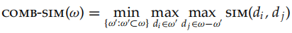

# 17 hierarchical clusering

Hierarchical clustering outputs a hierarchy

> a structure that is more informative than the unstructured set of clusters returned by flflat clustering

* not require us to prespecify the number of clusters
* deterministic
* lower effificiency
  * at least quadratic in the number of documents compared

agglomerative hierarchical clustering__differ in the similarity measures they employ

* single-link
* complete-link
* group-average
* centroid similarity

There are **few differences** between the applications of flflat and hierarchical clustering in information retrieval

## 17.1 Hierarchical agglomerative clustering

Hierarchical clustering algorithms-> either top-down or bottom-up

HAC-> Bottom-up hierarchical clustering

* treat each document as a singleton cluster**** at the outset and then **successively merge** (or agglomerate) pairs of clusters until all clusters have been merged into a single cluster that contains all documents
* visualized as a **dendrogram**$[17.1]$

  * defifine the combination similarity of a singleton cluster as its **document’s self-similarity** (which is 1.0 for cosine similarity)
* a dendrogram allows us to **reconstruct the history** of merges that resulted in the depicted clustering
* **the merge operation is monotonic**

  * A nonmonotonic hierarchical clustering contains at least **one inversion si < si+1**
* not require a prespecified number of clusters, needs to **be cut at some point**

  * Cut at a prespecifified level of similarity
  * Cut the dendrogram where the gap between two successive combination similarities is largest
  * Apply Equation
  * **prespecify the number of clusters K** andselect the cutting point that produces K clusters

A simple, naive HAC algorithm$[17.2]$

* the two most similar clusters are merged and the rows and columns of the merged cluster i in C are **updated**
* refine this algorithm for **the different similarity measures**$[17.3]$

## 17.2 Single-link and complete-link clustering

single-link clustering

* the similarity of two clusters is **the similarity of their most similar members**
* local

complete-link clustering

* the similarity of **their most dissimilar members**
* nonlocal
* disadvantage -> **A single document** far from the center can increase diameters of candidate merge clusters dramatically and completely change the fifinal clustering

depicts a single-link and a complete-link clustering of eight document$[17.4]$

Both single-link and complete-link clustering have **graph-theoretic interpretations**

* A **connected component** is a maximal set of connected points such that there is a path connecting each pair
* A **clique** is a set of points that are completely linked with each other

> Define sk to be the combination similarity of the two clusters merged in step k, and G(sk ) the graph that links all data points with a similarity of at least sk . Then the clusters after step k in single-link clustering are the connected components of G(sk ) and the clusters after step k in complete-link clustering are maximal cliques of G(sk ).

Single-link

* at step k are maximal sets of points that are linked via at least one link (a single link) of similarity **s ≥ sk**

complete-link

* at step k are maximal sets of points that are completely linked with each other via links of similarity **s ≥ sk**

**chaining**

> the merge criterion is strictly local, a chain of points can be extended for long distances without regard to the overall shape of the emerging cluster

**avoid chaining**

but **pays too much attention to outliers**

### 17.2.1 Time complexity

The complexity of the **naive HAC algorithm** in Figure 17.2 is **O(N3)**

priority-queue algorithm -> **O(N2 log N)**

The argument of EfficientHAC is a set of vectors because group-average agglomerative clustering and centroid clustering **require vectors as input**

For single link, we can introduce a **next-best-merge array (NBM)** as a further optimization$[17.9]$

* cannot for others
  * only single-link clustering is **best-merge persistent**
  * best-merge persistence does not hold for complete-link clustering$[17.10]$
* NBM keeps **track of what the best merge is for each cluster**
* the overall complexity of single-link clustering is O(N2)

All four HAC algorithms in this chapter are **O(N2) with respect to similarity computations**

* not a concern ofr choosing

## 17.3 Group-average agglomerative clustering

GGAC

> evaluates cluster quality based on **all similarities between documents**, thus avoiding the pitfalls of the single-link and complete-link criteria, which equate cluster similarity with the similarity of a single pair of documents
>
> But **self-similarities** are not included in the average

* two clusters ωi and ωj as the next merge in HAC
  * resulting merge cluster ωk = ωi ∪ ωj should be **coherent**
* need to look at all document–document similarities within ωk , including those that occur within ωi and those that occur within ωj

The term (Ni + Nj) on the right is the sum of Ni + Nj self-similarities of value 1.0

* compute the function Sim on lines 18 and 20 in EffificientHAC **in constant time**

**single-link/complete-link clustering**

* only require a square matrix of similarities as input and do not care how these similarities were computed

**GAAC require**

* documents represented as vectors
* length normalization of vectors, so that self-similarities are 1.0
* the dot product for computing the similarity between vectors and sums of vector

define group-average similarity **as including self-similarities:**

* Self-similarities are always **equal to 1.0**, the maximum possible value for length-normalized vectors

## 17.4 Centroid clustering

centroid clustering

* the similarity of two clusters is defifined as the similarity of **their centroids**

the difference between GAAC and centroid clustering

* GAAC considers **all pairs of documents** in computing average pairwise similarity
* centroid clustering **excludes pairs from the same cluster**

the first three steps of a centroid clustering$[17.11]$

In contrast to the other three HAC algorithms, centroid clustering is **not inversion monotonic**$17.12$

* Similarity increases in this sequence of two clustering steps
* **Increasing similarity** in a series of HAC clustering steps **contradicts** the fundamental assumption that small clusters are more **coherent** than large clusters
* but centroid clustering **is often used** because its similarity measure

## 17.5 Optimality of hierarchical agglomerative clustering

> **combination similarity** for the three non-inversion algorithms can be read off from the cluster without knowing its history

These direct definitions of combination similarity are as follows

#### single-link

The combination similarity of a cluster ω is **the smallest similarity of any bipartition of the cluster**, where the similarity of a bipartition is the largest similarity between any two documents from the two parts

each <ω' , ω − ω'> is a possible bipartition of ω

#### complete link

The combination similarity of a cluster ω is **the smallest similarity of any two points in ω**:

#### GAAC

The combination similarity of a cluster ω is **the average of all pairwise similarities in ω**

We can now **prove** the optimality of single-link clustering by **induction over the number of clusters K**

the merge criteria of complete-link clustering and GAAC **approximate the desideratum of approximate sphericity** better than the merge criterion of single-link clustering

recommend GAAC for document clustering

* two exceptions to this recommendation
* for **nonvector representations**-> complete-link method
* not to create a complete **hierarchy or exhaustive partition** of the entire document set

> it is generally the method that produces the clustering with the best properties for applications. It does not suffer from chaining, from sensitivity to outliers and from inversions

single-link clustering is a good choice for duplicate detection

## 17.6 Divisive clustering

top-down-> top-down clustering or divisive clustering

> We start at the top with all documents in one cluster. The cluster is split using a flat clustering algorithm
>
> This procedure is applied recursively until each document is in its own singleton cluster

* conceptually more **complex**
* more **efficient**-> linear in the number of documents and clusters
* divisive algorithms produce **more accurate hierarchies** than bottom-up algorithms in some circumstances
  * Top-down clustering benefifits from complete information about the global distribution when making top-level partitioning decisions

## 17.7 Cluster labeling

**Differential cluster labeling**

* A combination of a differential test with a penalty for rare terms often gives the best labeling results

> selects cluster labels by comparing the distribution of terms in one cluster with that of other clusters
>
> **MI and the χ2** test identify cluster labels that characterize one cluster in contrast to other clusters

apply three labeling methods to a K-means clustering$[17.2]$

**Cluster-internal labeling**

* computes a label that solely depends on the cluster itself
* contain important context
* easier to read
* play a role similar to a title
* effificient
* **fail to distinguish terms** that are frequent in the collection as a whole from those that are frequent only in the cluster

another problem For hierarchical clustering

> distinguish an internal node in the tree from its siblings, but also from its **parent and its children**

ans

> more complex criteria, **based on a combination of overall collection frequency and prevalence in a given cluster**, can determine whether a term is a more informative label for a child node or a parent node

## 17.8 Implementation notes

In low dimensions

* **more aggressive optimizations are possible** that make the computation of most pairwise similarities unnecessary

using GAAC on a large document set in **high dimensions**

* take care to **avoid dense centroids**
* ans

  * truncating centroids
  * representing clusters by means of sparse medoids instead of dense centroids

For such **large sets**, HAC can only **be used in combination with a flat clustering algorithm** like K-means

* **Buckshot algorithm**: employ an HAC algorithm to compute seeds of high quality
* combines the determinism and higher reliability of HAC with the effificiency of K-means

## 17.9 References and further reading

