# 18 Matrix decompositions and latent semantic indexing

latent semantic indexing

* construct a low-rank approximation to the term-document matrix

## 18.1 Linear algebra review

none

## 18.2 Term–document matrices and singular value decompositions

C->MXN

U->MXM -> $CC^T$

V->NXN -> $C^TC$

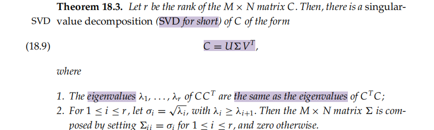

The values σi are referred to as **the singular values of C**

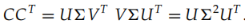

the **entry (i, j)** in $CC^T$ is the number of documents in which **both term i and term j occur**

**the reduced SVD or truncated SVD**

> When writing down the numerical values of the SVD, it is conventional to represent  as an r × r matrix with the singular values on the diagonals, because all its entries outside this submatrix are zeros

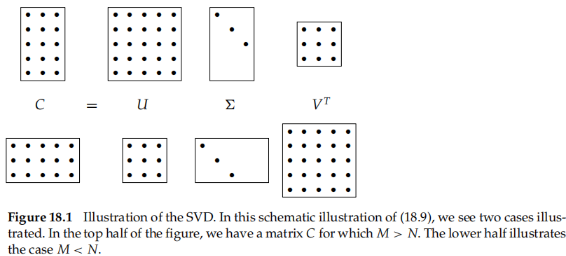

## 18.3 Low-rank approximations

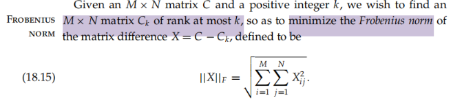

the **Frobenius** norm of **X measures the discrepancy between Ck and C**

**Ck as a low-rank approximation** -> k is far smaller than r

solve -> by SVD

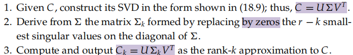

this procedure yields the matrix of rank k with the lowest possible Frobenius error

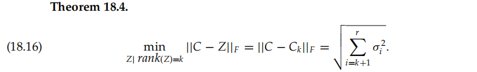

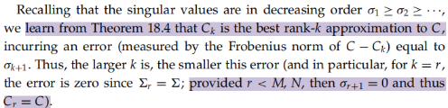

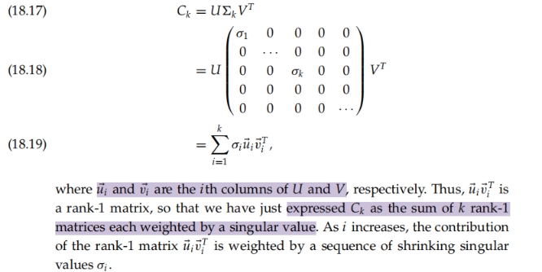

## 18.4 Latent semantic indexing18.4 LS

**LSI**

1. the approximation of a term-document matrix C by one of lower rank using the SVD
2. The low-rank approximation to C yields a new representation for each document in the collection
3. compute query-document similarity scores in this low-rank representation

aim at

* **synonymy and polysemy**
* use the **co-occurrences** of terms to capture the latent semantic associations of terms

we use the **SVD** to construct **a low-rank approximation Ck** to the term–document matrix

* a value of k that is far smaller than the original rank of C
* k -> the low hundreds
* **defined by the k principal eigenvectors (corresponding to the largest eigenvalues) of CCT and CTC**
* the matrix $C_k$ is itself still **an M × N matrix**, irrespective of k
* use the new k-dimensional LSI representation to compute similarities between vectors

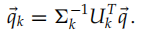

A query vector q is **mapped into its representation in the LSI** space by the transformation

* also can be  a new document
  * allows us to incrementally add documents to an LSI representation
  * disadvantage -> **the quality of the LSI representation will degrade** as more documents are added and will eventually **require a recomputation** of the LSI representation

This has **a signifificant computational cost**, when compared with the cost of processing q in its native form

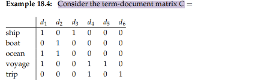

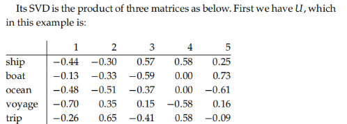

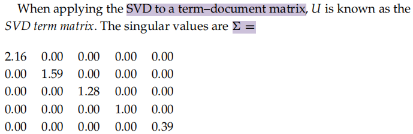

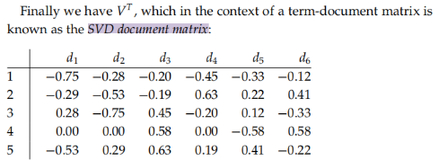

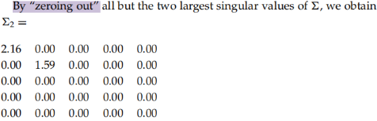88

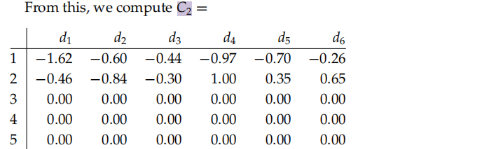

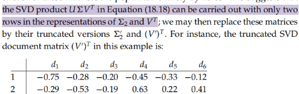

the documents in $(V')^T$ in two dimensions$[18.3]$

* C2 is dense relative to C

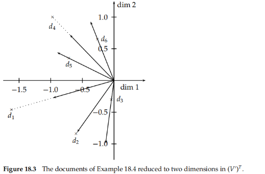

**constrained optimization problem**

* view the low-rank approximation of C by Ck
* This intuition suggests, then, that not only should retrieval quality not suffer too much from the dimension reduction, but in fact may improve

some conclusions

* The **computational** cost of the SVD is **significant**
* As we reduce k, **recall** tends to increase, as expected
* Most surprisingly, a value of k in the low hundreds can actually increase precision on some query benchmarks
* LSI works best in applications where there is **little overlap** between queries and documents

disadvantage

* no good way of expressing **negations**
* no way of enforcing **Boolean conditions**

LSI can be viewed as **soft clustering**

> interpreting each dimension of the reduced space as a cluster and the value that a document has on that dimension as its fractional membership in that cluster.

## 18.5 References and further reading

