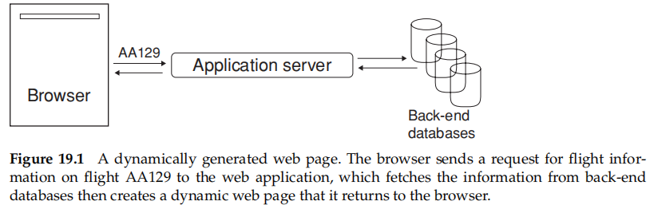
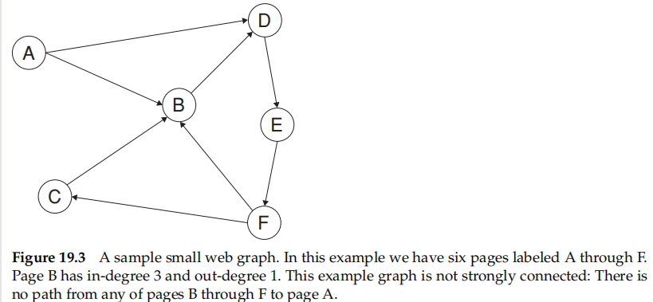
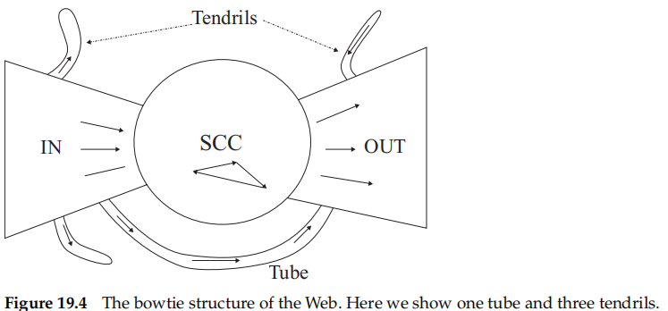
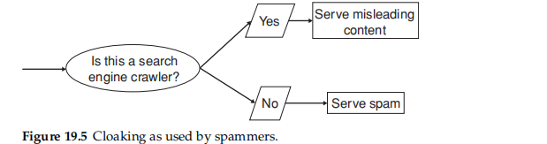
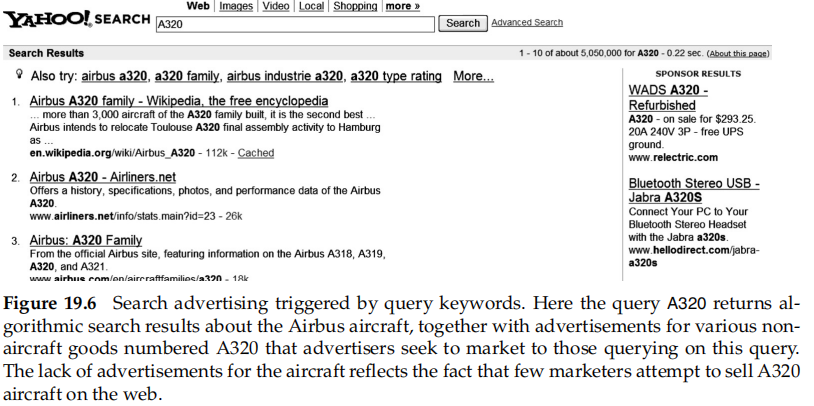
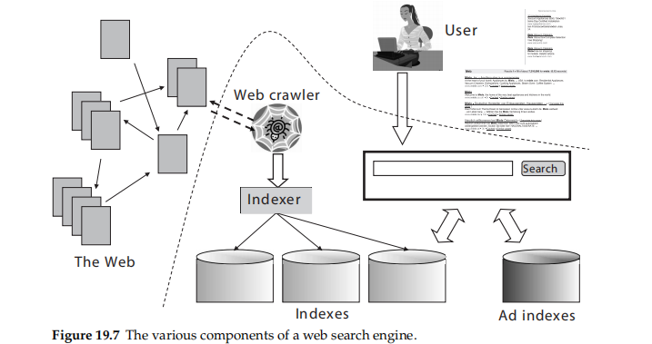
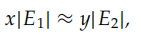
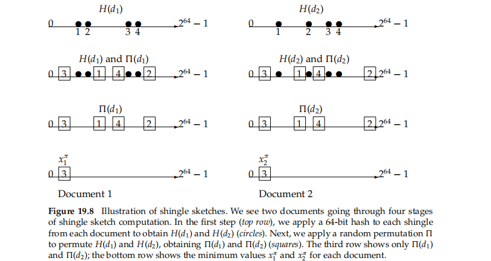
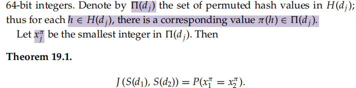
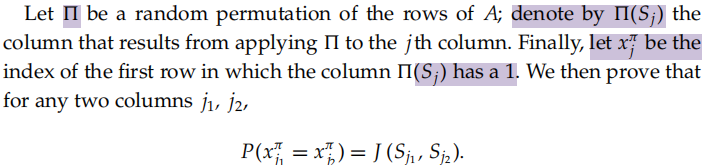

# 19 web search basics

## 19.1 Background and history

web search **different – and generally far harder** – than searching “traditional” documents

challenge

* on the challenge of **scale**
* gauge the **authoritativeness** of a document based on cues

## 19.2 Web characteristics

decentralized content publishing with essentially no central control of authorship

**consisted entirely of images** and therefore, no indexable text

tremendous variation in grammar and style

The democratization of content creation on the web meant a new level of granularity in opinion on virtually any subject

* assign such a measure of trust

### 19.2.1 The web graph

> view the static Web consisting of static HTML pages together with the hyperlinks between them as a directed graph in which e**ach web page is a node and each hyperlink a directed edge**

in-link-> in-degree

out-link-> out-degree

**not randomly distributed**

* widely reported to be **a power law**
* in-degree i is proportional to 1/{i^α}
* has a bowtie shape$[19.4]$

  * in several studies IN and OUT are roughly equal in size,
  * SCC is somewhat larger
  * **tubes** -> are small sets of pages outside SCC that lead directly from IN to OUT
  * **tendrils** -> either lead nowhere from IN, or from nowhere to OUT

### 19.2.2 Spam

> the manipulation of web page content for the purpose of appearing high up in search results for selected keywords

cloaking$[19.5]$

> it stems from the fact that the relationship between page publishers and web search engines is not completely collaborative
>
> returns **different pages depending** on whether the http request comes from a web search engine’s crawler

doorway page

> contains **text and metadata carefully chosen to rank highly** on selected search keywords

**adversarial information retrieval**

* link analysis -> link spam

## 19.3 Advertising as the economic model

CPM model__cost per mil

CPC model__cost per click

sponsored search or search advertising

two kinds of search engine

* the “pure” search engines
* the sponsored search engines
* **combine**__provide pure search results as the primary response to a user’s search, together with sponsored search results displayed separately and distinctively to the right of the algorithmic results

click spam

> Search engines face the challenge of discerning which of the clicks they observe are part of a pattern of click spam, to **avoid charging their advertiser clients for such clicks**

## 19.4 The search user experience

Google identified two principles that helped it to grow at the expense of its competitors:

* Afocus on relevance, specifically precision rather than recall in the first few results
  * simply to save users time in locating the information they sought
* a user experience that is lightweight, meaning that both the search query page and the search results page are uncluttered and almost entirely textual, with very few graphical elements
  * provide a user experience that is extremely responsive

### 19.4.1 User query needs

common web search

* Informational queries
  * seek general information on a broad topic
* Navigational queries
  * seek the website or home page of a single entity that the user has in mind
* transactional query
  * s a prelude to the user performing a transaction on the Web

## 19.5 Index size and estimation

**Given two search engines, what are the relative sizes of their indexes?** Even this question turns out to be imprecise, for the following reasons.

* In response to queries, a search engine can return web pages whose contents it has not (fully or even partially) indexed
* Search engines generally organize their indexes in various tiers and partitions, not all of which are examined on every search

assumption

* each search engine indexes a fraction of the Web chosen independently and uniformly at random

some questionable assumptions

* that there is a **finite size** for the Web from which meach search engine chooses a subset
* each engine chooses an **independent, uniformly chosen subset**

capture–recapture method__a classical estimation technique

* give us an **unbiased estimator** for |E1|/|E2|

> Suppose that we could **pick a random page from the index of E1 and test whether it is in E2’s index** and symmetrically, test whether a random page from E2 is in E1.
>
> These experiments give us **fractions x and y** such that our estimate is that a fraction x of the pages in E1 are in E2, while a fraction y of the pages in E2 are in E1.
>
> Then, letting **|Ei| denote the size of the index of search engine Ei** , we have

Unfortunately, picking a web page uniformly at random is a difficult problem->ans

* **Random searches**

  * Begin with a search log of web searches; send a random search from this log to E1 and a random page from the results
  * has a number of issues, including the bias from the types of searches made by the work group
* **Random IP addresses**

  * many hosts might share one IP or not accept http requests from the host where the experiment is conducted
* **Random walks**

  * the Web is not strongly connected
  * the time it takes for the random walk to settle into this steady state is unknown
* **random queries**

  * noteworthy

    * successfully built upon for a series of increasingly refifined estimates
    * turned out to be the approach most likely to be misinterpreted and carelessly implemented
  * idea

    * pick a page (almost) uniformly at random from a search engine’s index by **posing a random query to it**
  * problem

    * amassing a sample web dictionary

> We use **a random conjunctive query** on E1 and pick from the top 100 returned results a page p at random. We then test p for presence in E2 by choosing six to eight low-frequency terms in p and using them in a conjunctive query for E2. We can improve the estimate by repeating the experiment a large number of times

Both the sampling process and the testing process have a number of issues

* Our sample is **biased toward longer documents**
* Picking from the top 100 results of E1 induces **a bias** from the ranking algorithm of E1 ||Picking from all the results of E1 makes the experimentslower
* During the **checking phase**, a number of additional biases are introduced
* Either E1 or E2 may **refuse to respond to the test queries**, treating them as robotic spam rather than as bona fide queries
* There could be **operational problems** like connection time outs

there is **no perfect solution** yet, but the level of sophistication in statistics for understanding the biases is increasing

**document random walk sampling**

> a document is chosen by a random walk on a virtual graph derived from documents
>
> The graph is never instantiated->
>
> rather, **a random walk on it can be performed** by moving from a document d to another by picking a pair of keywords in d, running a query on a search engine and picking a random document from the results

## 19.6 Near-duplicates and shingling

**duplication**

* keep down storage and processing overheads

ans

* **fingerprint** but not apple to **near duplication**
* **shingling**$[19.8]$
  * S(dj) denote the set of shingles of document dj

> a positive integer k and a sequence of terms in a document d, define the k shingles of d to be the set of all consecutive sequences of k terms in d
>
> Intuitively, **two documents are near duplicates** if the sets of shingles generated from them are nearly the same

Jaccard coeffificient

* S(d1) and S(d2) as |S(d1) ∩ S(d2)|/|S(d1) ∪ S(d2)|

add -> hash

* **detect document pairs whose sets H() have large Jaccard overlaps**
* **π** be a random permutation from the 64-bit integers to the 64-bit integers

proof

> We give the proof in a slightly more general setting:
>
> Consider a family of sets whose elements are drawn from a common universe
>
> View the sets as columns of a matrix A, with one row for each element in the universe
>
> The element ai j = 1 if element i is present in the set Sj that the jth column represents

our test for the Jaccard coeffificient of the shingle sets is **probabilistic**

> we compare **the computed values xiπ** from different documents.
>
> If a pair coincides, we have candidate near duplicates. Repeat the process independently for **200 random permutations** π (a choice suggested in the literature). Call the set of the 200 resulting values of xiπ the sketch ψ(di) of di . We can then estimate the Jaccard coeffificient for any pair of documents di , dj to be **|ψi ∩ ψj|/200**
>
> if this **exceeds a preset threshold**, we declare that di and dj are similar

optimate

* use **fgerprints** to remove all but one copy of identical documents
* remove **common HTML tags and integers** from the shingle computation
* use a **union-find** algorithm to create clusters that contain documents that are similar
* **cuts down the space** needed in the computation

## 19.7 References and further reading

