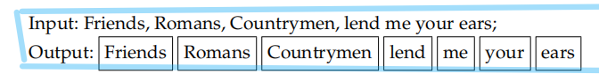
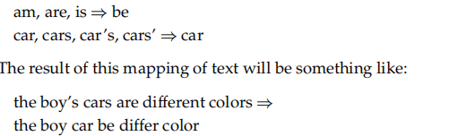
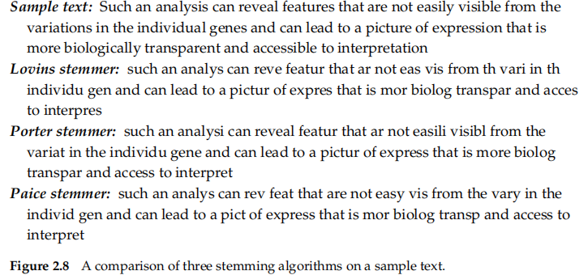
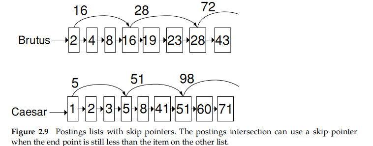
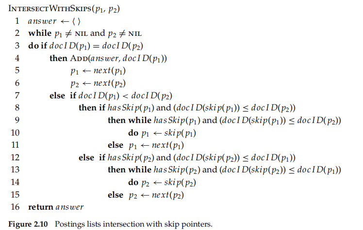
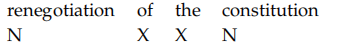
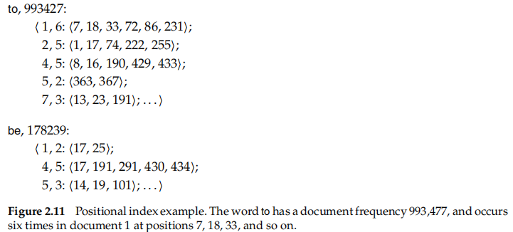
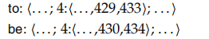
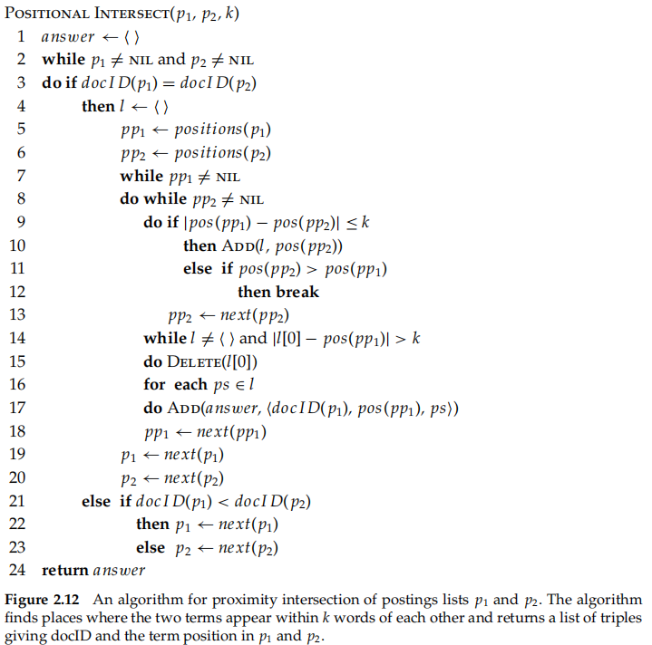

## The term vocabulary and postings lists

**Tokenization** is the process of chopping character streams into tokens

**linguistic preprocessing** then deals with building equivalence classes of tokens

## 2.1 Document delineation and character sequence decoding

### 2.1.1 Obtaining the character sequence in a document

* first step: determine thecorrect encoding
* second step : convert this byte sequence into a linear sequence of characters_classifification

  * save the choice of encoding
* Even for plain text documents, additional decoding may need to be done
* Finally, the textual part of the document may need to be extracted out of other material that will not be processed.

writing systems

* not all is a linear sequence of characters
* Arabic_two-dimensional and mixed-order
* but an essentially linear structure remains

### 2.1.2 Choosing a document unit

the issue of **indexing granularity**

* **a precision/recall tradeoff**
  * If the units get too small, we are likely to miss important passages
  * if units are too large we tend to get spurious matches and the relevant information is hard for the user to find
* alleviate : use of explicit or implicit **proximity search**
* An information retrieval (IR) system should be designed to **offer choices of granularity**

## 2.2 Determining the vocabulary of terms

### 2.2.1 Tokenization

tokenization

* chop it up into pieces
* throw away certain characters, such as punctuation
* token

  * a sequence of characters in some particular document that are grouped together as a useful semantic unit for processing
* type

  * the class of all tokens term containing the same character sequence
* term

  * a (perhaps normalized) type that is included in the IR system’s dictionary

the correct tokens to use

* there are a number of **tricky cases**
  * the various uses of the apostrophe for possession and contractions
  * deal with:split on all nonalphanumeric characters
* a sequence of characters in a text will always match the same sequence typed in a query
  * These issues of tokenization are language specifific
    * Language identifification
    * based on classifiers that use short character subsequences as features
* **unusual specifific tokens** that we wish to recognize as terms
* English
  * **hyphenation**__a classifification problem, heuristic rules
  * **splitting on white space** can also split what should be regarded as a single token
    * The problems of hyphens and nonseparating whitespace can even interact.
* Each new language presents some new issues
  * French
  * German
  * Chinese

### 2.2.2 Dropping common terms: stop words

* stop words : of little value
  * determining a stop list is to sort the terms by**collection frequency**
  * the members of which are then **discarded** during indexing
  * Some special query types are disproportionately affected
* The general trend in IR systems over time has been from standard use of quite large stop lists (200–300 terms) to very small stop lists (7–12 terms) to no stop list whatsoever.
* the design of modern IR systems has focused precisely on how we can **exploit the statistics of language** so as to be able to cope with common words in better ways
* So for most modern IR systems, the additional cost of including stop words is not that high – either in terms of index size or in terms of query processing time.

### 2.2.3 Normalization (equivalence classing of terms)

**Token normalization** is the process of canonicalizing tokens so that matches occur despite superfificial differences in the character sequences of the tokens.

* method: implicitly create equivalence classes
* advantage: the equivalence classing to be done is implicit\easy to write rules of this sort that remove characters
* disadvantage: it is not obvious when you might want to add characters
* another method : maintain relations between unnormalized tokens->lists of synonyms

  * index unnormalized tokens and to maintain a query expansion list of multiple vocabulary entries to consider for a certainquery term
  * perform the expansion during index construction
* Use of either of these methods is considerably **less effificient** than equivalence classing, because there are more postings to store and merge.
* the increased flexibility that comes from distinct postings lists **is appealing more flexible than equivalence classes** because the expansion lists can overlap while not being identica

The best amount of equivalence classing or query expansion to do is a fairly open question.

Accents and diacritics

* This can be done by **normalizing tokens to remove diacritics**.
* words are distinguished only by their accents : it might be best to equate all words to a form withoutdiacritics

Capitalization/case-folding

* do case-folding by reducing all letters to lower case__equate words that might better be kept apart
* make some tokens lowercase__truecasing
* lowercasing everything often remains the most practical solution

Other issues in English

* idiosyncratic and particular to English

Other languagesare quite

* present distinctive issues in equivalence classing
* Document collections being indexed can include documents from many different languagesrun
  * a language identifification classififier on documents and then to tag terms in the vocabulary for their language
* the spelling may be unclear or there may be variant transliteration standards giving different spellings
  * the Soundex algorithm

### 2.2.4 Stemming and lemmatization

different forms of a word

families of derivationally related words with similar meanings

* aim : reduce inflflectional forms and sometimes derivationally related forms of a word to a common base form
* Stemming:a crude heuristic process
  * commonly collapses derivationally related words
* Lemmatization:the use of a vocabulary and morphological analysis of words
  * ans:lemma
  * collapses the different inflflectional forms of a lemma
* achieve: an additional plug-in component

Stemmers:

* Porter’s algorithm（five phases）：www.tartarus.org/˜martin/PorterStemmer/
  * use a concept of the measure of a word
  * five phases
* www.cs.waikato.ac.nz/˜eibe/stemmers/
* www.comp.lancs.ac.uk/computing/research/stemming/

the exact stemmed form does not matter, only **the equivalence classes** it forms.

lemmatizer

* full **morphological analysis** to accurately identify the lemma for each word

Stemming increases recall while harming precision

* particular inflflectional forms are used in particular collocations

Getting better value from term normalization depends more on pragmatic issues of word use than on formal issues of linguistic morphology.

The situation is different for languages with much more morphology

## 2.3 Faster postings list intersection via skip pointers

process postings list intersection in sublinear time

* case: the index isn't changing too fast
* use **a skip list** by augmenting postings lists with skip list skip pointers (at indexing time)
  * where to place skip pointers
    * a tradeoff
    * A simple heuristic : a postings list of length P, **use √P** evenly spaced skip pointers
  * how to do effificient merging using skip pointers
* A number of variant versions of postings list intersection with skip pointers is possible depending on when **exactly you check the skip pointer**
* the presence of skip pointers only **helps for and queries**, not for or queries.
* A malicious deletion strategy can render skip lists ineffective__**for static**
* Choosing the optimal encoding for an inverted index is an ever-changing game
  * dependent on underlying computer technologies and their relative speeds and sizes

## 2.4 Positional postings and phrase queries

support **a double quotes phrase syntax** (“stanford university”) for **phrase queries** or for **implicit** phrase queries

### 2.4.1 Biword indexes

* consider every pair of consecutive terms in a document as a phrase__treat each of these biwords as a vocabulary term

  * The query stanford university palo alto can be broken into the Boolean query on biwords:
  * “stanford university” and “university palo” and “palo alto”
* work fairly well in practice but occasional false positives
* related nouns can often **be divided** from each other by various function words

  * tokenize the text and perform part-of-speech tagging
  * deem any string of terms of the form **NX*N** to be an extended biword
  * 
  * need to also parse it into Ns and Xs, and then **segment the query into extended biwords**
  * does not always work in an intuitively optimal manner
* phrase index： The concept of a biword index can be extended to longer

  * the chance of **a false-positive match** on indexed phrases oflength three or more becomes very **small**
  * greatly expand the vocabulary size

### 2.4.2 Positional indexes

a positional index__each **position** is a token index in the document, also usually record **the term frequency**

* start with **the least frequent term**
* working out **offsets**

  * checking that both terms are in a document
  * checking that their positions of appearance in the document are compatible with the phrase query
* Example 2.1: Satisfying phrase queries.

/k means “within k words of (on either side).”

* positional indexes can be used for such queries; biword indexes cannot.

**Positional index size.**

* expands required postings storage signifificantly
* changes the asymptotic complexity of a postings intersection operation
* large documents cause an increase of two orders of magnitude in the space required to store the postings list
  * A posting now needs **an entry** for each occurrence of a term

### 2.4.3 Combination schemes

biword indexes and positional indexes

> A combination strategy uses a phrase index, or just a biword index, for certain
>
> queries and uses a positional index for other phrase queries

an even more sophisticated scheme

* add next word index

---
