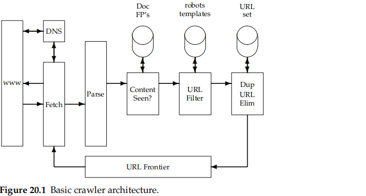
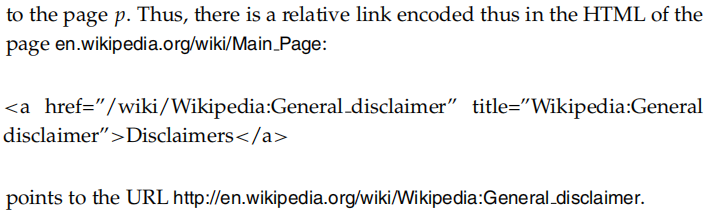
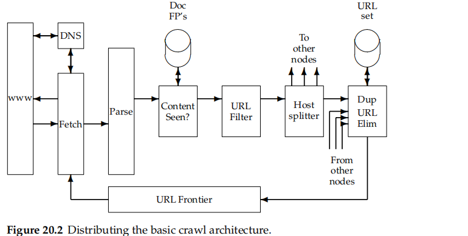
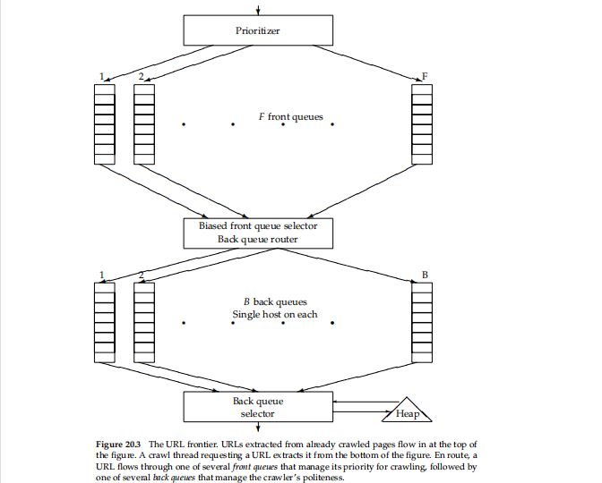
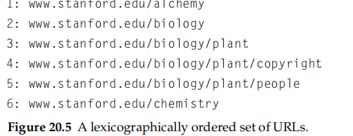
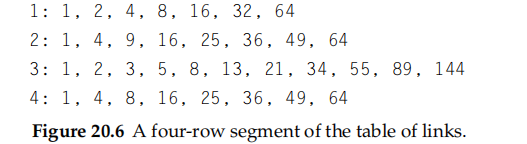

# 20 Web crawling and indexes

> **Web crawling** is the process by which we gather pages from the Web to index them and support a search engine

### 20.1.1 Features a crawler must provide

features that web crawlers must provide, followed by features they should provide

* Robustness
  * avoid spider traps
* Politeness
  * politeness policies must be respected

### 20.1.2 Features a crawler should provide

* Distributed
* scalable
* Performance and effificiency
* Quality
* Freshness
* Extensible
  * the crawler architecture be modular

## 20.2 Crawling

basic operation of any hypertext crawler

* begins with one or more URLs that **constitute a seed set**
* picks a URL from this seed set, then **fetches the web page at that URL**
* extract both the text and the links from the page

> The entire process may be viewed as **traversing the web graph**
>
> In **continuous crawling**, the URL of a fetched page is added back to the frontier for fetching again in the future

build crawlers of some basic properties any nonprofessional crawler should satisfy

* Only one connection should be open to any given host at a time
* A waiting time of a few seconds should occur between successive requests to a host
* Politeness retrictions should be obeyed

### 20.2.1 Crwaler architecture

performed by anywhere from one to potentially hundreds of threads

* **The URL frontier**, containing URLs yet to be fetched in the current crawl(in the case of continuous crawling, a URL may have been fetched previously but is back in the frontier for re-fetching)
* **A DNS resolution module** that determines the web server from which to fetch the page specified by a URL
* **A fetch module** that uses the http protocol to retrieve the web page at a URL
* **A parsing module** that extracts the text and set of links from a fetched web page
* **A duplicate elimination** module that determines whether an extracted link is already in the URL frontier or has recently been fetched

**a single URL through the cycle** of being fetched, passing through various checks and filters, then fifinally (for continuous crawling) being returned to the URL frontier

* **taking a URL** from the frontier and fetching the web page at that URL, generally using the http protocol

  * a temporary store
* parsed and the text as well as the links in it are extracted

  * for rank
  * add URL -> each extracted link goes through a series of tests to determine whether the link should be added to the URL frontier
* **a URL filter** is used to determine whether the extracted URL should be excluded from the frontier based on one of several tests

  * **robots exclusion protocol**
  * a cache can be used to obtain a recently fetched copy of the fifile for the host
  * robots-fifiltering immediately before attempting to fetch a web page
* a URL should be **normalized** in the following sense

* the URL is checked for **duplicate elimination**

###### Distributing the crawler

the threads in a crawler could run under different processes, each at a different node of a distributed crawling system

* use in **a geographically distrbutio**n crawler system where each node crawls hosts “near” it
* How do the various nodes of a distributed crawler **communicate and share URLs**?
  * Following the URL filter, we use **a host splitter to dispatch each surviving URL** to the crawler node responsible for the URL;thus the set of hosts being crawled is partitioned among the nodes
  * complacated
    * document fifingerprints/shingles cannot be partitioned based on host name
    * There is **very little locality** in the stream of document fifingerprints/shingles
    * Documents **change over time** and so, in the context of continuous crawling, we must be able to delete their outdated fifingerprints/shingles from the content-seen set(s)

### 20.2.2 DNS resolution

DNS resolution is **a well-known bottleneck in web crawling**

* distribution nature of the domain name services -> long time
  * ans:cache
* politeness constraints -> limit the cache hit rate
* implementation in standard libraties
  * blocked
  * ans:owm DNS resolver

### 20.2.3 the URL frontier

**Two important consideration**s govern the order in which URLs are returned by the frontier

* **high-quality pages that change frequently** should be prioritized for frequent crawling
* **politeness**: We must avoid repeated fetch requests to a host within a short time span
  * ans: A common heuristic is to insert a gap between successive fetch requests to a host that is an order of magnitude **larger than the time taken for the most recent fetch from that host**

shows a polite and prioritizing implementation of a URL frontier $[20.3]$

* only one connection is open at a time to any host
* a waiting time of a few seconds occurs between successive requests to a host
* high-priority pages are crawled preferentially

two submodules

* **F front queues**

  * FIFO
  * PRIORITIZER
  * **The number of front queues, together with the policy of assigning priorities and picking queues**, determines the priority properties we wish to build into the system
  * the URL an integer priority i between 1 and F based on its fetch history
* **B back queues**

  * FIFO
  * **The number of back queues** governs the extent to which we can keep all crawl threads busy while respecting politeness
    * three times
  * politeness
  * it is nonempty while the crawl is in progress
  * it only contains URLs from a single host
  * auxiliary T -> maintain the mapping orm hosts to back queues
    * Whenever a back queue is empty and is being refifilled from a front queue, table T must be updated accordingly
  * maintain a heap with one entry for each back queue
    * the earliest time at which the host corresponding to that queue can be contacted again
* morememory -> disk

## 20.3 Distributing indexes

two implementations

* **partitioning by terms**
  * global index organization
  * the dictionary of index terms is partitioned into subsets, each subset residing at a node
  * allows greater concurrency
  * nontrivial -> long postings list for merging
* **partitioning bu documents**
  * local index organization
  * each node contains the index for a subset of all documents
  * more local disk seeks
  * difficulty -> global statistics used in scoring – such as idf – must be computed across the entire document collectio

How do we decide the partition of documents to nodes?

* assign all pages from a host to a single node

  * difficulty ->  a preponderance of the results
* **A hash of each URL into the space of index nodes results** in a more uniform distribution of query time computation across nodes

  * heuristic -> partition the document collection into indexes of documents that are more likely to score highly on most queries and low-scoring indexes with the remaining documents

## 20.4 Connectivity servers

> web search engines require a **connectivity server that supports fast connectivity queries** on the web graph

**an adjacency table**->build a table whose entries are the pages linked to by p

exploit several ideas:

* **Similarity between lists**
  * Many rows of the table have many entries in common. Thus, if we explicitly represent a prototype row for several similar rows, the remainder can be succinctly expressed in terms of the prototypical row
* Locality
  * Many links from a page go to “nearby” pages – pages on the same host, for instance. This suggests that in encoding the destination of a link, we can often use small integers and thereby save space.
* We use gap encodings in sorted lists
  * Rather than store the destination of each link, we store the offset from the  previous entry in the row.

implementation

* treat each URL as an alphanumeric string and sort these strings$[20.5]$
* assign its position in this ordering as the unique identifying integer$[20.6]$
* We walk down the table, encoding each table row in terms of the seven preceding rows
* demand a threshold of similarity

