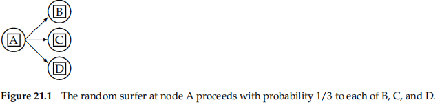
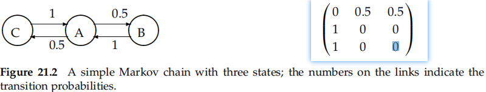
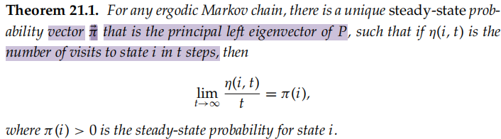
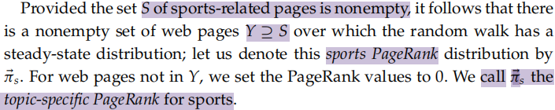
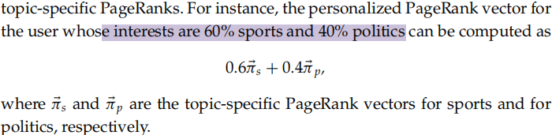
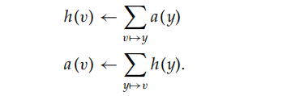
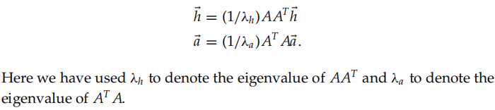
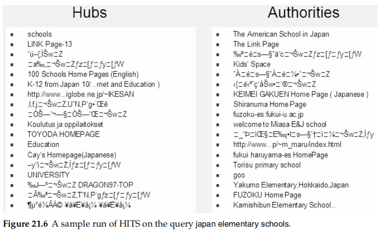

# 21 link analysis

**the use of hyperlinks for ranking** web search results

Link analysis for web search has intellectual antecedents in the field of citation analysis, aspects of which overlap with an area known as **bibliometrics**

* link analysis on the Web treats hyperlinks from a web page to another as**a conferral of authority**

link spam

> one may contrive to set up multiple web pages pointing to a target web page, with the intent of **artificially boosting** the latter’s tally of in-links

## 21.1 The Web as a graph

Our study of link analysis builds on two intuitions

* The anchor text pointing to page B is a good description of page B
* The hyperlink from A to B represents an endorsement of page B, by the creator of page A
  * "internal" links -> discount
  * many links among pages within a single website stem from the user of a common template

### 21.1.1 Anchor text and the web graph

```apache
<a href="http://www.acm.org/jacm/">Journal of the ACM.</a>
```

* the link points to the page -> www.acm.org/jacm/
* the anchor text -> Journal of the ACM

there is often **a gap** between the terms in a web page and how web users would describe that web page

* rich in graphics and images
* anchor text terms -> terms for indexing
  * special indicator
  * also weighted based on frequency || penalty
  * side effects
    * nickname
    * derogatory -> spamming || spam detection
      * a website can create misleading anchor text pointing to itself to boost its ranking on selected query terms
* The window of text surrounding anchor text -> usable

## 21.2 PageRank

PageRank

> assigns to every node in the web graph a numerical score between 0 and 1

Given a query, a web search engine computes **a composite score** for each web page that combines hundreds of features such as cosine similarity and term proximity, together with the PageRank score



pages visited **more often in this walk are more important**$[21.1]$

teleport operation -> being chosen uniformly at random from all web pages

* When at a node with **no out-links**, the surfer invokes the teleport operation
* At any node that has outgoing links,the surfer invokes the teleport operation with probability **0 <α< 1** and the standard random walk with probability 1 − α
  * α is a **fixed** parameter chosen in advance. Typically, α might be 0.1

### 21.2.1 Markov chains

**discrete-time stochastic process**

> a process that occurs in a series of time steps in each of which a random choice is made
>
> consists of N states



is characterized by an N × N transition probability matrix P$[21.2]$

* each of whose entries is in the interval [0,1]
* the entries in each row of P add up to 1
* $P_{ij}$ -> the probability that the state at the next time-step is j, conditioned on the current state being i

  * depends only on the current state i
  * Markov property
  * $\forall i,\sum_{j=1}^{N}P_{ij}=1$
    * **stochastic matrix** ->non-negative entries->principal left eigenvector corresponding to its largest eigenvalue, which is 1
  * depends **only on the current state**, and not on how the Markov chain arrived at the current state
* probability vector -> a vector all of whose entries are in the interval [0, 1]

The teleport operation contributes to these transition probabilities

> if there is a **hyperlink** from page i to page j, then Aij = 1, otherwise Aij = 0. We can readily derive the transition **probability matrix P** for our Markov chain from the N × N matrix A. If a row of A has no 1’s, then devide each element by 1/N. For all other rows proceed as follows

1. Divide each 1 in A by the number of 1s in its row
   * Thus, if there is a row with three 1s, then each of them is replaced by 1/3
2. Multiply the resulting matrix by 1 − α
3. Add α/N to every entry of the resulting matrix, to obtain P

compute **the surfer’s distribution over the states at any time**, given only the initial distribution and the transition probability matrix P

set the PageRank of each node v to this **steady-state visit frequency** and show how it can be computed

> Definition: A Markov chain is said to be **ergodic** if there exists a positive integer T0 such that for all pairs of states i, j in the Markov chain, if it is started at time 0 in state i then for all t > T0, the probability of being in state j at time t is greater than 0

condition

* irreducibility and aperiodicity
* a sequence of transitions of nonzero probability from any state to any other
* the states are not partitioned into sets such that all state transitions occur cyclically from one set to another



This steady-state probability for a state is the PageRank of the corresponding web page

### 21.2.2 The PageRank computation

the left eigenvectors of the transition probability matrix P are N-vectors π such that

$\vec {\pi} P =\lambda \vec {\pi}
$

the steady-tate distribution -> $\vec {\pi} P =1 \vec {\pi}
$

* 1 is an eigenvalue of P
* compute **the principal left eigenvector** of the matrix P – the one with eigenvalue 1 – we would have computed the PageRank values
  * power interation

PageRank

* independent of any query
* as just one of many factors in scoring a web page


### Topic-specific PageRank

teleporting to a random web page chosen **nonuniformly**

* particular interests
* need a **nonzero subset S** of sports-related web pages
* mixture of interests
  * a linear mixture of interests
  * leads to an **ergodic Markov chain** with a steady-state distribution that is personalized to this user’s preferences over topics
  * implementation appears cumbersome






## 21.3 Hubs and authorities

given a query, every web page is assigned two scores__for broad-topic searches

* hub score  -> h(v)
  * handcompiled lists of **links to authoritative web pages** on a specifific topic
* authority score  -> a(v)
  * authoritative sources of information on the topic

> A good hub page is one that points to many good authorities; a good authority page is one that is pointed to by many good hub pages


**HITS__hyperlink-induced topic search**

1. h(v)=a(v)=1 for all nodes v
2. 
3. updates iteratively


if A ->a square matrix with one row and one column for each page in the subset




key consequences

* The iterative updates in Equation (21.8) (or equivalently, Equation (21.9)), if scaled by the appropriate eigenvalues, are equivalent to the power iteration method for computing the eigenvectors of AAT and AT A. Provided that the principal eigenvalue of AAT is unique, the iteratively computed entries of hand a **settle into unique steady-state values** determined by the entries of A and hence the link structure of the graph
* In computing these eigenvector entries, we are not restricted to using the power iteration method; indeed, we could use any **fast method for computing the principal eigenvector of a stochastic matrix**

The resulting computation thus takes the following form:

1. Assemble the target subset of web pages, form the graph induced by their hyperlinks and compute AAT and AT A
2. Compute the principal eigenvectors of AAT and AT A to form the vector of two scores
3. Output the top-scoring hubs and the top-scoring authorities


### 21.3.1 Choosing the subset of the Web

the following procedure for compiling the subset of the Web for which to compute hub and authority scores

* Given a query (say leukemia), use a text index to get all pages containing leukemia. Call this **the root set of pages**
* Build **the base set of pages**, to include the root set as well as any page that either links to a page in the root set, or is linked to by a page in the root set


We then use the base set for computing hub and authority scores. The base set is constructed in this manner for three reasons:

* A good authority page **may not contain the query text**
* If the text query manages to capture a good hub page **vh** in the root set, then the inclusion of all pages linked to by any page in the root set will capture all the good authorities linked to by **vh in the base set**
* the “expansion” of the root set into the base set enriches **the common pool of good hubs and authorities**

cross-language retrieval

> this cross-language effect resulted purely from link analysis, with no linguistic translation taking place




the results of running HITS on the query$[21.6]$

* not necessarily in Latin characters, the resulting print is a string of gibberish


