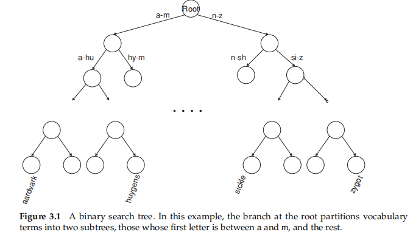
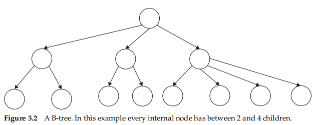
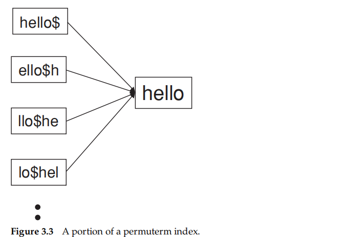
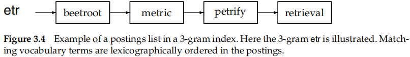
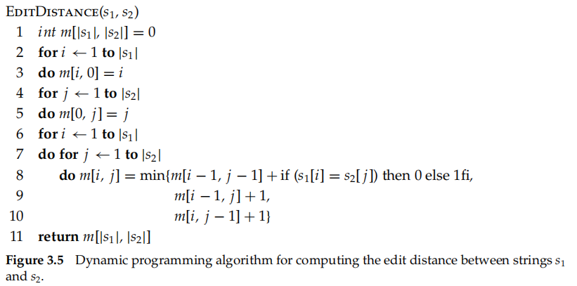
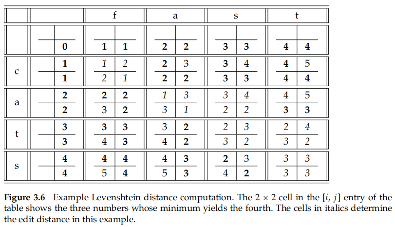
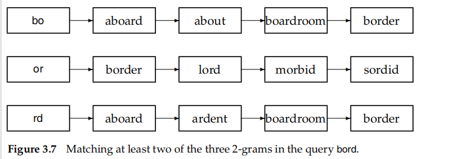

## Dictionaries and tolerant retrieval

Here, we develop techniques that are **robust** to typographical errors in the query, as well as alternative spellings

## 3.1 Search structures for dictionaries

dictionary__vocabulary lookup operation uses a classical data structure

* hashing
  * Hashing has been used for dictionary lookup in some search engines
  * collisions are resolved by **auxiliary structures**
  * **no easy way to find minor variants** of a query term
* search trees
  * such as binary tree$[3.1]$
  * Efficient search but need rebalance
    * allow the number of subtrees under an internal node to vary in a fixed interval__B-tree$[3.2]$
  * have a prescribed ordering

## 3.2 Wildcard queries

* the user mis uncertain of the spelling of a query term
* is aware of multiple variants of spelling a term and (consciously) seeks documents containing any of the variants
* stemming
* uncertain of the correct rendition of a foreign word or phrase

A query such as **mon*** is known as a **trailing wildcard query**

* A search tree
* use |W| lookups on the standard inverted index

**leading wildcard queries**

* a reverse B-tree
* the term **lemon** would, in the B-tree, be represented by the path **root-n-o-m-e-l**.

wildcard queries in which there is a **single * symbol**

* a regular B-tree together with a reverse B-tree
* the intersection W ∩ R of these two sets

### 3.2.1 General wildcard queries

express the given wildcard query qw as **a Boolean query Q on a specially constructed index**

###### Permuterm indexes$[3.3]$

**$** -> mark the end of a term

permuterm vocabulary__the set of rotated terms in the permuterm index

seeking **n$m*** (via a search tree) leads to rotations of (among others) the terms **man** and **moron**

disadvantage: dicitonary becomes quite large

### 3.2.2 k-Gram indexes for wildcard queries

the k-gram index -> a sequence of k characters

* **cas, ast and stl** are all 3-grams occurring in the term castle
* **$** -> beginning or end of a term

the dictionary contains all k-grams that occur in any term in the vocabulary$[3.4]$

demands one further step of processing__a **postfiltering** step

* retired->the two 3-grams **$re and red** but not **red***

Even without Boolean combinations of wildcard queries, the processing of **a wildcard query can be quite expensive**

## 3.3 Spelling correction

the first based on **edit distance** and the second based on **k-gram overlap**

### 3.3.1 Implementing spelling correction

two basic principles

* Of various alternative correct spellings for a misspelled query, choose the “nearest” one
* When two correctly spelled queries are tied (or nearly tied), select the one that is more common

build on these **computations of proximity**; their functionality is then exposed nto users in one of several ways:

* On the query carot always retrieve documents containing carot as well as nany “spell-corrected” version of carot, including carrot and tarot
* As in (1) above, but only when the query term carot is not in the dictionary
* As in (1) above, but only when the original query returned fewer than a preset number of documents (say fewer than fifive documents)
* When the original query returns fewer than a preset number of documents, the search interface presents a spelling suggestion to the end user:this suggestion consists of the spell-corrected query term(s). Thus, the search engine might respond to the user: “Did you mean carrot?”

### 3.3.2 Forms of spelling correction

* isolated-term correction
* context-sensitive correction

two techniques

* edit distance
* k-gram overlap

### 3.3.3 Edit distance

the edit distance

* minimum number of edit operations required to transform s1 into s2
* Levenshtein distance__dynamic programming$[3.5][3.6]$

demands more

* given a set S of strings (corresponding to terms in the vocabulary) and a query string q, we seek the string(s) in V of least edit distance from q___heuristics
* restrict the search to dictionary terms beginning with the **same letter as the query string**
* a version of the permuterm index
* we refine this rotation scheme: for each rotation, we omit a suffifix of characters before performing the B-tree traversal

### 3.3.4 k-Gram indexes for spelling correction

assist with retrieving vocabulary terms **with low edit distance** to the query q

* many k-grams in common
* matched vocabulary terms to contain a fifixed number of k-grams from the query q
  * shortcoming: implausible
* Jaccard coeffificient
  * measuring the overlap between two sets A     and B, defifined to be |A∩ B|/|A∪ B|
    * the set of k-grams in the query q
    * the set of k-grams in a vocabulary term
  * hard to compute the k-grams of t
  * only need the length of the string t
* replace the Jaccard coeffificient by other measures
  * fifirst use the k-gram index to enumerate a set of candidate vocabulary terms that are potential corrections of q
  * compute the edit distance from q to each term in this set, selecting terms from the set with small edit distance to q

### 3.3.5 Context-sensitive spelling correction

enumerate corrections of each of the three query terms then try substitutions of each correction in the phrase

* expensive___Several heuristics
* retain only the most frequent combinations in the collection or in the query logs
* As an alternative to using the biword statistics in the collection, we may use the logs of queries issued by users; these could of course include queries with spelling errors

## 3.4 Phonetic correction

soundex algorithms__for each term  “phonetic hash”  ___mainly used to correct phonetic misspellings in proper nouns___  various variants

1. Turn every term to be indexed into a **four-character reduced** form. Build an inverted index from these reduced forms to the original terms; call this the soundex index
2. Do the same with query terms
3. When the query calls for a soundex match, **search this soundex index**

The variations in **different** soundex algorithms have to do with the **conversion of terms to four-character form**s.

* **Retain the first** letter of the term
* **Change** all occurrences of the following letters to ’0’ (zero): A, E, I, O, U,H, W, and Y
* Change letters to digits as follows

  * B, F, P, V to 1
  * C, G, J, K, Q, S, X, Z to 2.
  * D, T to 3.
  * L to 4
  * M, N to 5
  * R to 6
* Repeatedly **remove** one out of each pair of consecutive identical digits
* Remove all zeros from the resulting string. Pad the resulting string with trailing zeros and return the first four positions, which will **consist of a letter followed by three digits**

rests on a few observations

1. vowels are viewed as interchangeable, in transcribing names;
2. consonants with similar sounds (e.g.,D and T) are put in equivalence classes

such rules tend to **be writing-system depenent**

## 3.5 References and further reading
