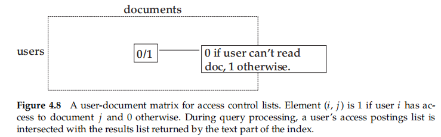

## Index construction

* index construction or indexing  indexer
* blocked sort-based indexing
* static, distributed, dynamic index
* security, ranked

## 4.1 Hardware basics

depend on : the characteristics of the computer

* Access to data in memory is much faster than access to data on disk___**caching**
* When doing a disk read or write, it takes a while for the disk head to move to the part of the disk where the data are located___**chunk and seek time**
* Operating systems generally read and write entire blocks___**buffer**
* Data transfers from disk to memory are handled by the system bus___**comress and decompress**
* Servers used in IR systems typically have several gigabytes (GB) of main memory, sometimes tens of GB___**servers**

## 4.2 Blocked sort-based indexing

methods for **large collections** that require the use of **secondary storage**

* represent terms as termIDs

  * a single pass:processing the collection
  * a two-pass : first vocabulary and then construct the inverted index
* realize that **the postings file of many large collections cannot fit into memory even after compression**

  * method : **external sorting algorithm that uses disk**
  * key : **minimize** the number of **random disk seeks** during sorting
  * **blocked sort-based indexing algorithm or BSBI**$[4.2]$

    1. segments the collection into parts of equal size
    2. sorts the termID–docID pairs of each part in memory
    3. stores intermediate sorted results on disk
    4. merges all intermediate results into the final index
  * Inversion

    1. sort the termID–docID pairs
    2. collect all termID–docID pairs with the same termID into a postings list
    3. written to disk : an inverted index for the block
  * merge the blocks$[4.3]$

    1. maintain small read buffer and a write buffer
    2. priority queue or a similar data structure___the lowest termID
    3. written back to disk
  * expensive

    * time complexity : $ O(T log T)$
    * need ParseNextBlock and MegreBlocks

## 4.3 Single-pass in-memory indexing

single-pass in-memory indexing or SPIMI___index collections of **any size**

* uses terms instead of termIDs
* writes each block’s dictionary to disk
* starts a new dictionary for the next block

difference between BSBI and SPIMI

* SPIMI adds a posting directly to its postings list (line 10)
  * each postings list is **dynamic**
  * advantages : faster and save memory
* (lines 8–9): some memory is wasted___lower than in BSBI
* (line 12)When memory has been **exhausted**, we write the index of the block (which consists of the dictionary and the postings lists) to disk
  * sort the terms (line 11)

**compression**

* the postings and the dictionary terms

time complexity of SPIMI is $O(T)$

## 4.4 Distributed indexing

**clusters**__for construct any reasonably sized web index__distributed indexing algorithms

distributed indexing for a **term-partitioned** index__from MapReduce(a general architecture for distributed computing)

need **robust**__divide the work up into chunks that we can easily assign and master node in case of failure – reassign

**A master node** directs the process of assigning and reassigning tasks to individual worker nodes

steps of MapReduce$[4.5]$__map and reduce phases of MapReduce

an example on a collection consisting of two documents$[4.6]$

* split into n splits__evenly and efficiently

  * 16 or 64 MB
  * As a machine finishes processing one split, it is assigned the next one__not preassigned
  * If a machine dies or becomes a laggard due to hardware problems, the split it is working on is simply **reassigned** to another machine
* key-value pairs__breaks a large computing problem into smaller

  * form (termID,docID)
    * a (perhaps precomputed) mapping  copied to all nodes
    * use terms directly (instead of termIDs) for infrequent terms
* parsers__map phase

  * mapping splits of the input data to key-value pairs
  * writes its output to local intermediate files__segment files
* reduce phase

  * all values for a given key to be stored close
  * partitioning **the keys into j term partitions** and having the parsers write keyvalue pairs for each term partition into a **separate segment file**
* reduce__inverters$[4.6]$

  * Collecting all **values** (here: docIDs) for a given key (here: termID) into one list
  * The master assigns each term partition to **a different inverter**
  * Each term partition (corresponding to r segment files, one on each parser) is processed by one inverted
* Parsers and inverters are **not separate** sets of machines
* To minimize write times before inverters reduce the data

  * writes its segment fifiles to **its local disk**
  * minimizes the amount of network traffific needed during indexing
* the general schema of the MapReduce functions$[4.6]$
* Another MapReduce operation transforms the term-partitioned index we just created into a **document-partitioned** one

## 4.5 Dynamic indexing

modifified frequently__added, deleted, and updated

* simplest way__**periodically reconstruct** the index from scratch
* new documents be included quickly__a large main index and a small **auxiliary index** that stores new documents
  * auxiliary index is kept in memory
  * search are run across both indexes and results merged
  * delete -> invalidation bit vector
  * Documents are updated by deleting and reinserting
  * **Each time the auxiliary index becomes too large, we merge it into the main**
    * Updating each document separately requires up to Mave disk seeks
    * the **one-fifile-per-postings-list** scheme is **infeasible** for most file systems cannot effificiently handle very large numbers of fifiles
* simplest alternative__store the index as one large fifile
* reality__choose a compromise between the two extremes
* process each **posting $T/n$ times**
  * n is the size of the auxiliary index
  * T->the total number of postings
  * the **overall time complexity is$(T^2/n)$**
* introducing **log2(T/n) indexes** I0, I1 of size 2^0 × n, 2^1 × n, 2^2 × n
  * better than $(T^2/n)$
  * **logarithmic merging**$[4.7]$
  * Overall index **construction** time is $ (T log(T/n))$
  * a slow down of query processing
* **Having multiple indexes complicates the maintenance of collection-wide statistics**
  * all aspects of an IR system are more complex in logarithmic merging
* some large search engines adopt a reconstruction-from-scratch strategy

## 4.6 Other types of indexes

positional indexes

* (termID, docID, (position1, position2, . . . ))
* postings contain positional information in addition to docIDs
* the algorithms discussed here can all be applied

ordered with respect to docID

* advantageous for compression
* not optimal when we build **ranked**
  * ordered by weight or impact
  * an impact-sorted index__the insertion can occur anywhere

Security

* User authorization is often mediated through **access control lists or ACLs**
* inverting the resulting **user-document** matrix
  * difficult to maintain when access permissions change

indexes for storing and retrieving terms

## 4.7 References and further reading
