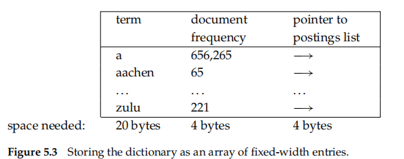

## 5 Index compression

compression techniques for dictionary and inverted index

* efficient
* less disk space->25%
* increased use of caching
* faster transfer of data from disk to memory

## 5.1 Statistical properties of terms in information retrieval

Reuters-RCV1's term and postings statistics$[5.1]$

* “deltas%” indicates the reduction in size from the previous line
* “T%” is the cumulative reduction from unfifiltered

show

* preprocessing affects the size of the dictionary and the number of **nonpositional postings** greatly
* The rule of **30 states** that the 30 most common words account for 30% of the tokens in written text

compression

* lossless__The compression techniques__all information is preserved
* lossy compression, which discards some information

  * Case folding, stemming, and stop word elimination
  * there are mretrieval scenarios where lossy methods can be used for compression **without any reduction in effectiveness**

estimate the number of distinct terms M in a collection

* the Oxford English Dictionary (OED)
  * more than 600,000 words
  * not include most names of people, locations, products...

### 5.1.1 Heaps’ law: Estimating the number of terms

Heaps’ law$[5.1]$

* estimates vocabulary size as a function of collection size
  * the dictionary size **continues to increase** with more documents in the collection, rather than a maximum vocabulary size being reached
  * the size of the dictionary is quite **large** for large collections
* $M=kT^b$
  * T is the number of tokens in the collection
  * Typical values for the parameters k and b are
  * 30 ≤ k ≤ 100 and b ≈ 0.5
* the simplest possible relationship between collection size and vocabulary size is linear in log–log space
* The parameter **k is quite variable** because vocabulary growth depends a lot on the nature of the collection and how it is processed
* **Case-folding and stemming** reduce the growth rate of the vocabulary
* **including numbers and spelling** errors increase it

### 5.1.2 Zipf’s law: Modeling the distribution of terms

Zipf’s law__the distribution of terms in a collection

* $cf_i 正相关 1/i$
  * the collection frequency cfi of the ith most common term is proportional to 1/i
  * frequency decreases very **rapidly** with rank
  * one of the simplest ways of formalizing
* as $cf_i = ci^k$
  * or as $log cf_i = log c +k log i$
  * where k = −1 and c is a constant to be defifined
* a power law with exponent k = −1
* not particularly good,but enough$[5.2]$

## 5.2 Dictionary compression

* primary: the number of disk seeks necessary to process a query

### 5.2.1 Dictionary as a string

* simplest data structure
  * sort the vocabulary lexicographically and store it in an array of fixed-width entries$[5.3]$
  * disadvantage
    * wasteful
    * length limit
    * resort: storing the dictionary terms as one long string of characters$[5.4]$

### 5.2.2 Blocked storage

**grouping terms** in the string into **blocks** of size k and keeping **a term pointer** only for the first term of each block$[5.5]$

* eliminate k − 1 term pointers, but need an additional k bytes for **storing the length of each term**

By increasing the block size k, we get better compression

* a tradeoff between **compression and the speed of term lookup**$[5.6]$

**front coding**__consecutive entries in an alphabetically sorted list share comfront coding mon prefifixes$[5.7]$

* A common prefix is identified for a subsequence of the term list and then referred to with **a special character**

minimal perfect hashing

* a hash function that maps M terms onto [1, ... , M] without collisions
* **cannot** be used in a **dynamic** environment

it may **not be feasible** to store the entire dictionary in main memory for very large text collections and for hard ware with limited memory

## 5.3 Postings file compression

efficient__fewer than 20 bits per document

* find : the postings for **frequent** terms are **close** together
* -> the gaps between postings are short$[5.3]$
* **a variable encoding**->uses fewer bits for short gaps
  * bytewise compression
  * bitwise compression

### 5.3.1 Variable byte codes

Variable byte (VB) encoding

* an integral number of bytes to encode a gap$[5.8][5.4]$

  * last 7 bits -> “payload” encode part of the gap
  * first bit -> a continuation bit set to 1 for the last byte of the encoded gap and to 0 otherwise
* **bytes** offer a good compromise between compression ratio and speed of decompression

  * **Larger words** further **decrease** the amount of bit manipulation necessary at the cost of **less effective** (or no) compression
* **variable byte codes** offer an **excellent tradeoff** between time and space

### 5.3.2 γ Codes

**Bit-level** codes adapt the length of the code on the **finer grained bit level**

* simplest bit-level code -> **unary code**

  * unary code of n is a string of n 1s followed by a 0$[5.5]$
* **γ encoding**

  * variable-length encoding by splitting the representation of a gap G into a pair of **length and offset**

    * Offset is G in binary,the leading 1 removed
    * Length encodes the **length of offset** in unary code
    * 13->1110 101
  * the entire code is 2 × log2 G + 1 bits

    * offset is  log2 G bits
    * length is  log2 G +1 bits
  * do not know **the probability distribution over gaps a priori**
  * trait

    * universality
    * prefifix free->not need delimiters between them
    * parameter free->not fit and dynamic

entropy H(P)

* coding properties ：

  * a discrete probability distribution P
  * $H(P)=-\sum_{x\in X}{P(x)log_2P(x)}$
  * X is the set of all possible numbers we need to be able to encode  $\sum_{x\in X}P(x)=1.0$
* a measure of uncertainty$[5.9]$

the lower bound for the expected length E(L) of a code L is H(P) if certain conditions hold

* for 1 < H(P) < ∞, γ encoding is within a factor of 3 of thisoptimal encoding, approaching 2 for large H(P)
  * $\frac{E(L_y)}{H(P)}<=2+\frac{1}{H(P)}<=3$
  * it holds for **any probability distribution P**
* **universal**: A code like γ code with the property of being within a factor of optimal for an arbitrary universal distribution P

How much compression of the inverted index do γ codes achieve?

* Zipf’s law->get term statistics that characterize the distribution of terms in the collection
* calculate the space requirements for an inverted index compressed with **γ encoding**[pessimistic]

  * the average number of occurrences f per document is **1 ≤ f** for terms in the fifirst block
    * corresponding to a total number of N gaps per term
    * stratify the vocabulary into blocks of size Lc = 15
    * term i occurs 15/i times per document
  * in the second block $[\frac{1}{2},1]$
  * in the third block $[\frac{1}{3},\frac{1}{2}]$ corresponding to N/3 gaps per term, and so on
* another unrealistic assumption

  * all gaps for a given term have the same size$[5.10]$

* the actual size of the compressed index is even lower__101 MB
  * Zipf’s law is **not a very good approximation** of the actual distribution of term frequencies for Reuters-RCV1
  * **gaps** are **not uniform**
* the assumptions about **the distribution of term frequencies** are accurate, the predictions of the model are correct$[5.6]$

* **query processing is more expensive** for γ codes than for variable byte codes
* both γ and VB codes meet the objectives we stated in the beginning of the chapter

## 5.4 References and further reading

lue
