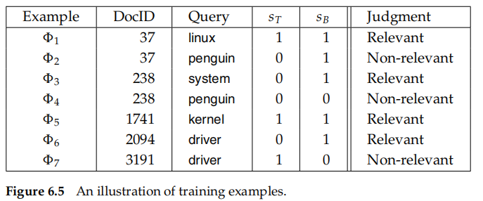
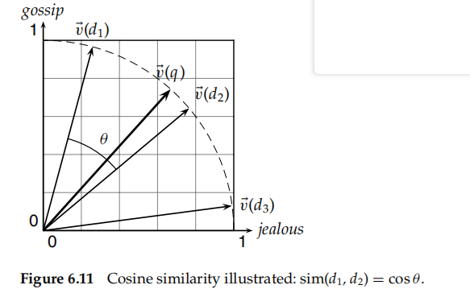

## Scoring, term weighting, and the vector space model

**rank-order** the documents matching a query

* assigning a score to a (query, document) pair

## 6.1 Parametric and zone indexes

most documents have **additional structure**__metadata

* specific forms of data about a document
* metadata generally included **fields**
* finite

“find documents authored by William Shakespeare in 1601, containing the phrase alas poor Yorick.”$[6.1]$

* merge psting from standard inverted as well as **parametric indexes**
* one parametric index for each field
* support querying ranges on such ordered values(dates)
* a structure like a **B-tree** may be used for the field's dicionary

**Zones** are similar to fields

* contents of a zone can be **arbitrary free text**
* document titles and abstracts are generally treated as zones
* a separate inverted index for each zone of a document$[6.2]$
* stems from the text of that zone

reduce the size of the dictionary

* encoding the **zone** in which a term occurs in the postings
* occurrences of william in the title and author zones of various documents are encoded$[6.3]$
  * support **weighted zone scoring**

### 6.1.1 Weighted zone scoring

a second application of zones and fields__a linear combination of zone scores

* the pair **(q, d)** a score in the interval [0, 1]
* each zone of the document contributes a Boolean value

$$
the-weighted-zone-score=\sum^{l}_{i=1}g_is_i
$$

* each of document has l zones
* g1, ... , g∈ [0, 1] such that $\sum^{l}_{i=1}g_i=1$
* $s_i$->be the Boolean score denoting a match  between q and the ith zone

implement the computation of weighted zone scores

* compute the score for each document in turn, adding in all the contributions from the various zones
* the query q is a two-term query consisting of query terms q1 and q2 and and the Boolean function is AND->1 if both query terms are present in a zone and 0 otherwise$[6.4]$
  * the array scores[] above as a set of **accumulators**

### 6.1.2 Learning weights

machinelearned relevance

* these weights are “learned” using **training examples** that have been judged editorially    $chapter-15$
  1. We are provided with a set of training examples, each of which is a tuple consisting of a query q and a document d, together with **a relevance judgment for d on q**. In the simplest form, each relevance judgment is either relevant or nonrelevant. More sophisticated implementations of the vmethodology make use of more nuanced judgments
  2. The weights **gi** are then “learned” from these examples, in order that **the learned scores approximate the relevance judgments in the training examples**
* expensive -> the labor-intensive assembly of user-generated relevance judgments from which to learn the weights
* a simple optimization problem
  * each document has a title zone and a body zone
  * a query q and a document d
  * a constant g ∈ [0, 1]
  * $$
    score(d,q) = g*s_T(d,q)+(1-q)s_B(d,q)
    $$
* how to **determine the constant g** from a set of **training examples**$[6.5]$
  * a triple of the form $\Phi_j=(d_j,q_j,r(d_j.q_j))$
  * a given training document dj
  * a given training query q j
  * a relevance judgment r(dj , q j)
* each training example
  * $score(d_j,q_j) = g*s_T(d_j,q_j)+(1-q)s_B(d_j,q_j)$
* compare this computed score with the human relevance judgment
* defifine the error of the scoring function with weight g as
  * $\epsilon(g,\Phi_j)=(r(d_j.q_j)-score(d_j,q_j))^2$
* **minimizes** : the total error of a set of training examples is given by
  * $\sum_j\epsilon(g,\Phi_j)$

### 6.1.3 The optimal weight g

simplify->the total error corresponding

## 6.2 Term frequency and weighting

the next logical step

* a document or zone hat **mentions a query term more often** has more to do with that query and therefore should **receive a higher score**
* compute a score between a query term t and a document d, based on the weight of t in d__the number of occurrences of term t in document
  * term frequency and is denoted $tf_{t,d}$
* the bag od words model
  * exact **ordering** of the terms in a document **is ignored**
  * the **number** of occurrences of each term is **material**

### 6.2.1 Inverse document frequency

certain terms have little or no discriminating power in determining relevance

**collection frequency**

* scale down the term weights of terms with high collection frequency
* the total number of occurrences of a term in the collection

**document frequency**__more common$df_t$

* be the number of documents in the collection that contain a term t
* better to use a document-level statistic than to use a collection-wide

N -> the total number of documents in a collection

**inverse document frequency(idf)** of a term

$$
idf_t=log\frac{N}{df_t}
$$

logarithms are to the base 10$[6.8]$

### 6.2.2 Tf–idf weighting

$tf–idf$ weighting scheme assigns to term t a weight in document d given by

$$
tf-idf_{t,d} = tf_{t,d} * idf_t
$$

* highest when t occurs many times within a small number of documents
  * thus lending high discriminating power to those documents
* lower when the term occurs fewer times in a document, or occurs in many documents
  * (thus offering a less pronounced relevance signal
* lowest when the term occurs in virtually all documents

view each document as a vector

* one component corresponding to each term in the dictionary
* not occur -> 0
* crucial to scoring and ranking

overlap score measure

$$
Score(q,d)=\sum_{t\in q}tf-idf_{t,d}
$$

## 6.3 The vector space model for scoring

vector space model

* the representation of a set of documents as vectors in a common vector space
* a pivotal step in this development is the view (Section 6.3.2) of queries as vectors in the same vector space as the document collection.

### 6.3.1 Dot products

$\vec {V}(d)$ -> document d, with one component in the vector for each dictionary term

* loses the relative ordering of the terms in each document

the similarity between two documents__**cosine similarity**

* This measure is the cosine of the angle θ between the two vectors$[6.11]$
* more like this feature__computing the dot products between v(d) nand each of v(d1), ... ,v(dN), then picking off the highest resulting sim values

$$
sim(d_1,d_2)=\frac{\vec {V}(d_1) \cdot \vec {V}(d_2)}{|\vec {V}(d_1)|| \vec {V}(d_2)|}
$$

term–document matrix

* a collection of N documents as a collection of vectors leads to a natural view of a collection

### 6.3.2 Queries as vectors

can also view a query as a vector

* $jealous-gossip$ -> $\vec{v}(q)=(0,0.707,0.707)$
* Wuthering Heights is the top-scoring document for this query with a score of 0.509
* misleading

  * the number of dimensions in practice is far larger than three; it equals the vocabulary size M
  * A document may have a high cosine score for a query, even if it does not contain all query terms
* expensive

  * compute sort select
  * need heuristics

### 6.3.3 Computing vector scores

a typical setting

* a collection of documents each represented by a vector
* a free text query represented by a vector
* a positive integer K

seek the K documents of the collection with the highest vector space scores on the given query$[6.11]$

* term-at-a-time scoring or accumulation

  * document-at-a-time ->concurrent postings traversal, we compute the scores of one document at a time7
* accumulators -> the N elements of the array Scores
* wasteful_float

  * using inverse document frequency, we need not precompute idft; it suffifices to store N/dft at the head of the postings for t
  * store the term frequency tft,d for each postings entry

## 6.4 Variant tf–idf functions

### 6.4.1 Sublinear tf scaling

use instead the **logarithm** of the term frequency

replace **tf** by some other function wf as follow

$$
wf-idf_{t,d}=wf_{t,d} * idf_t
$$

**replace tf–idf by wf–idf** as defifined

### 6.4.2 Maximum tf normalization

normalize the tf weights of all terms occurring in a document by the maximum tf in that document

$$
tf_{max}(d)=max_{\tau \in d}if_{\tau,d}
$$

$$
ntf_{t,d}=a + (1-a)\frac{tf_{t,d}}{tf_{max}(d)}
$$

a is a value between 0 and 1 and is generally set to 0.4

* some early work used the value 0.5
* smoothing term -> damp the contribution of the second term ->  a scaling down of tf by the largest tf value in d
* avoid : higher term frequencies in longer documents

Maximum tf normalization does suffer from the following issues:

1. The method is unstable in the following sense: A change in the stop word list can dramatically alter term weightings (and therefore ranking). Thus it is **hard to tune**.
2. A document may contain an outlier term with an unusually large number of occurrences of that term, **not representative** of the content of that document
3. More generally, a document in which the most frequent term **appears roughly** as often as many other terms should be treated differently from one with a more skewed distribution.

### 6.4.3 Document and query weighting schemes

Variations from one vector space scoring method to another hinge on the specifific choices of weights in the vectors$\vec V(d)and \vec V(q)$

the principal weighting schemes in use for each$[6.15]$

**SMART notation**___a mnemonic for representing a specifific combination of weights

* takes the form ddd.qqq
  * first triplet gives the term weighting of the document vector
  * the second triplet gives the weighting in the query vector
    * The first letter in each triplet specifies the term frequency component of the weighting
    * the second the document frequency component
    * the third the form of normalization used

### 6.4.4 Pivoted normalized document length

normalized each document vector by the Euclidean length

* eliminated all information on the **length** of the original document
  * masks some subtleties about longer documents
* longer documents have higher tf values
* longer documents contain more distinct terms

Longer documents can broadly be lumped into two categories

* **verbose** documents that essentially repeat the same content
* documents covering **multiple different topics**

**pivoted document length normalization**

a form of document length normalization that is independent of term and document frequencies

* resulting “normalized” documents are not necessarily of unit length

probability of relevance

* Consider a document collection together with an ensemble of queries for that collection
* compute a probability of relevance as a function of document length, averaged over all queries in the ensemble$[6.16thick]$
  * not continuous __it is in fact a histogram of discrete buckets of document length
* **cosine normalization[thin] has a tendency to distort the computed relevance vis-a-vis the true relevance, at the expense of longer documents**

$l_p$__pivot length

* crossover at a point p corresponding to document length
* “rotate” the cosine normalization curve counterclockwise about p so that it more closely matches thick line representing the relevance versus document length curve

simplest implementation of pivoted document length normalization

* a normalization factor in the denominator that is linear in $|\vec {V}(d)|$ ,but one of slope < 1
* the x- axis represents$|\vec {V}(d)|$
* the y-axis represents possible normalization factors we can use
* thin line = x depicts the use of cosine normalization
* the thick line representing pivoted length normalization
  * It is linear in the document length and has the form$a|\vec {V}(d)|+(1-a)piv$
    * where piv is the cosine normalization value at which the two curves intersect
  * Its slope is a < 1
  * It crosses the y = x line at piv
* It has been argued that in practice, Equation (6.16) is well approximated by
  * $au_d+(1-a)piv$
  * where ud is the number of unique terms in document d

not appropriate for all applications

* relevance may have little to do with document length
* the dependency may be more complex than can be accounted for by a simple linear pivoted normalization

## 6.5 References and further reading

