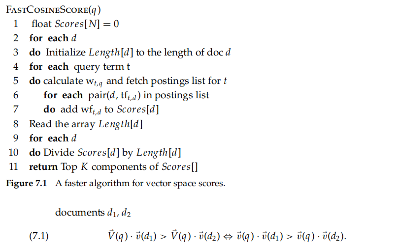
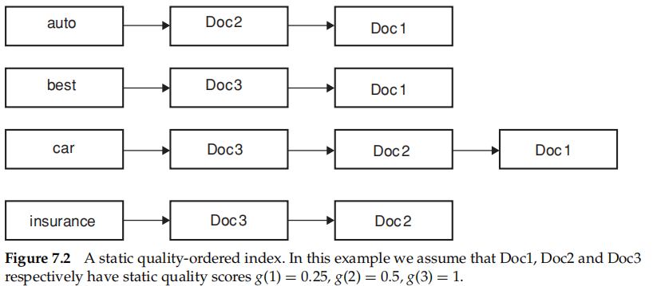
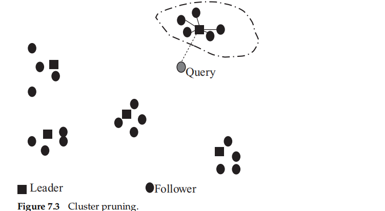
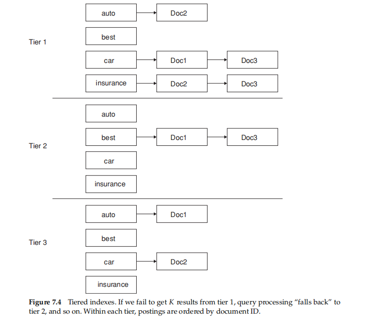
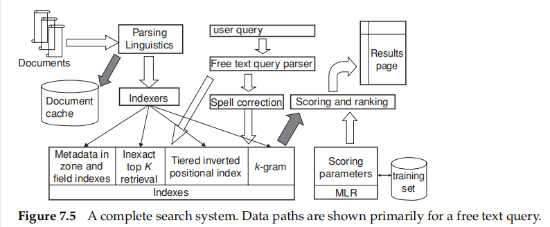

## Computing scores in a complete search system

## 7.1 Efficient scoring and ranking

For the purpose of ranking the documents matching this query, we are really interested in the **relative (rather than absolute)** scores of the documents in the collection

* take wt,q to be 1
* maintain **an idf value for each dictionary term** and a **tf value for each postings entry**
* a better approach is to use a **heap** to retrieve only the top K documents in order

### 7.1.1 Inexact top K document retrieval

hope to dramatically lower the cost of computing the K documents we output, without materially altering the user’s perceived relevance of the top K results

* Such inexact top K retrieval is not necessarily, from the user’s perspective, a bad thing
* The principal cost in computing the output stems from computing cosine similarities between the query and a large number of documents

The heuristics have the following two-step scheme:

1. Find a set A of documents that are contenders, where **K < |A| << N**. A does not necessarily contain the K top-scoring documents for the query, but is **likely** to have many documents with scores near those of the top K
2. Return the K top-scoring documents in A

### 7.1.2 Index elimination

For a **multiterm** query q, it is clear we only consider documents containing at least one of the query terms

* We only consider documents containing terms whose idf exceeds a preset threshold
  * Low-idf terms are treated as stop words and do not contribute to scoring
* We only consider documents that contain many (and as a special case, all) of the query terms
  * may end up with fewer than K candidate documents in the output

### 7.1.3 Champion lists

champion lists__fancy lists__top docs

> precompute, for each term t in the dictionary, the set of the r documents with the highest weights for t; the value of r is chosen in advance.

given a query q we create a set A as follows

* We take the union of the champion lists for each of the terms comprising q
* restrict cosine computation to only the documents in A
* r should be large compared with K
* may find ourselves with a set A that has fewer than K
* There is no reason to have the same value of r for all terms in the vocabulary

### 7.1.4 Static quality scores and ordering

In many search engines, we have available a measure of quality **g(d)** for each document d that is **query independent** and thus **static**   [0,1]

* The net score for a document d is some combination of g(d) together with the query-dependent score induced (say) by (6.12)
* a simple example: $net-score(q,d)=g(d)+\frac{\vec {V}(d) \cdot \vec {V}(q)}{|\vec {V}(d)|| \vec {V}(q)|}$
  * the static quality g(d) and the query-dependent score from (6.10) have equal contributions
  * the effectiveness of our heuristics depends on the specifific relative weighting
* consider ordering the documents in the postings list for each term by decreasing value of g(d)
* rely on the g(d) values to provide this common ordering$[7.2]$

The next idea is a direct extension of champion lists

* For a well-chosen value r, we maintain for each term $t$ a **global champion list** of the $r$ documents with the highest values for $g(d) + tf-idf_{t,d}$
* sorted by a common order
* only compute the net scores for documents in the union of these global champion lists

We conclude the discussion of global champion lists with one further idea.

* for each term $t$ two postings lists consisting of disjoint sets of documents, each sorted by $g(d)$ values
  * high__the m documents with the highest tf values for t
  * low___all other documents containing t
* first high then low

### 7.1.5 Impact ordering

term-at-a-time scoring

* introduce a technique for inexact top K retrieval in which the postings are not all ordered by a common ordering
* require scores to be **“accumulated” one term** at a time

impact ordering__the postings list for a document may be ordered by other quantities than term frequency

order the documents $d$ in the postings list of term $t$ by decreasing order of $tf_{t,d}$

two ideas

* when traversing the postings list for a query term t, we stop after considering a prefix of the postings list – either after a fixed number of documents r have been seen, or after the value of $tf_{t,d}$, has dropped below a threshold
* when accumulating scores in the outer loop of Figure 6.14, we consider the query terms in decreasing order of idf, so that the query terms likely to contribute the most to the fifinal scores are considered first
  * As we get to query terms with lower idf, we can determine whether to proceed based on the changes in document scores from processing the previous query term

### 7.1.6 Cluster pruning

have a preprocessing step during which we cluster the document vectors

* Pick √N documents at random from the collection. Call these **leaders**
  * documents that are not leaders as **followers**
* For each document that is not a leader, we compute its nearest leader

query processing proceeds as follows

* Given a query q, fifind the leader L that is closest to q. This entails computing cosine similarities from q to each of the √N leaders
* The candidate set A consists of L together with its followers. We compute the cosine scores for all documents in this candidate set

A region of he vector space that is dense in documents is likely to produce multiple leaders and thus **a finer partition into subregions**

Variations of cluster pruning introduce additional parameters b1 and b2 both of which are positive integers__at the expense of more computation

* In the preprocessing step, we attach each follower to its $b_1$ closest leaders, rather than a single closest leader
* At query time we consider the $b_2$ leaders closest to the query q

## 7.2 Components of an information retrieval system

do not restrict ourselves to vector space retrieval in this section

### 7.2.1 Tiered indexes

tiered indexes__viewed as a generalization of champion lists

* threshold of 20 for tier 1 and 10 for tier 2
* order the postings entries within a tier by document ID

### 7.2.2 Query term proximity

Consider a query with two or more query terms, t1, t2, ... , tk

Let ω be the width of the smallest window in a document d that contains all the query terms measured in the number of words in the window

* the smaller that ω is, the better that d matches the query
* In cases where the document does not contain all of the query terms, we can set ω to be some enormous number
* also stop words are not considered in computing ω

closer to the “soft conjunctive” semantics

implement: the simplest answer relies on a “hand coding” technique

### 7.2.3 Designing parsing and scoring functions

how should we combine these features?

* depends on the user population, the query distribution, and the collection of documents

**query parser**

> used to translate the user-specifified keywords into a query with various operators that is executed against the underlying indexes

entail multiple queries against the underlying indexes

1. Run the user-generated query string as a phrase query. Rank them by vector space scoring using as query the vector consisting of the three terms **rising interest rates**
2. If fewer than ten documents contain the phrase r**ising interest rates**, run the two 2-term phrase queries rising interest and interest rates; rank these using vector space scoring, as well
3. If we still have fewer than ten results, run the vector space query consist ing of the three individual query terms

demands an aggregate scoring function that **accumulates evidence** of a document’s relevance from multiple sources

* depends on the setting
* manually confifigure the scoring function as well as the query parser
* change infrequently__use machine-learned scoring

### 7.2.4 Putting it all together

1. documents stream in from the left for parsing and linguistic processing (language and format detection, tokenization, and stemming)
2. resulting stream of tokens feeds into two modules
   1. retain a copy of each parsed document in a document cache
   2. enables us to generate results snippets: snippets of text accompanying each document in the results list for a query
   3. This snippet tries to give a succinct explanation to the user of why the document matches the query
3. A second copy of the tokens is fed to a bank of indexers that create a bank of indexes, including zone and fifield in dexes that store the metadata for each document, (tiered) positional indexes,indexes for spelling correction and other tolerant retrieval, and structures for accelerating inexact top K retrieval
4. A free text user query (top center) is sent down to the indexes both directly and through a module for generating spelling-correction candidates
5. the latter may optionally be invoked only when the original query fails to retrieve enough results
6. Retrieved documents (dark arrow) are passed to a scoring module that computes scores based on machine-learned ranking (MLR) for scoring and ranking documents
7. these ranked documents are rendered as a results page

## 7.3 Vector space scoring and query operator interaction

conclude this chapter by discussing how the vector space scoring model relates to the query operators we have studied in earlier chapters

a set of terms typed into their query boxes (thus on the face of it, a free text query) carries the semantics of a conjunctive query that only retrieves documents containing all or most query terms

### Boolean retrieval

a vector space index can be used to answer Boolean queries, but the reverse is not true

complex

> it is in fact possible to invoke so-called p-norms to combine Boolean and vector space queries, but we know of no system that makes use of this fact

### Wildcard queries

Wildcard and vector space queries require different indexes that both can be implemented using postings and a dictionary

we may interpret the wildcard component of the query as spawning multiple terms in the vector space, all of which are added to the query vector

### Phrase queries

Even if we were to try and somehow treat every biword as a term , the weights on different axes are **not independent**

an index built for vector space retrieval **cannot be used** for phrase queries

Although these two retrieval paradigms (phrase and vector space) consequently have **different implementations** in terms of indexes and retrieval algorithms, they can in some cases be **combined usefully**, as in the three-step example of query parsing in Section 7.2.3

## 7.4 References and further reading

