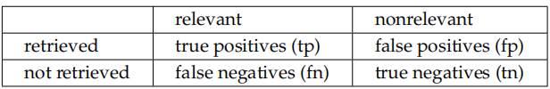
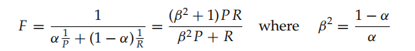
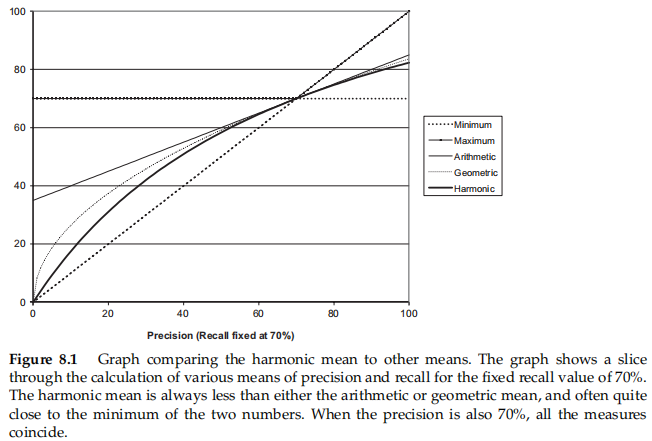
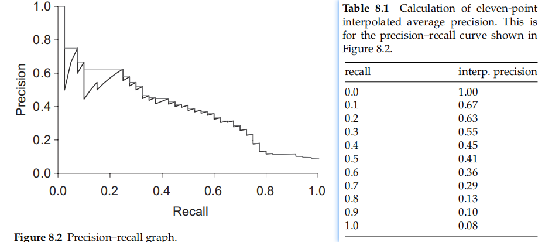
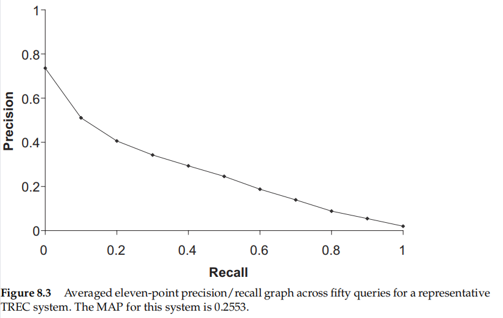
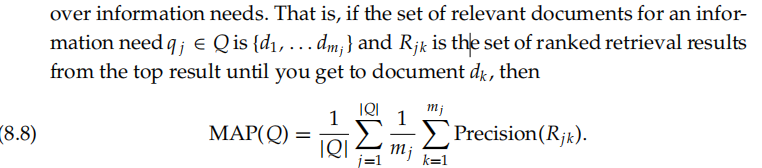
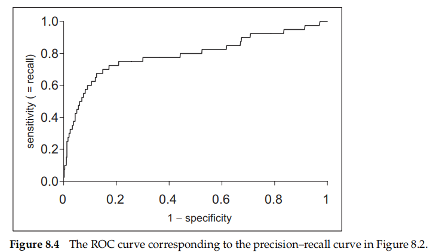
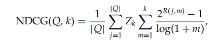
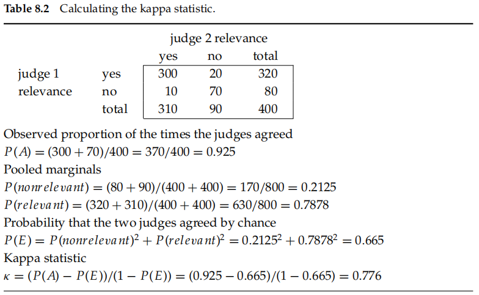

## 8 Evaluation in information retrieval

IR has developed as a **highly empirical discipline**, requiring careful and thorough **evaluation** to demonstrate the superior performance of novel techniques on **representative document collections**

Speed of response and the size of the index are factors in user happiness, but user perceptions do not always coincide with system designers’ notions of quality.

## 8.1 Information retrieval system evaluation

To measure ad hoc IR effectiveness in the standard way, we need a test collection consisting of three things:

1. A document collection
2. A test suite of information needs, expressible as queries
3. A set of relevance judgments, standardly a binary assessment of either relevant or nonrelevant for each query–document pair

**gold standard** or **ground truth** judgment of relevance__relevant or nonrelevant

The test document collection and suite of information needs have to be of a **reasonable size**:As a rule of thumb, fififty information needs has usually been found to be a suffificient minimum

Relevance is **assessed relative to an information need,** not a query__(simplifification)Relevance can reasonably be thought of as a scale, with some documents highly relevant and others marginally

Many systems contain **various weights** that can be adjusted to tune system performance.

have one or more development test collections, and to tune the parameters on the development test collection. The tester then runs the system with those weights on the test collection and reports the results on that collection as an unbiased estimate of performance

## 8.2 Standard test collections

focus particularly on test collections for ad hoc information retrieval system evaluation, but also mention a couple of similar test collections for text classifification

* The Cranfield collection
* Text Retrieval Conference (TREC)
* GOV2
* NII Test Collections for IR Systems (NTCIR)
* Cross Language Evaluation Forum (CLEF)
* Reuters-21578 and Reuters-RCV1
* Newsgroups

## 8.3 Evaluation of unranked retrieval sets

precision and recall

* Precision (P) is the fraction of retrieved documents that are relevant
  * #(relevant items retrieved) / #(relevant items retrieved)
  * P(relevant|retrieved)
  * P=tp/(tp+fp)
* Recall (R) is the fraction of relevant documents that are retrieved
  * #(relevant items retrieved) / #(relevant items)
  * P(retrieved|relevant)
  * R=tp/(tp+fn)
* accuracy
  * (tp+tn)/(tp+fp+fn+tn)
  * needless:the data are extremely skewed
* The measures of precision and recall concentrate the evaluation on the return of true positives, asking what percentage of the relevant documents have been found and how many false positives have also been returned
* one is more important than the other in many circumstances:have two numbers for precision and recall
  * we want to get some amount of recall while tolerating only a certain percentage of false positives

F measure

* trade off precision versus recall
* the weighted harmonic mean of precision and recall
  * When the values of two numbers differ greatly, the harmonic mean is closer to their minimum than to their arithmetic mean$[8.1]$
* balanced F measure__a=1/2 or b=1,written as $F_1=2PR/(P+R)$
* Values of β < 1 emphasize precision, whereas values of β > 1 emphasize recall
* a value of β = 3 or β = 5 might be used if recall is to be emphasized

## 8.4 Evaluation of ranked retrieval results

**evaluate the ranked retrieval results**

* precision–recall curve$[8.2]$
  * have a distinctive sawtooth shape
* remove these jiggles : an interpolated precision
  * the **interpolated precision** ($p_{interp}$) at a certain recall level r is defifined as the highest precision found for any recall level r ≥ r
  * $p_{inrerrp}(r)=max_{r'>=r}p(r')$
* a desire to boil this information down to a few numbers
  * traditional:eleven-point interpolated average precision$[8.3]$
  * the interpolated precision is measured at the 11 recall levels of 0.0, 0.1, 0.2, . . . , 1.0
  * we then calculate the arithmetic mean of the interpolated precision at that recall level for each information need in the test collection
  *

**mean average precision (MAP)**

* provides a single-fifigure measure of quality across recall levels
* especially good discrimination and stability

* When a relevant document is not retrieved at all -> 0
* For a single information need, the average precision approximates the area under the uninterpolated precision–recall curve, and so the MAP is **roughly the average area under the precision–recall curve for a set of queries**
* Using MAP, fixed recall levels are not chosen, and there is no interpolation
* Calculated MAP scores normally vary widely across information needs when measured within a single system, for instance, between 0.1 and 0.7
* This means that a set of test information needs must be large and diverse enough to be representative of system effective ness across different queries

**precision at k__R-precision**

* a set of known relevant documents **Rel**, from which we calculate the precision of the top Rel documents returned
* R-precision adjusts for the size of the set of relevant documents
* If there are |Rel| relevant documents for a query, we examine the top |Rel| results of a system, and find that r are relevant, then by definition, not only is **the precision** (and hence R-precision) r/|Rel|, but the **recall** of this result set is also **r/|Rel|**
* R-precision turns out to be identical to **the break-even point**, another measure that is sometimes used
  * this equality relationship holding
* **R-precision turns out to be highly correlated with MAP empirically, despite measuring only a single point on the curve**

**ROC curve__receiver operating characteristics**

* plots the true positive rate or sensitivity against the false-positive rate or (1 − specifificity)$[8.4]$
  * sensitivity__another term for recall
  * e false-positive rate -> fp/(fp + tn)
  * For unranked result sets, specificity, given by **tn/( f p + tn)**, was not seen as a very useful notion
* **the ROC analog of MAP** : report the area under the ROC curve
* Precision–recall curves are sometimes loosely referred to as ROC curves

**cumulative gain__normalized disnary notions of relevance**

* Like precision at k, it is evaluated over some number k of top search results
* R(j, d) -> the relevance score assessors gave to document d for query j
* where Zk is a normalization factor calculated to make it so that a perfect rank ing’s NDCG at k is 1
* For queries for which k' < k documents are retrieved, the last summation is done up to k'

## 8.5 Assessing relevance

Using **random** combinations of query terms as an information need is generally not a good idea because typically they will not resemble the actual distribution of information needs

**pooling** -> For large modern collections, it is usual for relevance to be assessed only for a subset of the documents for each query

* where relevance is assessed over a subset of the collection that is formed **from the top k documents** returned by a number of different IR systems(usually the ones to be evaluated)
* perhaps other sources such as the results of **Boolean keyword searches** or documents found by expert searchers in an interactive process

**kappa statistic**

In the fifinal analysis, the success of an IR system depends on how good it is at satisfying the **needs of these idiosyncratic humans**, one information need at a time

$kappa=\frac{P(A)-P(E)}{1-P(E)}$

* categorical judgments and corrects a simple agreement rate for the rate of chance agreement
* P(A) -> proportion of the times the judges agreed
* P(E) -> proportion of the times they would be expected to agree by chance
  * simply -> a two-class decision and assume nothing more, then the expected chance agreement rate is 0.5
  * normally -> marginal statistics to calculate expected agreement
    * two ways -> whether one pools the marginal distribution across judges or uses the marginals for each judge separately
    * it is more conservative in the presence of systematic differences in assessments across judges$[8.2]$
  * a kappa value between 0.67 and 0.8 is taken as fair agreement

The choice can make a considerable absolute difference to reported scores, but has in general been found to have little impact on the relative effectiveness ranking of either different systems or variants of a single system that are being compared for effectiveness

### 8.5.1 Critiques and justififications of the concept of relevance

The advantage of system evaluation, as enabled by the standard model of relevant and nonrelevant documents, is that we have a fifixed setting in which we can vary IR systems and system parameters to carry out comparative experiments

in practice, the standard formal measures for IR evaluation, although **a simplification, are good enough**, and recent work in optimizing formal evaluation measures in IR has succeeded brilliantly

**disadvantage**

* The relevance of one document is treated as independent of the relevance of other documents in the collection
* Assessments are binary: There aren’t any nuanced assessments of relevance
* Relevance of a document to an information need is treated as an absolute, objective decision

**fixed**

* with documents divided into three or four classes
* distinguishing slightly relevant documents from highly relevant documents

One clear problem with the relevance-based assessment that we have presented is the distinction between **relevance and marginal relevance**

* latter : a document still has distinctive usefulness after the user has looked at certain other document
* need: diversity and novelty

## 8.6 A broader perspective: System quality and user utility

The standard way to measure human satisfaction is by various **kinds of user studies**

* quantitative measures
* subjective
* qualitative

### 8.6.1 System issues

practical benchmarks

* How fast does it index; that is, how many documents per hour does it index for a certain distribution over document lengths?
* How fast does it search; that is, what is its latency as a function of index size?
* How expressive is its query language? How fast is it on complex queries?
* How large is its document collection, in terms of the number of documents or the collection having information distributed across a broad range of topics?

All these criteria, apart from query language expressiveness, are straight for wardly **measurable**

### 8.6.2 User utility

quantify aggregate user happiness

* depends entirely on the setting
* “enterprise” intranet search engine -> user productivity and others (information security)
* User happiness is elusive to measure, and this is part of why the standard methodology uses the proxy of relevance of search results

### 8.6.3 Refining a deployed system

A/B testing

* For such a test, precisely one thing is changed between the current system and a proposed system, and a small proportion of **traffic (say, 1%–10% of users) is randomly directed to the variant system**, while **most users use the current system**
* sample: clickthrough log analysis or clickstream mining
* running **a bunch of single variable tests** (either nin sequence or in parallel)

## 8.7 Results snippets

snippet

* allow the user to decide its relevance
* consists of the document title and a short summary, which is automatically extracted
  * static
  * dynamic(or query dependent)->customized according to the user’s information need as deduced from a query

static

* generally composed of either or both a **subset** of the document and **metadata** associated with the document
* This summary is typically **extracted and cached at indexing time**, in such a way that it can be retrieved and presented quickly when displaying search results

natural language processing (NLP)

* better ways to do text summarization
* positional factors,with content factors
* the system synthesizes sentences for a summary
* **It is easier, safer, and often even better to just use sentences from the original document**

Dynamic$[8.5]$

* display one or more “windows” on the document
  * contain one or several of the query terms
* keyword-in-context (KWIC) snippets
* **generated in conjunction with scoring**
* NLP:**stretch some number of words to the left and right of the query terms**
* improve the ability but complication

The standard solution to this in a world of large and cheap disk drives is to **locally cache all the documents at index time**

Given a variety of keyword occurrences in a document, the goal is to **choose fragments that are**

1. maximally informative about the discussion of those terms in the document
2. self-contained enough to be easy to read
3. short enough to fifit within the normally strict constraints on the space available for summaries

Rather than caching an entire document, it is common to cache **only a generous but fifixed size prefix of the document**, such as perhaps 10,000 characters

**updated**->these changes will be neither in the cache nor in the index

## 8.8 References and further reading

none

