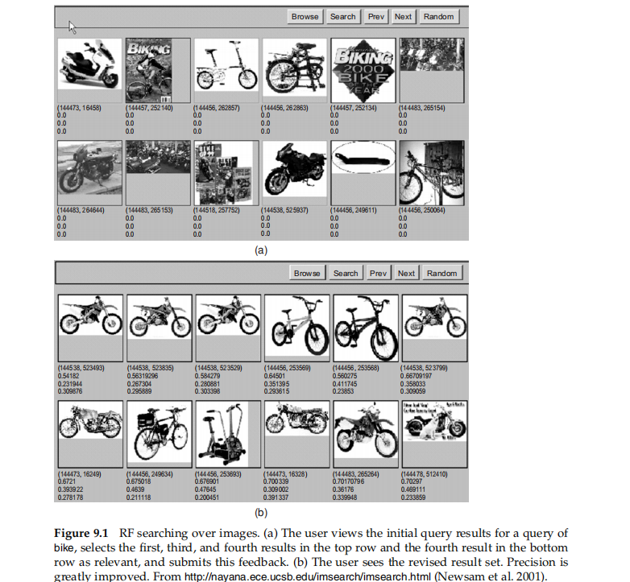
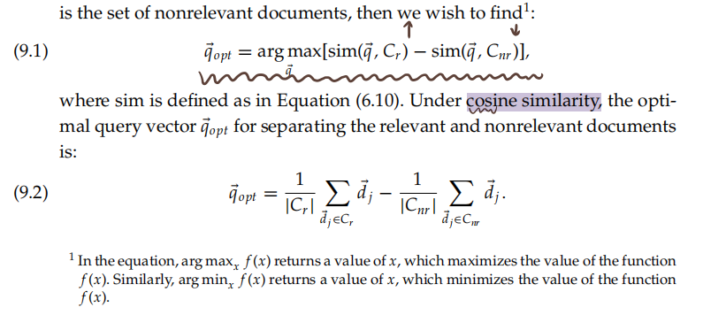
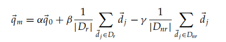
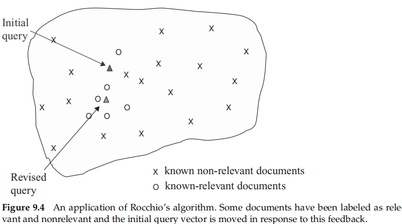
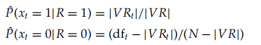
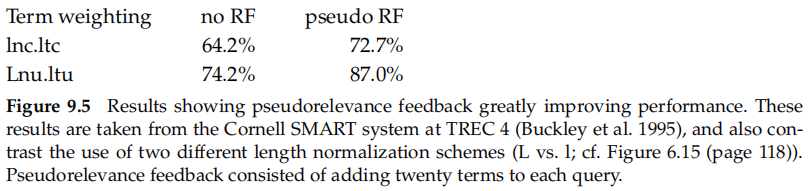
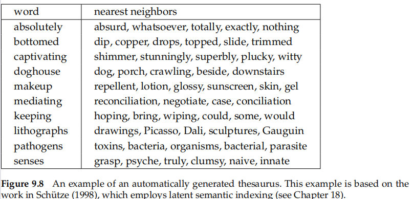

# 9 Relevance feedback andquery expansion

synonymy-> an impact on the recall of most information retrieval (IR) systems

* by manually refining a query
* global methods
  * Query expansion/reformulation with a thesaurus or WordNet
  * Query expansion via automatic thesaurus generation
  * Techniques like spelling correction
* local methods
  * Relevance feedback
  * Pseudorelevance feedback, also known as blind relevance feedback
  * (Global) Indirect relevance feedback

## 9.1 Relevance feedback and pseudo relevance feedback

relevance feedback ->  involve the user in the IR process so as to improve the fifinal result set

1. The user issues a (short, simple) query
2. The system returns an initial set of retrieval results
3. The user marks some returned documents as relevant or nonrelevant
4. The system computes a better representation of the information need based on the user feedback
5. The system displays a revised set of retrieval results

* **one or more iterations**
* it may be difficult to formulate a good query when you don’tknow the collection well, but it is easy to judge particular documents
* effective

* **Image search** provides a good example of RF$[9.1]$
* textual$[9.2]$

### 9.1.1 The Rocchio algorithm for relevance feedback

incorporating relevance feedback information into the vector space model of Section 6.3

**The underlying theory**

* the optimal query is the vector difference between the centroids of the relevant and nonrelevant documents
* not terribly useful -> full set of relevant documents is nnot known; it is what we want to fifind

**The Rocchio (1971) algorithm**

* q0 is the original query vector
* Dr and Dnr are the set of known relevant and nonrelevant documents
* α, β, and γ are weight attached to each term

* can be used for retrieval in the standard **vector space model**
* **negative** term weights are ignored -> 0
* $[9.4]$

* Relevance feedback can improve both recall and precision
* most useful for increasing **recall**

  * expands the query
  * partly an effect of the use case
    * they want high recall, users can be expected to take time to review results and to iterate on the search
* **Positive feedback** also turns out to be much more valuable than negative feedback, and so most IR systems set γ<β

  * Reasonable->α = 1, β = 0.75, and γ = 0.15
  * only positive feedback->γ = 0
* only the marked nonrelevant document
* **Ide dec-hi** is the most effective or at least the most consistent performer

### 9.1.2 Probabilistic relevance feedback

proceed to build a classifier->Naive Bayes probabilistic model

* N is the total number of documents
* dft is the number that contain t
* VR is the set of known relevant documents
* VRt is the subset of this set containing t

Equation (9.4) as a basis for term weighting is likely insuffificient

### 9.1.3 When does relevance feedback work?

depends on certain assumptions

[1]make an initial query that is at least somewhere close to the documents they desire

kinds of problems that relevance feedback cannot solve alone

* Misspellings
* Cross-language IR
* Mismatch of searcher’s vocabulary versus collection vocabulary

[2]relevant documents to be similar to each other

* term distribution in all relevant documents will be similar to that in the documents marked by the users, and the term distribution in all nonrelevant documents will be different from those in relevant documents
* Implicitly, the Rocchio RF model treats relevant documents as a **single cluster**, which it models via the centroid of the cluster
* a multimodal class
  * Subsets of the documents using different vocabulary, such as Burma versus Myanmar
  * A query for which the answer set is inherently disjunctive, such as Pop stars who once worked at Burger King
  * Instances of a general concept, which often appear as a disjunction of more specifific concepts, for example, felines

**Good editorial content** in the collection can often provide a solution

Relevance feedback is **not necessarily popular with users**

have practical problems

* inefficient
* reweight certain prominent terms in the relevant documents
* limited number of terms like this may give mbetter results
* using more terms is better in terms of retrieved document quality

### 9.1.4 Relevance feedback on the web

offer a similar/related pages feature

RF has **been little used** in web search

RF is hard to explain to the average user, and RF is mainly a recall enhancing strategy, and web search users are only rarely concerned with getting sufficient recall

### 9.1.5 Evaluation of relevance feedback strategies

Successful use of RF requires enough judged documents -> having at least five judged documentsis recommended

* start with an initial query q0 and to compute a precision–recall graph
  * cheating
  * o the fact that known relevant documents (judged by the user) are now ranked higher
* use documents in the residual collection for the second round of evaluation
* have two collections, one that is used for the initial query and relevance judgments, and the second that is then used for comparative evaluation
* best : user studies of its effectiveness

### 9.1.6 Pseudo relevance feedback

automatic local analysis

> do normal retrieval to find an initial set of most relevant documents, to then assume that the top k ranked documents are relevant, and fifinally to do RF as before under this assumption

mostly works$[9.5]$

* work better than global analysis
* it is not without the dangers of an automatic process

### 9.1.7 Indirect relevance feedback

implicit (relevance) feedback

it is easy to collect implicit feedback in large quantities for a high-volume system, such as a web search engine

clickstream mining

### 9.1.8 Summary

* effective at improving relevance of results
* onerous

Beyond the core ad hoc retrieval scenario, other uses of RF include:

* Following a changing information need (e.g., names of car models of interest change over time)
* Maintaining an information fifilter (e.g., for a news feed). Such fifilters are discussed further in Chapter 13
* Active learning (deciding which examples it is most useful to know the class of to reduce annotation costs).

## 9.2 Global methods for query reformulation

### 9.2.1 Vocabulary tools for query reformulation

Various user supports

* help the user to see how their searches are or are not working
* This includes information about words that were omitted from the query because they were on
  * stop lists
  * what words were stemmed to
  * the number of hits on each term or phrase
  * and whether words were dynamically turned into phrases

### 9.2.2 Query expansion

query expansion

* opt to use one of these alternative query suggestions$[9.6]$
* how to generate alternative or expanded queries for the user

  * global analysis
  * Use of a thesaurus can be combined with ideas of term weighting; for instance, one might weight added terms less than original query terms

Methods for building a thesaurus for query expansion include the following

* Use of a controlled vocabulary that is maintained by human editors

  * Use of a controlled vocabulary is quite common for wellresourced domains
* A manual thesaurus. Here, human editors have built up sets of synonymous names for concepts, without designating a canonical term
* An automatically derived thesaurus
* Query reformulations based on query log mining

Thesaurus-based query expansion has the advantage of **not requiring any user input**. Use of query expansion generally **increases recall** and is widely used in many science and engineering fifields.

### 9.2.3 Automatic thesaurus generation

the cost of a manual thesaurus

* simply to exploit word cooccurrence
* use a shallow grammatical analysis of the text and to exploit grammatical relations or grammatical dependencies

using word cooccurrence is more **robust** (it cannot be misled by parser errors), but using grammatical relations is more **accurate**

based on term-term similarities$[9.8]$

1. begin with a term–document matrix A -> has length-normalized rows

  * $C = AA^T$
  * Cu,v is a similarity score between terms u and v, with a larger number being better
2. Latent Semantic Indexing

* The **quality of the associations** is typically a problem
* thesauri suffer from both **false positives and false negatives**
* not retrieve many additional ndocuments
* **effective** in increasing recall
* **a high cost to manually producing** a thesaurus and then updating it for scientific and terminological developments within a field
* General thesauri and dictionaries give **far too little coverage of the rich**, domain-particular vocabularies of most scientific fields
* **significantly decrease precision**->particularly when the query contains ambiguous terms
* have the advantage of being much more **understandable** to the system user

